# Tutorial 1A: From raw data to evoked responses: pre-process MEG & EEG data

In this tutorial, you will go through the initial steps that take you from raw data to evoked responses. These steps are:
1. Import the raw MEG and EEG data.
2. Inspect the data and metadata.
3. Select timelocked data
4. Clean the data by removing artefacts, filter data, and re-reference EEG.

The raw data is stored in the three `fif` files that you have downloaded before beginning the tutorials:

    'tactile_stim_raw_tsss_mc.fif'
    'tactile_stim_raw_tsss_mc-1.fif'
    'tactile_stim_raw_tsss_mc-2.fif'

Note that though there are three data files, they are all part of one single recording session. But because the `fif` format (the file format of the Neuromag MEG/EEG system that we used to record data) only allows files to have a size of up to 2GB, the recording has been split into separate files. We should, therefore, think of these as one single file when we continue to process the data despite there being three files.

This is an important thing to notice when recording data. It illustrates the need for consistent file naming. For the example data, you can see that all are called `tactile_stim`, indicating that it is the same task.

## Setup paths
The first step is to point to the path where we have the data and setup FieldTrip. Change these to appropriate paths for your operating system and setup.

```matlab
clear all
close all
restoredefaultpath
addpath('C:/fieldtrip/')            % Change to match your FieldTrip path
ft_defaults

meg_path = 'C:/meeg_course/data';   % Change to match your data path
```

Then define the subject and recording specific paths. For now, we only have one subject and session. In principle, we could just define the path as one string variable when we only have one subject. But we introduce this already now as it is a good ´way to organize your data when you have multiple subjects or session. In that case, the cell array `subjects_and_dates` can be expanded to include more subjects, simply by adding the subject ids and session names.

```matlab
%% Define subject paths
% List of all subjects/session
subjects_and_dates = ...
                    {
                        'NatMEG_0177/170424/'  % add more as needed
                    };
           
% List of all filenames that we will import                
filenames = {...
        'tactile_stim_raw_tsss_mc.fif' 
        'tactile_stim_raw_tsss_mc-1.fif'
        'tactile_stim_raw_tsss_mc-2.fif'
            };

% Define where to put output data
output_path = fullfile(meg_path, subjects_and_dates{1}, 'MEG');
```

## First look at what is in the data files
The `fif` files contain everything that was recorded during the recording data, including MEG data, EEG data, triggers, and various metadata. Before you import everything, take a look at what is in the files. This is especially a good idea if you are dealing with large files to avoid that you confidentially read in more data than what your computer can handle.

Now it is time to use the first FieldTrip function: use `ft_read_header` to read metadata from the `fif` files. Note that this will not read the data yet. `ft_read_header` is a low-level FieldTrip function and does not need a `cfg` struct to work.

```Matlab
%% Read header
infile = fullfile(output_path, filenames{1});
hdr = ft_read_header(infile);
```
The output of `ft_read_header` is here the struct `hdr`. This contains information about what channels is in the data. Explore the struct to find out what is in the data file.

One thing to be aware of is that this only read the header information from one of the three `fif` files. The information about which channels are in the data is the same for all three files as it was recording in one session. But the duration and time-stamps of the recordings might be off because of the split files.

Now read the headers of all three data files to find out how long the recording was and how much data we have. Make a preallocated cell array and loop over data files to read the header information into the cell array:

```Matlab
%% Read all headers
hdrs = cell(3,1);

for ii = 1:length(filenames)
    infile = fullfile(output_path, filenames{ii});
    hdrs{ii} = ft_read_header(infile);
end
```
Take a look at the information in the `hdrs` array (index cell arrays with curly brackets like this: `hdrs{1}`). Look at the channel information as you did before. The channel information should be the same for all three files.

> **Question 1.1:**
>
> * What type of data channels is in the data?  
>
> * What is the sampling frequency? 
>
> * How many samples are there in the entire recording? 
> * How long is the time of the recording?
>
> Hint: look at the fields `nSamples` and `Fs` to calculate the total duration of the recording session.

## Read trigger values
The data consists of tactile stimulation to all five fingers of the right hand. When each stimulation to a finger occurred is marked by a trigger in the data. We will use these triggers to select the parts of the data that we will analyze later on.

What the values of the triggers represent is something you always want to write down in a trigger manual or protocol so that you always know what the values represent. You can read the values from the data, but their meaning is something you should know. 

For this data, I know from my recording notes the trigger values represent the following:

    1  = Little finger tactile stimulation
    2  = Ring finger tactile stimulation
    4  = Middle finger tactile stimulation
    8  = Index finger tactile stimulation
    16 = Thumb tactile stimulation
    32 = New block begins
    64 = End of experiment

But knowing what the values represent is one thing. Another is to see how they actually look in the data. It is a good quality check to inspect how the trigger values appear in the data. For example, if we are to pilot a newly designed experiment, we want to make sure that the value and the order of the triggers appear correct.

To inspect trigger values we use `ft_read_event`. Similar to `ft_read_header` this is also a low-level FieldTrip function and does not need a `cfg` struct to work. Now use `ft_read_event` to read the events (i.e. triggers) in the file you specified above:

```matlab
%% Read events
eve = ft_read_event(infile);
```
Look at the `eve` structure:

> **Question 1.2:** What are the values and the types of events in `eve` and how many events are there in total?

Because there are several trigger channels in the data, FieldTrip read all channels as independent channels and combine everything into a single struct. There are advantages of this, but for now, we are only interested in the composite trigger channel called `STI101`.

Now use the header info you read above to find the channel index of the channel called `STI101`:

```matlab
% Find only the relevant channel
chanindx = find(~cellfun(@isempty, strfind(hdr.label, 'STI101')));

% Read events only from relevant channel
eve = ft_read_event(infile, 'chanindx', chanindx);
```
Again, be aware that this only read the events from one of the three `fif` files. The information about which channels are in the data is the same for all three files as it was recording in one session. Now read the events from all three data files to find all the triggers in the entire recording.

```matlab
%% Read all events
eves = cell(3,1);
for ii = 1:length(filenames)
    infile = fullfile(output_path, filenames{ii});
    eves{ii} = ft_read_event(infile, 'chanindx', chanindx);
end

% Combine
eve = [eves{1}, eves{2}, eves{3}];
```
Now that we have all events combined in one struct, take a look at how many we have of each trial:

```matlab
% See unique events
unique([eve.value])

% Make a summary table of event count
[vals,~,idx] = unique([eve.value]);
n  = histc([eve.value], vals);
evetab = [vals; n];   % Make a quick table
```
In addition to knowing how many trials we have of each type, we also want to know how the trials are distributed over time. The time the trigger occurred is stored in `eve.sample`.

If you, however, look at the minimum and maximum sample values in `eves{1}`, `eves{2}`, and `eves{3}`, e.g. like this (the square bracket `[...]` easily converts the struct into a vector that can be parsed to MATLAB functions):

```matlab
min([eves{1}.sample])   % Change "1" to "2" and "3"
max([eves{1}.sample])   % Change "1" to "2" and "3"
```
you will notice that the range of the samples is the same for all files. This would mean that the triggers for each part of the occurred within the same duration of time. This is obviously not possible. What happened here is that the sample info is defined relative to the onset of the individual files rather than the onset of the recording session. Let us correct that before we plot the triggers across time:

```matlab
% Correct sample info for split files
sam1 = [eves{1}.sample]; 
sam2 = [eves{2}.sample]+hdrs{1}.nSamples;
sam3 = [eves{3}.sample]+hdrs{1}.nSamples+hdrs{2}.nSamples;
allsam = [sam1, sam2, sam3];
```
Then plot the trigger values across time:

```matlab
% Plot
figure
scatter(allsam, [eve.value])
```

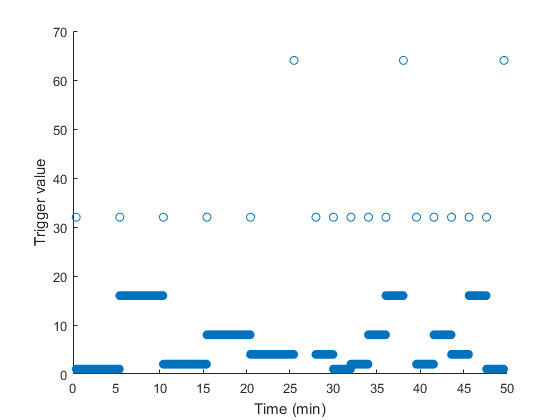

## Inspect raw data
Now that you have a sense about what is in the data files, it is time to take a look at the actual data. Always start by visually inspecting raw data.

FieldTrip has a GUI called `ft_databrowser` to plot raw data.

First, we inspect the magnetometers (`cfg.channel = 'megmag'`). We will look at the different sensor types (magnetometer, gradiometer, and electrodes) separately. The three sensor types are on different numerical scales so will look weird plotted in the same plot (but try to set `cfg.channel = 'all'`).

```matlab
%% Inspect raw data
cfg = [];
cfg.datafile    = infile;
cfg.continuous  = 'yes'
cfg.viewmode    = 'vertical';
cfg.plotevents  = 'yes';      % Plot triggers as horizontal lines
cfg.channel     = 'megmag';   % Which channels to plot (change to 'meggrad' to plot gradiometers and 'eeg' to plot EEG)

ft_databrowser(cfg);
```
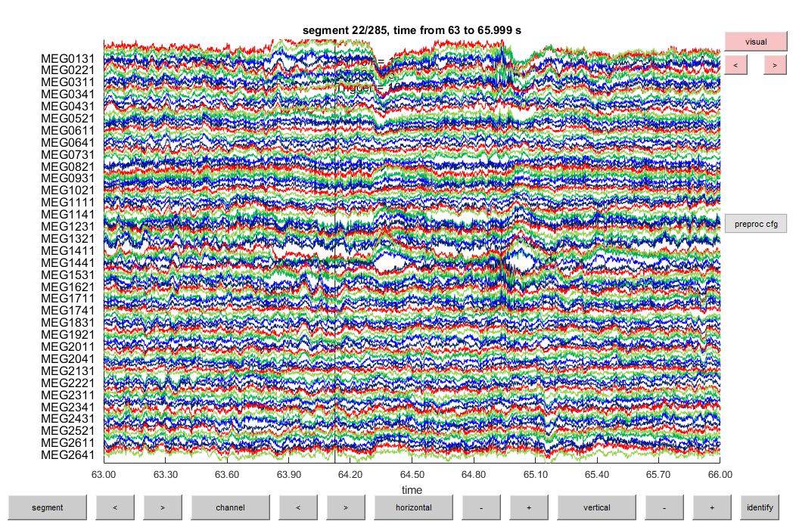

Browse through the data with the arrows buttons in the bottom and change the scaling with the `horizontal` and `vertical` buttons.

You can also add visual pre-processing options by clicking the `preproc cfg` button to the right of the plot. Try, for example, to add a low-pass filter to the data, by adding this to the `preproc cfg`:

```matlab
cfg.preproc.lpfilter = 'yes';
cfg.preproc.lpfreq = 40;
```

To see all the options type `help ft_databrowser` in the MATLAB terminal.

## Read raw data
Now that you have a sense about what is in the data files, it is time to read the actual data.

This is an event-related study, so we want to import data around the events of interest. In FieldTrip this is a two-step procedure. The first step is to specify the trial definition: which triggers do you want to use and what amount of data should be included before and after the trigger. The second step is then to read in the data based on the specified trials in which you also can apply your pre-processing procedure.

For the first step, you make a trial structure with `ft_definetrial`. You need to specify the time around the triggers that you want to import, which channel it should read the events from (i.e. the trigger channel), and the value(s) of the event you want to read.

```matlab
%% Read trial definitions
infile = fullfile(output_path, filenames{1});

% define trials
cfg = [];
cfg.dataset             = infile;
cfg.trialdef.prestim    = 2;        % seconds before trigger
cfg.trialdef.poststim   = 2;        % seconds after trigger
cfg.trialdef.eventvalue = 8;
cfg.trialdef.eventtype  = 'STI101';

cfg = ft_definetrial(cfg);
```
`ft_definetrial` does not return a new data structure as its output as most FieldTrip functions, but return a `cfg` structure that we pass on to `ft_preprocessing` in the next step.

But before you proceed to the next step, take a look at the trial definition that `ft_definetrial` created. You find this is `cfg.trl`.

`cfg.trl` is an Nx4 matrix with each row representing the start sample and end sample of each trial in the raw data, the offset (where in the trial the trigger is, which we will define as time=0 in the subsequent analysis), and the trigger value of the trial. The last column is mainly for bookkeeping and not strictly necessary for the next step. But it is always good to keep track of which trials we are dealing with.

Your `trl` structure might look like this:

| Start sample | End sample | Offset | Trigger value |
| ----: |------:| -----:| -:|
| 20788 | 24787 | -2000 | 1 |
| 24123 | 28122 | -2000 | 1 |
| 27458 | 31457 | -2000 | 1 |
| 30794 | 34793 | -2000 | 1 |
| 34129 | 38128 | -2000 | 1 |
| *...* | *...* | *...* | *...* |

Try to change `cfg.trialdef.eventvalue` from `8` to one of the other trigger values, e.g. `cfg.trialdef.eventvalue = 2` to see how this change the `trl` definition.

Now we are ready to read in the trials with `ft_preprocessing`. So far, we only want to use `ft_preprocessing` to read data and not to any pre-processing yet. Note that you should not reset config struct (`cfg = []`) for this call: you want the `cfg.trl` that you just created to be parsed to `ft_preprocessing`.

```matlab
%% Read trials
cfg.demean      = 'yes';        % basline correct
cfg.lpfilter    = 'yes';        % Apply low-pass filter
cfg.lpfreq      = 100;          % Low-pass cut-off frquency in Hz
cfg.hpfilter    = 'no';         % Do not apply high-pass filter
cfg.dftfilter   = 'no';
cfg.chantype    = {'MEG', 'EEG'};  % Which channels to read

data = ft_preprocessing(cfg);
```

Look at data structure `data`.

> **Question 1.3:** Explain how the MEG/EEG is data stored in the `data` struct.

As before, we once again only have read data from one of the three data files. The following code will loop over all three files and read data. For this next step, we also read all five conditions (i.e. tactile stimulation to each finger).

We do still not apply any pre-processing on the data. We can do that at this point, but for now, we will make as "raw" a dataset as possible because we will use this for several different analyses over the next tutorials. We will do the pre-processing later for the respective analyses. At this stage, we also split MEG and EEG data into different data structures. This is because, in the next steps, EEG and MEG have to be processed slightly different.

```matlab
%% Read all files
split_files_MEG = cell(1, length(filenames));
split_files_EEG = cell(1, length(filenames));

% Specify which events
events = [1, 2, 4, 8, 16];

for filename_index = 1:length(filenames)

    % define trials
    cfg = [];
    cfg.dataset             = fullfile(output_path, filenames{filename_index});
    cfg.trialdef.prestim    = 2;        % seconds before trigger
    cfg.trialdef.poststim   = 2;        % seconds after trigger
    cfg.trialdef.eventvalue = events;
    cfg.trialdef.eventtype  = 'STI101';

    cfg = ft_definetrial(cfg);
    
    % preprocess
    cfg.demean      = 'yes';        % basline correct
    cfg.lpfilter    = 'yes';        % Apply low-pass filter
    cfg.lpfreq      = 100;          % Low-pass cut-off frquency in Hz
    cfg.hpfilter    = 'no';         % Do not apply high-pass filter
    cfg.dftfilter   = 'no';
    
    % Read MEG
    cfg.channel     = 'MEG';

    split_files_MEG{filename_index} = ft_preprocessing(cfg);
    
    % Read EEG
    cfg.channel     = 'EEG';
    cfg.reref       = 'no';         % Do not re-reference yet
    
    split_files_EEG{filename_index} = ft_preprocessing(cfg);
    
    % Read extra channels
    cfg.channel     = {'EOG','ECG'};
    cfg.reref       = 'no';
    
    split_files_ExG{filename_index} = ft_preprocessing(cfg);
  
end
```

Finally, we use `ft_appenddata` to combine data from the three files into one MATLAB structure for MEG, one for EEG, and one for the extra channels. 

```matlab
% Append split files
cfg = [];
preprocessed_data_MEG = ft_appenddata(cfg, split_files_MEG{:});
preprocessed_data_EEG = ft_appenddata(cfg, split_files_EEG{:});
preprocessed_data_ExG = ft_appenddata(cfg, split_files_ExG{:});

```

> #### Sidenote
> At this point you will have a huge dataset in your computers memory and it can become very slow to the point that it will crash. You might want to get rid of large structs in your workspace, e.g., the `split_files_XXX` structs:
> ```matlab
> clear split_files_*
> ```
> It is sometimes a good idea to do a "clean-up" in your scripts to avoid that they crash when handling large datasets.
>
> If you still have problems running the next couple of steps you can also try to downsample the raw data first:
> ```matlab
> %% Downsample data
> cfg = [];
> cfg.resamplefs = 200;         % Resample to 200 Hz
> 
> downsampled_data_MEG = ft_resampledata(cfg, preprocessed_data_MEG);
> downsampled_data_EEG = ft_resampledata(cfg, preprocessed_data_EEG);
> downsampled_data_ExG = ft_resampledata(cfg, preprocessed_data_ExG);
> ```
> Then make sure to change the variable names when you continue with the tutorial. 

## Inspect trials
Once again, we will use `ft_databrowser` to visually inspect data after we have cut it into trials. This time we make a "butterfly plot".

First MEG:

```matlab
% Plot MEG
cfg = [];
cfg.continuous  = 'no';
cfg.viewmode    = 'butterfly';      % Also try 'vertical' as before
cfg.channel     = 'megmag';         % Also try 'megplanar'

ft_databrowser(cfg, preprocessed_data_MEG);
```
Then EEG:
```matlab
% Plot EEG
cfg = [];
cfg.continuous  = 'no';
cfg.viewmode    = 'butterfly';
cfg.channel     = 'eeg';

ft_databrowser(cfg, preprocessed_data_EEG);
```
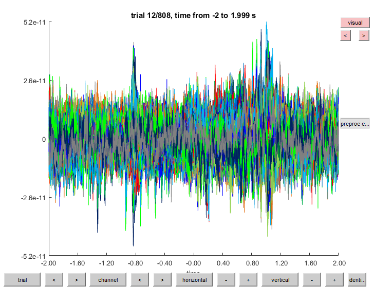

You can add visual pre-processing options by clicking the `preproc cfg` as before.

Try to inspect the data and see if you can identify some bad electrodes (and MEG sensors).

Remember the code above calling `ft_databrowser`: this function can be used to plot and inspect a wide range of different data. You will be asked to plot and inspect data thought the tutorial. `ft_databrowser` is a common way to do this.

## EEG specific pre-processing
These steps are specific for EEG:
* The data for the removed channels are interpolated back in based on their neighbours
* The data is re-referenced to the average of all the channels

### Identify bad channels
The bad electrodes will mess up our analysis if left in. Use `ft_rejectvisual` on the EEG data to identify bad channels. This opens a GUI (pictured below) that displays various summary measured across channels (top right plot), across trials (bottom left plot) and across channels and time. The plots are interactive: drag your cursor across the plots to select channels and trials to remove. In the fields `Toggle trial` and `Toggle channel`, you can manually remove and add individual trials and channels. You can change the summary statistics showed in the figures (try clicking various summary measures to see the difference). If you want to plot a single trial to see how it might be bad, enter the trial number in the `Plot trial` field and press `Enter`.

```matlab
% Find bad channels
cfg = [];
cfg.method      = 'summary';
cfg.keepchannel = 'no';
cfg.channel     = 'EEG*';
cfg.layout      = 'natmeg_customized_eeg1005.lay';

temp = ft_rejectvisual(cfg, preprocessed_data_EEG);
```
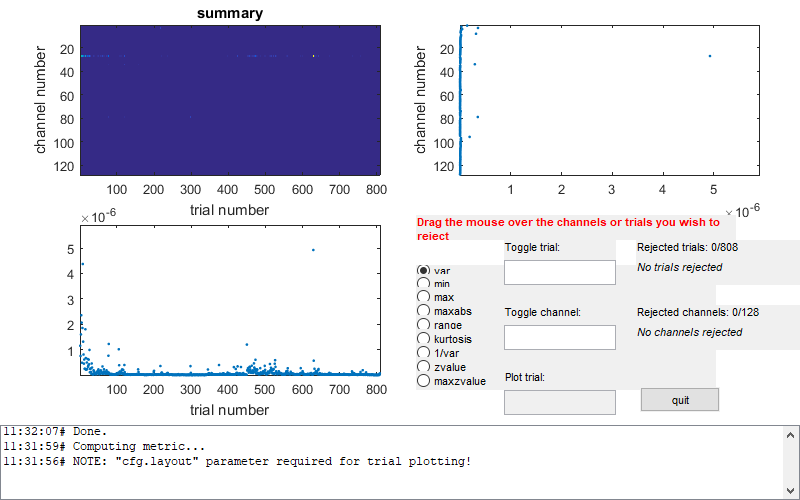

For now, only focus on the channels (top right plot). Mark the **channels** that you think are bad and ought to be removed. Drag across the "bad points" in the figure. Try to plot a few trials to see how the channels look. 

```matlab
% Get the names of the selected channels
badchannels = setdiff(preprocessed_data_EEG.label, temp.label);
```
> **Question 1.4:** Which channels did you mark as bad and why (you can use figures to illustrate)?

### Interpolate bad channels

The bad electrodes will be interpolated based on a combination of neighbouring electrodes. First, define the neighbours of each electrode and plot the neighbours.

```matlab
% Interpolate bad channels: Find neighbours
cfg             = [];
cfg.method      = 'triangulation';
cfg.senstype    = 'EEG'; % 
neighbours_EEG = ft_prepare_neighbours(cfg, preprocessed_data_EEG);

% plotting neighbours for inspection
cfg            = [];
cfg.neighbours = neighbours_EEG;
cfg.senstype   = 'EEG';
ft_neighbourplot(cfg, preprocessed_data_EEG);
```
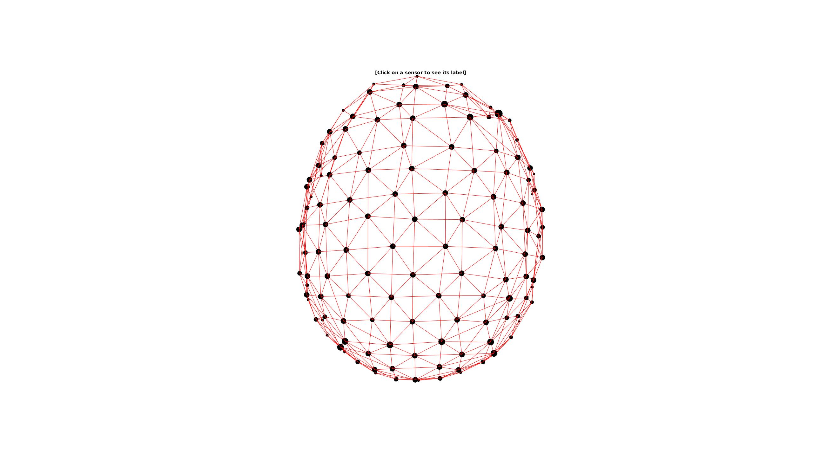

```matlab
%% Interpolate bad channels: the interpolation
cfg = [];
cfg.method          = 'spline';
cfg.neighbours      = neighbours_EEG;
cfg.badchannel      = badchannels;
cfg.senstype        = 'EEG';
interpolated_data = ft_channelrepair(cfg, preprocessed_data_EEG);
```

Plot the interpolated and non-interpolated EEG data. Can you spot the differences?

```matlab
cfg = [];
cfg.viewmode = 'butterfly';

ft_databrowser(cfg, preprocessed_data_EEG);     % not interpolated
ft_databrowser(cfg, interpolated_data);         % interpolated
```

### Re-reference to common average
The reference for the EEG signals has a great impact on how the signals appear. What reference you should use depends on several factors, such as what signals you are looking at, what is conventionally done, etc..

In the tutorial data, EEG was recorded with the FCz electrode as reference. This is almost above the sensorimotor areas so not ideal for looking at sensory potentials as we will in this tutorial. We, therefore, re-reference the EEG data. We will use a reference consisting of the average of all channels with `ft_preprocessing`. If we had only EEG data, we could have done this step already when we first imported the data above.

```matlab
%% Re-reference EEG
cfg = [];
cfg.reref            = 'yes';
cfg.refchannel       = 'all';

rereferenced_interpolated_data = ft_preprocessing(cfg, interpolated_data);
```
Use `ft_databrowser` to plot the re-referenced data to compare before and after.

## Append MEG and EEG data
From here on, the data can be combined into a single dataset and handled together. Use `ft_appenddata` to merge the MEG data, EEG data, and extra channels.

```matlab
%% Append all data
cfg = [];

preprocessed_data = ft_appenddata(cfg, preprocessed_data_MEG, rereferenced_interpolated_data, preprocessed_data_ExG);
```

## Remove bad trials
In this step, we remove bad trials. We will move the same bad trials from both MEG and EEG data. This is not necessary if we were analysis MEG and EEG separately. But in this tutorial we also want to compare MEG and EEG, so we want to have the exact same trials in both datasets.

If you have several experimental conditions, always collapse all conditions before summarizing and rejecting to avoid subjective bias. You have already done this if you imported trials all five triggers [1, 2, 4, 8, 16].

We will again use `ft_rejectvisual` and this time focus on the summary statistics over trials (bottom left plot). Mark the **trials** that you think are bad and ought to be removed. Drag across the "bad points" in the figure. Try to plot a few trials to see how the channels look. 
There are 

This is visually guided way to reject trials by removing those showing high variance. You can also remove specific artefacts by using the the `ft_artifact_xxx` and `ft_rejectartifact` functions. This is a more automated way to do it.

```Matlab
%% Remove bad trials
cfg = [];
cfg.method      = 'summary';
cfg.keepchannel = 'yes';
cfg.layout      = 'neuromag306all.lay';             % MEG layout for plotting

% Magnetometers
cfg.channel     = 'MEGMAG';
cleaned_data = ft_rejectvisual(cfg, preprocessed_data);

% Gradiomenters
cfg.channel     = 'MEGGRAD';
cleaned_data = ft_rejectvisual(cfg, cleaned_data);

% Electrodes
cfg.channel     = 'EEG*';
cfg.layout      = 'natmeg_customized_eeg1005.lay';  % Change to EEG layout

cleaned_data = ft_rejectvisual(cfg, cleaned_data);
```

## Adjust for the offset between trigger and the actual delivery of the stimulation

The trigger for the delivery of the tactile stimulation is sent with millisecond precision to the stimulation device and the MEG data acquisition software. However, because we cannot have electrical parts within the magnetically shield room, the stimulus is powered by pressurized air. This means that there is a delay from the device that received the trigger to the actual delivery of the sensory stimulation. The delay has been measured with an accelerometer to 41 ms. There is no way to know this from the data, and if we did not know, we might think that this subject had oddly slow event-related activity.

As a final step, we correct the onset of the trial, i.e. move the offset (0 ms) 41 ms forward in time. This is a processing step specific to this data. For other stimulus equipment, the delay will be different. Knowing the delay in the stimulus equipment and correcting for it in the analysis is important.

```matlab
%% Adjust offset
cfg = [];
cfg.offset = -41;   % Number of samples

cleaned_data_adjust = ft_redefinetrial(cfg, cleaned_data);
```

## Downsample the data

Downsample from 1000 Hz to 200 Hz. This speeds up processing time but decreases the number of frequencies we can look at. Note that if you already did this before, you should not do this again.

```Matlab
%% Downsample
cfg = [];
cfg.resamplefs = 200;

cleaned_downsampled_data = ft_resampledata(cfg, cleaned_data_adjust);
```

## Save
Now we are done with the basic pre-processing, so this is a good time to save the data. You will use this dataset in the following tutorials.

```Matlab
%% Save data
save(fullfile(output_path, 'cleaned_downsampled_data'), 'cleaned_downsampled_data', '-v7.3'); disp('done');
```

## Advanced pre-processing: independent component analysis (ICA)
Independent component analysis (ICA) is a decomposition method that breaks data into statistically independent components. ICA is useful for identifying patterns of activity that occur regularly in the data. ICA has many applications in MEG/EEG analysis. The most common use is to identify activity related to eye-blinks and heart-beats. These are part of the signal that we (usually) do not want.

The code below shows how to remove eye-blinks and heart-beats from the MEG data.

```matlab
%% Run ICA
cfg = [];
cfg.channel     = 'meg';
cfg.method      = 'fastica';    % Use "fastica" algorithm
cfg.numcomponent = 40;          % Can be up to N channels
comp           = ft_componentanalysis(cfg, cleaned_downsampled_data);

%% Save comp (good for bookkeeping)
save(fullfile(meg_dir, 'comp.mat'), 'comp')
```
Plot the components:

```matlab
%% Plot ICA
% Topography view (split in two figures)
cfg = [];
cfg.layout      = 'neuromag306all.lay';
cfg.marker      = 'off';
cfg.component   = [1:20];               
figure; ft_topoplotIC(cfg, comp)
cfg.component   = [21:40];      
figure; ft_topoplotIC(cfg, comp)

% Time-series view (split in two figures)
cfg = [];
cfg.viewmode    = 'component';
cfg.layout      = 'neuromag306all.lay';
cfg.blocksize   = 10;
cfg.channel     = [1:20];
ft_databrowser(cfg, comp)
cfg.channel     = [21:40];
ft_databrowser(cfg, comp)
```

See if you can find components that correspond to eye-blinks and heart-beats from the component topographies and component time-series? When you have found the components that correspond to eye-blinks and heart-beats, you can remove them with `ft_rejectcomponets`:

```matlab
%% Remove components
reject_comp = [1, 3, 7, 11];    % Write the index of the components you want to remove

% Remove components
cfg = [];
cfg.component   = reject_comp;
cfg.channel     = 'MEG';
cfg.updatesens  = 'yes';
icacleaned_downsampled_data = ft_rejectcomponent(cfg, comp, cleaned_downsampled_data);
```

### Semi-automatic detection of ECG components
The following code will find the components that show similarity to the ECG signal. It uses FieldTrips automatic detection of ECG artefacts, then makes epochs around the artefacts. It requires manual input for defining the duration of the QRS-complex in the ECG.

```matlab
%% Find ECG components
% Find ECG artifacts
cfg = [];
cfg.continuous            = 'no';
cfg.artfctdef.ecg.pretim  = 0.25;
cfg.artfctdef.ecg.psttim  = 0.50;
cfg.channel               = 'ECG';
cfg.artfctdef.ecg.inspect = 'ECG';
[~, artifact] = ft_artifact_ecg(cfg, cleaned_downsampled_data);
```
FieldTrip first asks if you want to `keep the current value (y/n) ?` In the a new figure you can see peaks in the ECG signal and the threshold. Accept (`y`) or provide a new cut-off value.

Next, FieldTrip asks you to define the duration of the QRS-complex. Change values, so the red shading covers the QRS-complex.

When it is done, continue with the following:

```matlab
% Make artifact epochs
cfg = [];
cfg.dftfilter  = 'yes';
cfg.demean     = 'yes';
cfg.trl        = [artifact zeros(size(artifact,1), 1)];
temp = ft_redefinetrial(cfg, cleaned_downsampled_data);

% Re-arrange data
cfg.channel    = 'MEG*';
data_ecg = ft_selectdata(cfg, temp);
cfg.channel    = 'ECG';
ecg = ft_selectdata(cfg, temp);
ecg.channel{:} = 'ECG';         % renaming for bookkeeping

% Remove residual linenoise in electric channel.
cfg = [];
cfg.dftfilter       = 'yes';
cfg.dftfreq         = [50, 100, 150];
ecg = ft_preprocessing(cfg, ecg);

% decompose the ECG-locked datasegments (using the únmixing matrix from comp)
cfg = [];
cfg.unmixing  = comp.unmixing;
cfg.topolabel = comp.topolabel;
comp_ecg = ft_componentanalysis(cfg, data_ecg);

% append the ecg channel to the data structure;
comp_ecg = ft_appenddata([], ecg, comp_ecg);

% average the components timelocked to the QRS-complex
cfg = [];
timelock = ft_timelockanalysis(cfg, comp_ecg);

% Plot
figure
subplot(2,1,1); plot(timelock.time, timelock.avg(1,:)); title('ECG')
subplot(2,1,2); plot(timelock.time, timelock.avg(2:end,:));  title('ICA comp')
```
Can you see a hint of components that might be correlated with the ECG?

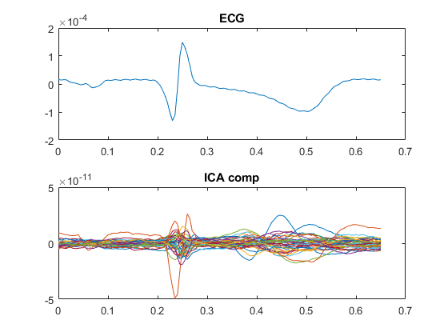

Now we find the components most like the ECG:

```Matlab
%% Find ECG components
% Define cutoff
cutoff = 0.5;           % Between 0-1 (analogue to a correlation coefficient)

% compute a frequency decomposition of all components and the ECG
cfg = [];
cfg.method     = 'mtmfft';
cfg.output     = 'fourier';
cfg.foilim     = [0 100];
cfg.taper      = 'hanning';
cfg.pad        = 'maxperlen';
freq = ft_freqanalysis(cfg, comp_ecg);

% compute coherence between all components and the ECG
cfg = [];
cfg.channelcmb = {'all' 'ECG'};
cfg.method     = 'coh';
fdcomp = ft_connectivityanalysis(cfg, freq);

% Find ECG components
maxcoh = max(fdcomp.cohspctrm, [], 2);
ecg_comp_idx = find(maxcoh > cutoff);
```
The variable `ecg_comp_idx` is the indexes of the components. Take a look at them:

```matlab
% look at the coherence spectrum between all components and the ECG
figure;
subplot(3,1,1); plot(fdcomp.freq, abs(fdcomp.cohspctrm)); hold on
plot([min(fdcomp.freq),max(fdcomp.freq)],[cutoff, cutoff], 'k--')
title('ECG'); xlabel('freq'); ylabel('coh');
subplot(3,1,2); imagesc(abs(fdcomp.cohspctrm));
xlabel('freq'); ylabel('comp');
subplot(3,1,3);
maxcoh = max(fdcomp.cohspctrm, [], 2);
foo = find(~(maxcoh > cutoff));
bp = bar(1:length(maxcoh), diag(maxcoh), 'stacked');
set(bp(foo),'facecolor','w'); set(bp(ecg_comp_idx),'facecolor','r')
axis([0.5, length(maxcoh)+0.5, 0, 1]); xlabel('comp'); ylabel('coh');

% View marked component(s)
cfg = [];
cfg.channel     = ecg_comp_idx; % components to be plotted
cfg.viewmode    = 'component';
cfg.layout      = 'neuromag306all.lay'; % specify the layout file that should be used for plotting
ft_databrowser(cfg, comp)
```
Summary:

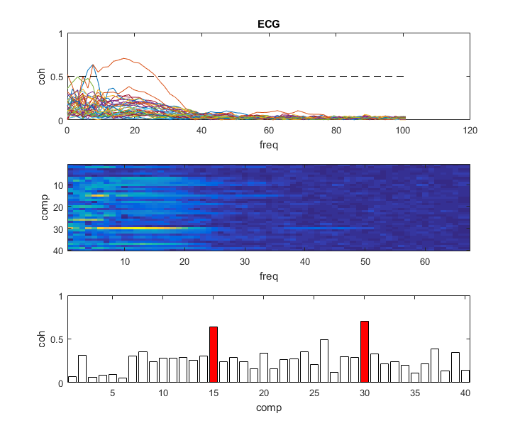

Topography and time-series view with `ft_databrowser` (use arrows to scroll though trials):

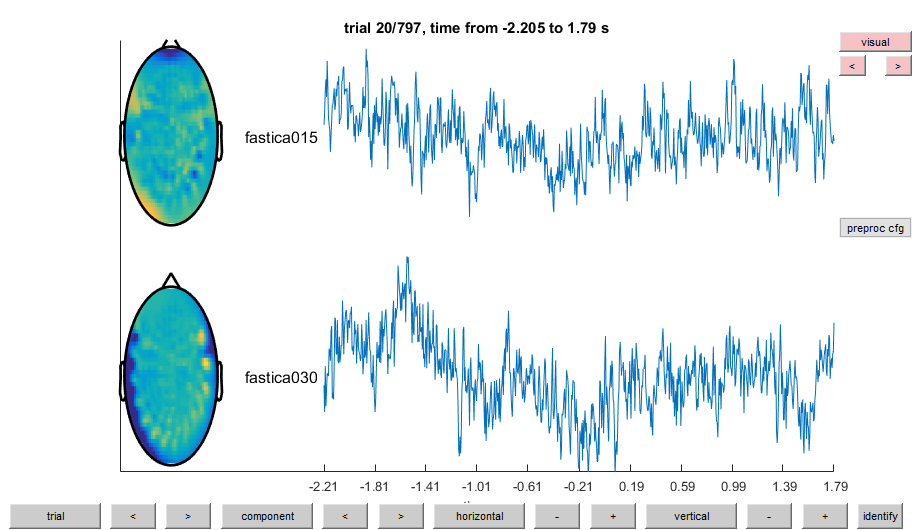

### semi-automatic detection of EOG components
The following code will find the components that show similarity to the EOG signal to remove eye-blinks. It uses Fieldtrip's automatic detection of EOG artefacts. It is similar to the semi-automatic detection of ECG components, but for EOG, we do the procedure twice to for each EOG channel (H/VEOG).

```matlab
%% Find EOG components
% Find EOG artifacts
cfg = [];
cfg.continuous            = 'no';
cfg.channel               = 'EOG';
[~, artifact] = ft_artifact_eog(cfg, cleaned_downsampled_data);

% Make artifact epochs
cfg = [];
cfg.dftfilter  = 'yes';
cfg.demean     = 'yes';
cfg.trl        = [artifact zeros(size(artifact,1), 1)];
temp = ft_redefinetrial(cfg, cleaned_downsampled_data);
    
% Re-arrange data    
cfg.channel    = 'MEG*';
data_eog = ft_selectdata(cfg, temp);
cfg.channel    = 'EOG';
eog = ft_selectdata(cfg, temp);
eog.channel{:} = 'EOG';         % renaming for bookkeeping
    
 % Remove residual linenoise in electric channel.
cfg = [];
cfg.dftfilter  = 'yes';
cfg.dftfreq    = [50, 100, 150];
eog = ft_preprocessing(cfg, eog);

% decompose the EOG epochs into components
cfg = [];
cfg.unmixing  = comp.unmixing;
cfg.topolabel = comp.topolabel;
comp_eog = ft_componentanalysis(cfg, data_eog);

% append the EOG channel to the data structure
comp_eog = ft_appenddata([], eog, comp_eog);

% Define cutoff
cutoff = 0.5;           % Between 0-1 (analogue to a correlation coefficient)

% compute a frequency decomposition of all components and the EOG
cfg = [];
cfg.method     = 'mtmfft';
cfg.output     = 'fourier';
cfg.foilim     = [0 100];
cfg.taper      = 'hanning';
cfg.pad        = 'maxperlen';
freq = ft_freqanalysis(cfg, comp_eog);

% compute coherence between all components and the E0G
cfg = [];
cfg.method     = 'coh';
cfg.channelcmb = {'comp*' 'EOG001'};
fdcomp_eog1 = ft_connectivityanalysis(cfg, freq);
cfg.channelcmb = {'comp*' 'EOG002'};
fdcomp_eog2 = ft_connectivityanalysis(cfg, freq);

% Find EOG components
maxcoh = max(fdcomp_eog1.cohspctrm, [], 2);
eog1_comp_idx = find(maxcoh > cutoff);
maxcoh = max(fdcomp_eog2.cohspctrm, [], 2);
eog2_comp_idx = find(maxcoh > cutoff);
```
The variables `eog1_comp_idx` and `eog2_comp_idx` are the indexes of the components for respectively H/VEOG. Take a look at them:

```matlab
% look at the coherence spectrum between all components and the EOG
figure;
subplot(3,2,1); title('EOG001'); xlabel('freq'); ylabel('coh');
plot(fdcomp_eog1.freq, abs(fdcomp.cohspctrm)); hold on
plot([min(fdcomp.freq),max(fdcomp.freq)],[cutoff, cutoff], 'k--');
subplot(3,2,2); title('EOG002'); xlabel('freq'); ylabel('coh');
plot(fdcomp_eog2.freq, abs(fdcomp.cohspctrm)); hold on
plot([min(fdcomp.freq),max(fdcomp.freq)],[cutoff, cutoff], 'k--');
subplot(3,2,3); xlabel('freq'); ylabel('comp');
imagesc(abs(fdcomp_eog1.cohspctrm));
subplot(3,2,4); xlabel('freq'); ylabel('comp');
imagesc(abs(fdcomp_eog2.cohspctrm));
subplot(3,2,5); xlabel('comp'); ylabel('coh');
maxcoh = max(fdcomp_eog1.cohspctrm, [], 2);
foo = find(~(maxcoh > cutoff));
bp = bar(1:length(maxcoh), diag(maxcoh), 'stacked');
set(bp(foo),'facecolor','w'); set(bp(eog1_comp_idx),'facecolor','r');
axis([0.5, length(maxcoh)+0.5, 0, 1]);
subplot(3,2,6); xlabel('comp'); ylabel('coh');
maxcoh = max(fdcomp_eog2.cohspctrm, [], 2);
foo = find(~(maxcoh > cutoff));
bp = bar(1:length(maxcoh), diag(maxcoh), 'stacked');
set(bp(foo),'facecolor','w'); set(bp(eog2_comp_idx),'facecolor','r'); 
axis([0.5, length(maxcoh)+0.5, 0, 1]);

% View marked component(s)
cfg = [];
cfg.channel     = ecg_comp_idx; 	   % components to be plotted
cfg.viewmode    = 'component';
cfg.layout      = 'neuromag306all.lay'; % specify the layout file that should be used for plotting
ft_databrowser(cfg, comp)
```
Summary:

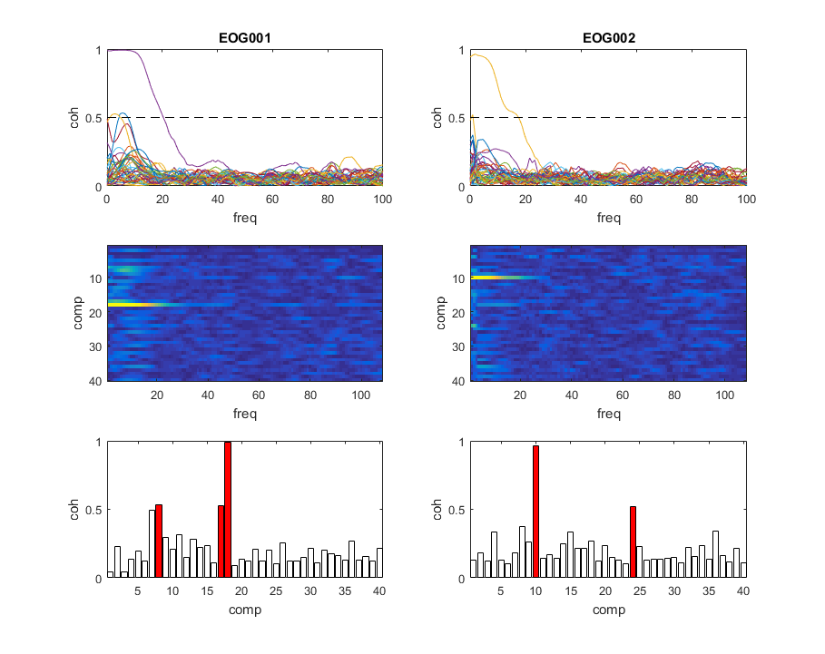

Topography and time-series view with `ft_databrowser` (use arrows to scroll though trials):

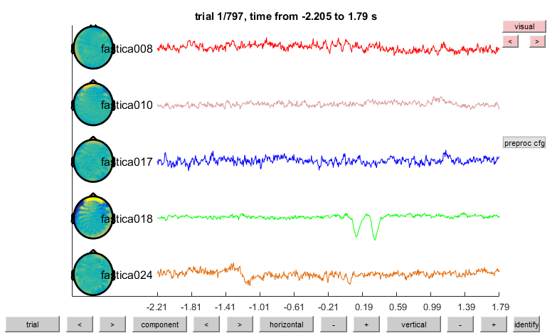

### Reject the marked components
Finally we remove the ECG and EOG componets:

```matlab
%% Remove components
% Make a list of all "bad" components
reject_comp = unique([ecg_comp_idx; eog1_comp_idx; eog2_comp_idx]);
    
% Remove components
cfg = [];
cfg.component   = reject_comp;
cfg.channel     = 'MEG';
cfg.updatesens  = 'yes';
icacleaned_downsampled_data = ft_rejectcomponent(cfg, comp, raw_flt);
```

Use `ft_databrowser` to inspect the difference between `cleaned_downsampled_data` and `icacleaned_downsampled_data` to see what difference this made.

### Save data
Finally, save the data:
```matlab
%% Save
save(fullfile(output_path, 'icacleaned_downsampled_data'), 'icacleaned_downsampled_data'); disp('done');
```

## End of Tutorial 1a...
Congratulations, you have now imported and prepared MEG and EEG. The tutorial continues in **Tutorial 1B: evoked responses**, where you will continue the processing on the data to get the evoked responses.

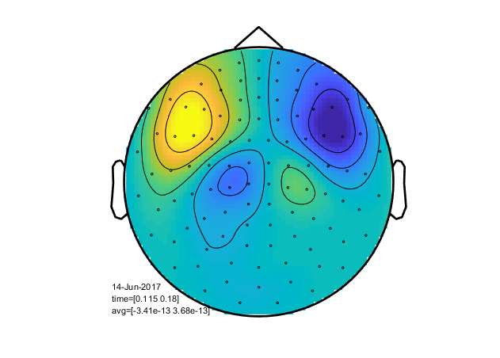