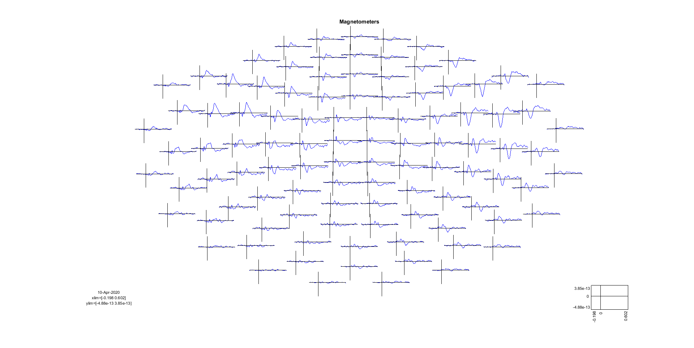
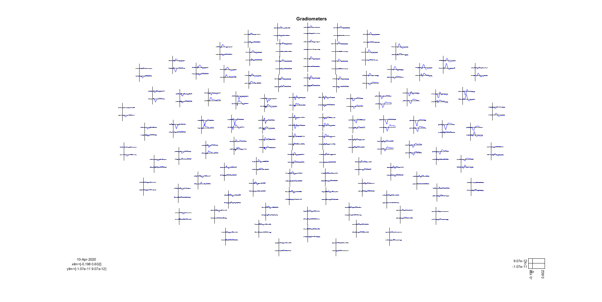
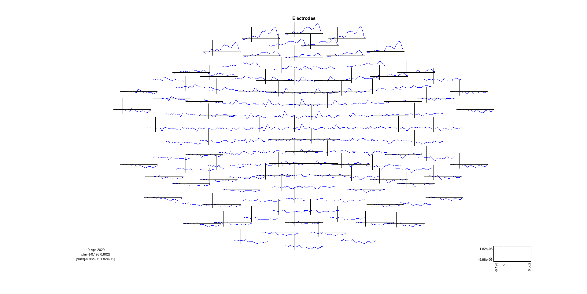
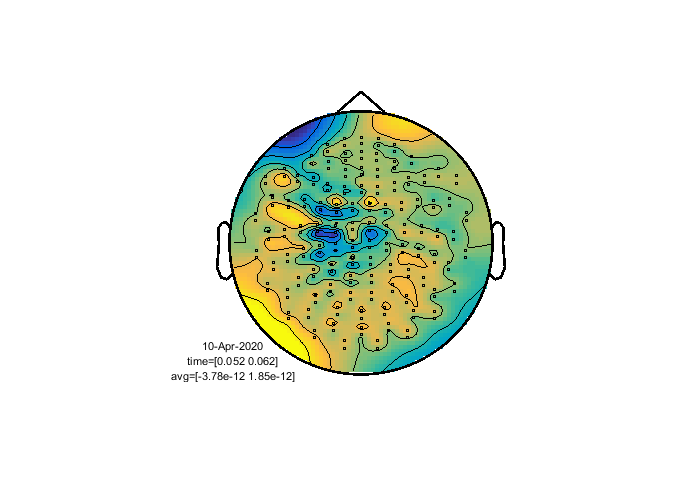
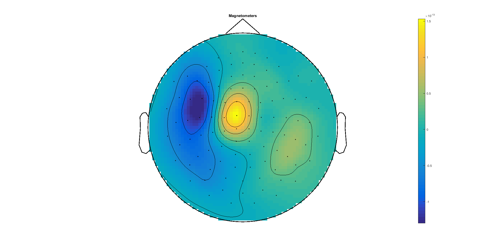
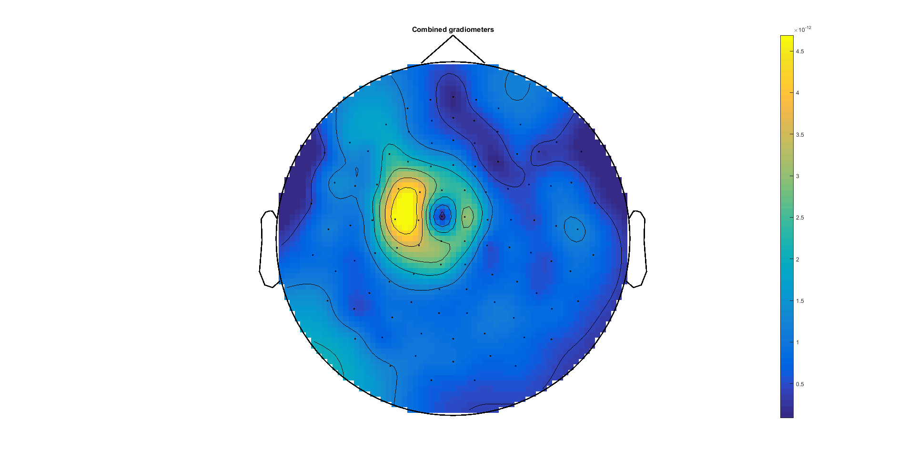
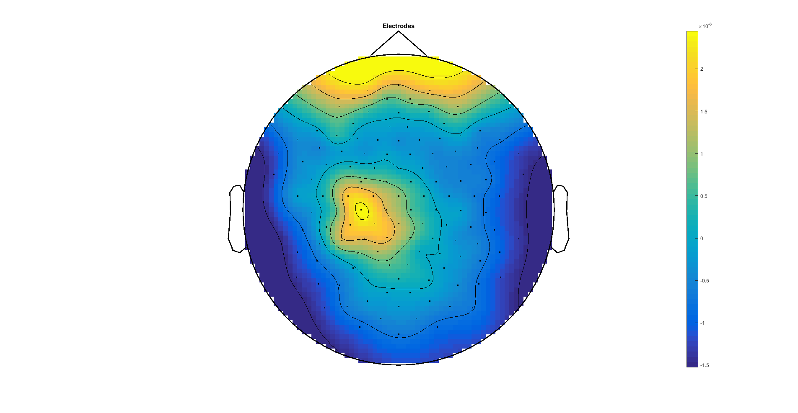
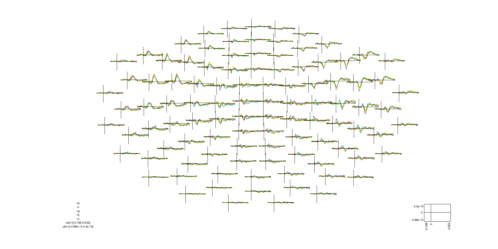
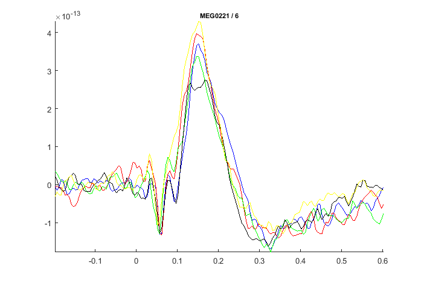

# Tutorial 1B: evoked responses

In this tutorial, you will continue the processing of MEG/EEG data from the pre-processed data to evoked responses. These steps are:

1. Baseline correct data.
2. Average trials to get evoked responses.
3. Plot and inspect the evoked responses.

## Setup paths
The first step is to point to the path where we have the data and setup FieldTrip. Change these to appropriate paths for your operating system and setup.

```matlab
clear all
close all
restoredefaultpath
addpath('C:/fieldtrip/')            % Change to match your FieldTrip path
ft_defaults

meg_path = 'C:/meeg_course/data';   % Change to match your data path
```

Then define the subject and recording specific paths.

```matlab
%% Define subject paths
% List of all subjects/session
subjects_and_dates = ...
                    {
                        'NatMEG_0177/170424/'  % add more as needed
                    };
           
% List of all filenames that we will import                
filenames = {...
        'tactile_stim_raw_tsss_mc.fif' 
        'tactile_stim_raw_tsss_mc-1.fif'
        'tactile_stim_raw_tsss_mc-2.fif'
            };

% Define where to put output data
output_path = fullfile(meg_path, subjects_and_dates{1}, 'MEG');
```

## Load data
Load the cleaned MEG/EEG data:
```matlab
%% Load data
load(fullfile(output_path, 'cleaned_downsampled_data.mat')); disp('done');
```

## A little more pre-processing
The data `cleaned_downsampled_data` had data 2 seconds before and after the stimulation. For this analysis, we are only interested in the activity that is "evoked" by the stimulation itself. Evoked responses are (usually) not lasting more than 500-1000 ms after stimulation before returning to baseline activity. We will, therefore, cut the epochs to only have data from stimulation (t = 0) until 600 ms after stimulation, and a 200 ms pre-stimulus baseline period. 

Since we are interested in the slow evoked responses, we might as well get rid of high-frequency noise: we will apply a 70 Hz lowpass filter before proceeding.

```matlab
%% Filter data for ERF/ERP
cfg = [];
cfg.lpfilter  = 'yes';        % Apply lowpass filter
cfg.lpfreq    = 70;           % lowpass cutoff frequency in Hz

filt_downsampled_data = ft_preprocessing(cfg, cleaned_downsampled_data)
```
Crop trials into time of interest:

```matlab
%% Crop data to time of interest
cfg = [];
cfg.toilim = [-0.200 0.600];
    
cropped_data = ft_redefinetrial(cfg, filt_downsampled_data);
```

The final step before we average data is to baseline correct data by subtracting the mean of the baseline period from -200 ms to 0. 
```matlab
%% Baseline correct
cfg = [];
cfg.demean          = 'yes';
cfg.baselinewindow  = [-0.200 0];

cropped_data_bs = ft_preprocessing(cfg, cropped_data);
```

## Calculate evoked responses
The final step is to average over trials with `ft_timelockanalysis`. First, we average the stimulation to the little finger (little finger = trigger value 1).

```matlab
%% Calculate evoked
% Find trials
select_trials = cropped_data.trialinfo == 1;    % Which trigger value to use

% Calculate evoked
cfg = [];
cfg.trials      = select_trials;

evo = ft_timelockanalysis(cfg, cropped_data_bs);
```
Congratulations, you have now computed evoked responses.

> **Question 1.6:** What is in you newly created `evo` struct? Explain the different fields.

## Visualize evoked responses
Use `ft_multiplotER` to plot the ERFs/ERPs. The plots show the averaged responses for all sensors of the given type.

The plots are interactive. Use your courser to select channels and then click on them to open a new figure that zooms in on the selected channels. You can then highlight parts of the time-series in the same way to open a new figure that shows the topography of that time window. Use this to explore the evoked responses.

```matlab
%% Plot evoked
% Magnetometers
figure
cfg = [];
cfg.layout  = 'neuromag306mag.lay';
cfg.channel = 'megmag';

ft_multiplotER(cfg, evo);

% Gradiometers
figure
cfg = [];
cfg.layout  = 'neuromag306planar.lay';
cfg.channel = 'meggrad';

ft_multiplotER(cfg, evo);

% Electrodes
figure
cfg = [];
cfg.layout  = 'natmeg_customized_eeg1005.lay';
cfg.channel = 'eeg';

ft_multiplotER(cfg, evo);
```






> **Question 1.7:** Why is it a good idea to plot magnetometers and gradiometers seperatly? 
> 
> You can plot both magnetomenters and gradiomenters in a single plot with `ft_multiplotER` by changeing the layout to `neuromag306all.lay`:
> ```matlab
> cfg = [];
> cfg.layout    = 'neuromag306all.lay';
> cfg.channel   = 'meg';
> 
> ft_multiplotER(cfg, evo);
> ```

### Combine gradiometers
If you explore the plots of the gradiometer data, you will notice that the topographies look fragmented, e.g.:



This is because the figure shows the values of each gradiometer channel. But the gradiometer channels are arranged in pairs that measure the gradient of the magnetic field in orthogonal directions. This means that each channel in a channel pair can have opposite signs (you can see this clearly in gradiometer plot you made with `ft_multiplotER` above). This is why the topography looks fragmented.

To make sense of the gradiometers, we combine each gradiometer pair to get the absolute value of the gradient:

```matlab
%% Combine planar gradiometers
cfg = [];
cfg.method = 'sum';

evo_combined_planar = ft_combineplanar(cfg, evo);
```
Take a look at the combined gradiometers. Notice how these are different from magnetometers and electrodes?

```matlab
%% Plot combined gradiometers
figure
cfg.layout  = 'neuromag306cmb.lay';      % Note the layout is changed
cfg.channel = 'meggrad';

ft_multiplotER(cfg, evo_combined_planar);
```

## Interpreting topographies
Now take a look at the topographies:

```matlab
%% topoplots
xlim = [0.057 0.057]   % Single time point (t = 57 ms)

% plot magnetometers
figure
cfg = [];
cfg.layout      = 'neuromag306mag.lay';
cfg.channel     = 'MEGMAG';
cfg.colorbar    = 'yes';
cfg.xlim        = xlim;

ft_topoplotER(cfg, evo_combined_planar);

% plot gradiometers
figure;
cfg = [];
cfg.layout      = 'neuromag306cmb.lay';
cfg.channel     = 'MEGGRAD';
cfg.colorbar    = 'yes';
cfg.xlim        = xlim;

ft_topoplotER(cfg, evo_combined_planar);

% plot EEG
figure;
cfg = [];
cfg.layout      = 'natmeg_customized_eeg1005.lay';
cfg.channel     = 'EEG';
cfg.colorbar    = 'yes';
cfg.xlim        = xlim;

ft_topoplotER(cfg, evo_combined_planar);
```







> **Question 1.8:** Based on the topographies: where do you estimate that are equivalent current dipoles and how many? Hint: remember the right-hand rule and what the different sensor types measure.
>
> Note that the EEG topography above is misleading for locating dipoles. Something in the pre-processing did not go right. What might this be? Did you do better? 

## Make evoked for all events

Now let us look at the ERFs and ERPs for the stimulation on all five fingers. To do this, we run the same code as above but will create a loop that loops over trigger values and store the output in a struct for convenience.

We have also included noise covariance estimation, which is necessary if you want to combine magnetometers, gradiometers and electrodes when doing source analysis.

``` matlab
%% All evoked
% define events
events = [1, 2, 4, 8, 16];
n_events = length(events);

% Loop over trigger values
timelockeds = cell(1, n_events);

for event_index = 1:n_events
    
    event = events(event_index);
    
    cfg = [];
    cfg.covariance          = 'yes';
    cfg.covariancewindow    = 'prestim';
    cfg.trials = cropped_data_bs.trialinfo == event;

    timelockeds{event_index} = ft_timelockanalysis(cfg, cropped_data_bs);
    
end
```

Save the data for later:

```matlab
%% Save
save(fullfile(output_path, 'timelockeds'), 'timelockeds');
```

## Plot all evoked responses in one figure
You can use `ft_multiplotER` to plot all conditions in the same figure for easy comparison (the `:` symbol means the output of all cells):

```matlab
%% Plot evoked
% Magnetometers
figure
cfg = [];
cfg.layout  = 'neuromag306mag.lay';
cfg.channel = 'megmag';

ft_multiplotER(cfg, timelockeds{:});
```




## End of Tutorial 1b