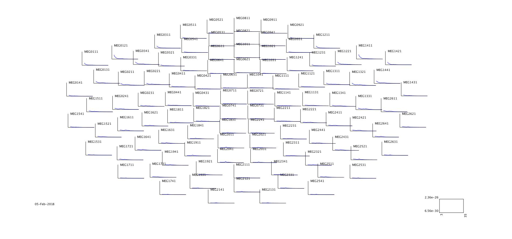
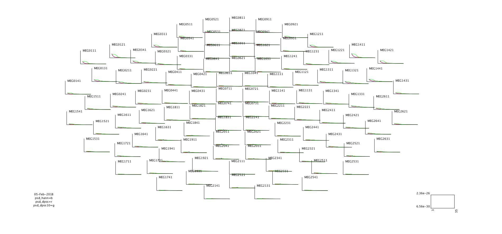
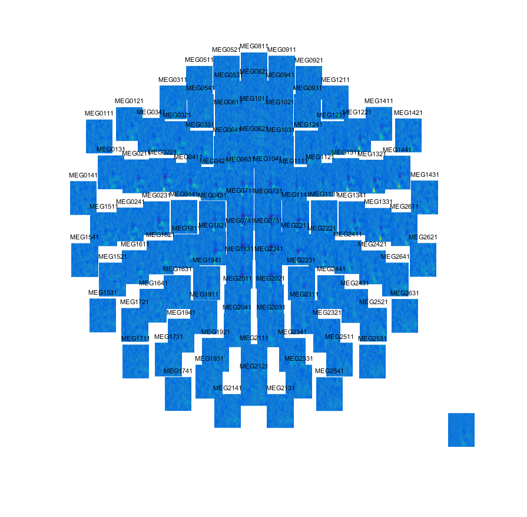
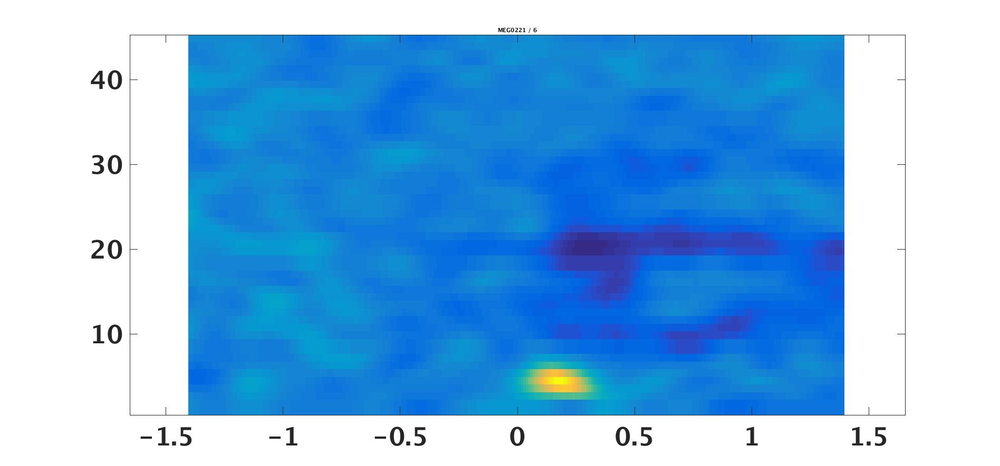
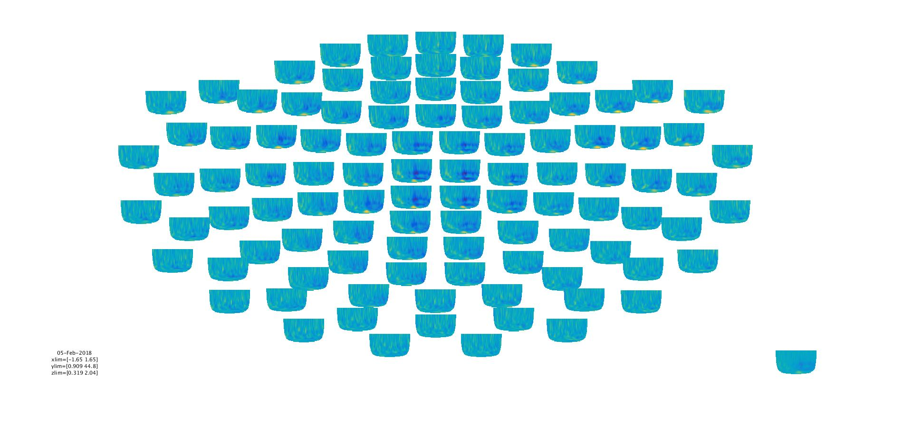
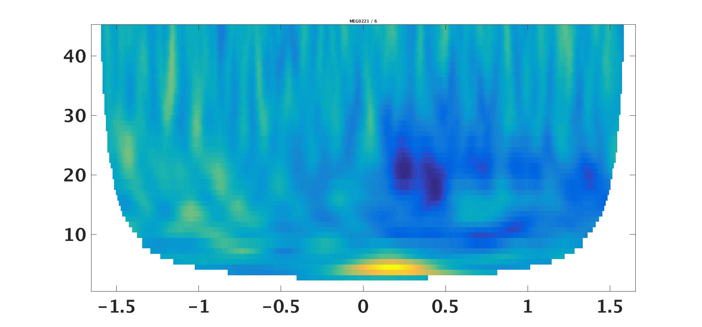
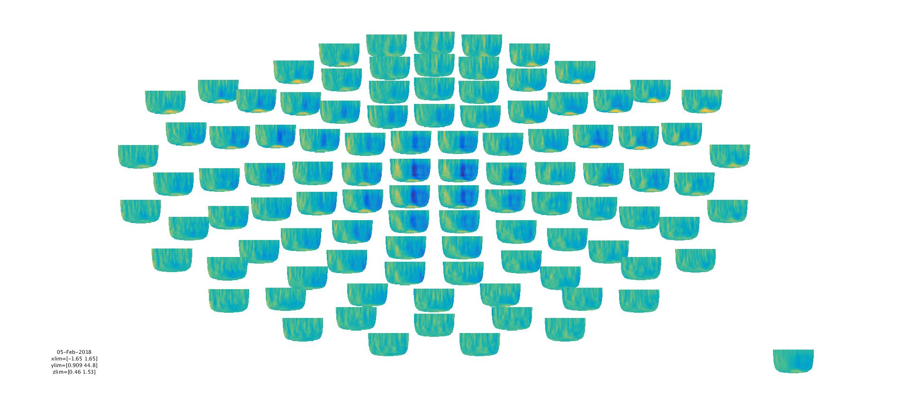
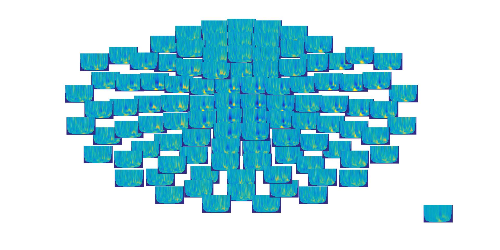

# Frequency analysis
In this tutorial, you will look at different methods for analysis frequency-specific responses in MEG/EEG data.

## Setup paths
The first step is to point to the path where we have the data and setup FieldTrip. Change these to appropriate paths for your operating system and setup.

```matlab
clear all
close all
restoredefaultpath
addpath('C:/fieldtrip/')            % Change to match your FieldTrip path
ft_defaults

meg_path = 'C:/meeg_course/data';   % Change to match your data path
```

Then define the subject and recording specific paths.

```matlab
%% Define subject paths
% List of all subjects/session
subjects_and_dates = ...
                    {
                        'NatMEG_0177/170424/'  % add more as needed
                    };

% Define where to put output data
output_path = fullfile(meg_path, subjects_and_dates{1}, 'MEG');
cd(output_path);
```

## Load data
Read in cleaned data from **Tutorial 1A** (remember where you put the data and what you named it).
If you did not complete the data preperation tutorial, you can load the data file `cleaned_downsampled_data.mat` from the tutorial material:

```matlab
%% Load data
load(fullfile(output_path, 'cleaned_downsampled_data.mat')); disp('Done');
```

> **Question 2.1:** previosuly we downsampled data to 200Hz. As a consequence hereof, what is the highest frequency we can investigate in this data?

## Select data
In the following tutorial, we will only analyse the conditions where the thumb was stimulated, i.e. the condition corresponding to trigger value `16`. Use _ft_selectdata_ to select the conditions with trigger 8:

```matlab
%% Select data
cfg = [];
cfg.trials = cleaned_downsampled_data.trialinfo==16;

epochs = ft_selectdata(cfg, cleaned_downsampled_data)
```

## Estimate power spectral density
We are going to compute the power spectral density (PSD). This gives us the average power across all trials. 

We will use different methods to estimate PDS: 
1) a single taper window
2) multi-tapered windows. 

All calculations is done with the FieldTrip function ``ft_freqanalysis``. ``ft_freqanalysis`` is the default function for running various types of frequency analysis such as calculating PSD and doing the time-frequency analysis. 

###  PSD with single taper
In the first calculation, we will use a Hann window to taper the epochs. This is applied to each epoch in the data structure before doing Fourier decomposition and then calculating the power. The field ``cfg.taper`` lets us define the windowing/tapering function. 

NB. If the process is slow, change ``cfg.channel`` to ``cfg.channel = 'MEG*1'`` to select only MEG magnetometers to run. You can always come back and re-run the analysis.

```matlab
%% Calculate PSD: single taper
cfg = [];
cfg.output          = 'pow';            % Return PSD
cfg.channel         = 'all';            % Calculate for MEG and EEG
cfg.method          = 'mtmfft';
cfg.taper           = 'hanning';        % Hann window as taper
cfg.foilim          = [1 95];           % Frequency range
cfg.pad             = 'nextpow2';       % Trial padding

psd_hann = ft_freqanalysis(cfg, epochs);
```

Once finished, look at what is in the structure `psd_hann`.

> **Question 2.2:** What is the dimension of the data, and what do the dimensions represent?

Plot the PSD using `ft_multiplotER`. the configuration `cfg.xlim` specifies the limits of the frequency axis. The code below only display the lower frequencies. Change `cfg.xlim` to see the whole spectrum.

```matlab
%% Plot PSD
cfg = [];
cfg.parameter       = 'powspctrm';
cfg.layout          = 'neuromag306mag.lay'; % Layout for MEG magnetometers
cfg.showlabels      = 'yes';
cfg.xlim            = [1 45];           % Frequencies to plot

figure;
ft_multiplotER(cfg, psd_hann);
```



### PSD with multitapers
Now we will do the same analysis, but use tapers based on Slepian sequences of tapers. The spectral smoothing is specified by passing the frequency range in the configuration `cfg.tapsmofrq`. `ft_freqanalysis` will then calculate the number of tapers needed to achieve the desired frequency smoothing. Note that the frequency smoothing is the range in either direction, so the frequency smoothing is the double of the numerical value given in `cfg.tapsmofrq`.

> **Question 2.3:** How many tapers is used when you run the command below? Hint: it tells you in the terminal.

```matlab
%% Calculate PSD: multitaper
cfg = [];
cfg.output          = 'pow';          % Return PSD
cfg.channel         = 'all';  % Calculate for MEG and EEG
cfg.method          = 'mtmfft';
cfg.taper           = 'dpss';         % Multitapers based on Slepian sequences
cfg.tapsmofrq       = 2;              % Smoothing +/- 2 Hz
cfg.foilim          = [1 95];
cfg.pad             = 'nextpow2';

psd_dpss = ft_freqanalysis(cfg, epochs);
```

Plot the PSD using ``ft_multiplotER`` as above.

Try to change the frequency smoothing range to e.g 10 Hz.

```matlab
cfg.tapsmofrq       = 10;            % Question: How many tapers does this use?
psd_dpss10 = ft_freqanalysis(cfg, epochs);
```

Compare the single taper PSD, and the two multitaper PSD you have calculated. Plot them side-by-side using `ft_multiplotER`

```matlab
%% Plot add PSDs
cfg = [];
cfg.parameter       = 'powspctrm';
cfg.layout          = 'neuromag306mag'; % Layout for MEG magnetometers
cfg.showlabels      = 'yes';
cfg.xlim            = [1 45];           % Frequencies to plot

figure;
ft_multiplotER(cfg, psd_hann, psd_dpss, psd_dpss10);
```



Compare the results from the different methods to calculate PSD.

> **Question 2.4:** Select the alpha range (~8-12 Hz) in the multiplot to plot as topo-plots. 
How different/alike are they? Explain why?
>
> Select the beta range (~14-30 Hz) and compare topo-plots. How different/alike are they? Explain why?
>
> Finally, plot the "high-gamma" range (~55-95 Hz) by changing `cfg.xlim = [55 95]`. How do the high-gamma spectra compare between methods?

Bonus: Change the layout to view the PSD of EEG

```matlab
%% Plot PSD for EEG
cfg = [];
cfg.parameter       = 'powspctrm';
cfg.layout          = 'natmeg_customized_eeg1005.lay';      % EEG layout
cfg.showlabels      = 'yes';
cfg.xlim            = [1 45];
figure;
ft_multiplotER(cfg, psd_hann);
```

## Time-frequency analysis
The PSD analysis above assumes that the spectral power is the same across the entire epoch. But we can also analyze how the spectral signals evolve, e.g. how oscillatory activity changes as a response to stimuli.

Instead of calculating the power across the entire epoch and then average all epochs, we now will calculate the power for each time sample. In essence, we centre the window on a given time sample and estimate the power of that particular window. As above, we can choose to taper the window with a single taper (e.g., the Hann window) or use multitapers. Finally, we will also use Wavelet analysis, which are sequences of tapered sine-waves fitted to the data for the given time point.

### Get TFR with single taper MEG
In FieldTrip, you also use the function `ft_freqanalysis` to calculate the time-frequency response (TFR). This time we change the method to `mtmconvol`. We have to specify the time sample resolution (`toi`: times of interest), and the length of the window centred on the time of interest (`t_ftimwin`: window length).

NB. TFR calculations take significantly longer time to calculate than PSD. You can always change `cfg.channel = 'MEG*1'` to save time. You can always go back and redo the other channel types.

```matlab
%% Calculate TFR: single taper
cfg = [];
cfg.output      = 'pow';      
cfg.channel     = {'MEG','EEG'};
cfg.method      = 'mtmconvol';
cfg.taper       = 'hanning';    % Hann window as taper
cfg.foi         = 1:1:45;       % Frequencies we want to estimate from 1 Hz to 45 Hz in steps of 1HZ
cfg.toi         = -2:0.01:2;            % Timepoints to center on
cfg.t_ftimwin   = 0.5*ones(length(cfg.foi),1);  % length of time window

tfr_hann = ft_freqanalysis(cfg, epochs);
```

Plot the result with `ft_multiplotTFR`:

```matlab
%% Plot TFR
cfg = [];
cfg.parameter       = 'powspctrm';
cfg.layout          = 'neuromag306mag.lay';
cfg.showlabels      = 'yes';

figure;
ft_multiplotTFR(cfg, tfr_hann);
```

> **Question 2.5:** This plot look weird! How come? What do we see in the plot (Hint: Remember the PSD plots from before)?


Do the same plot, but this time define a baseline to use as a reference for plotting. This can be from the start of the trial to stimuli at time 0 `[-inf 0]`, or the entire epoch `[-inf inf]`. You can see the different options by calling _help_ for _ft_multiplotTFR_. Here we plot the relative change (`cfg.baselinetype = 'relative'`) compared to the baseline from the start to time 0.

```matlab
%% Plot relative TFR with baseline correction
cfg = [];
cfg.parameter       = 'powspctrm';
cfg.layout          = 'neuromag306mag.lay';
cfg.showlabels      = 'yes';
cfg.baselinetype    = 'relative';  % Type of baseline, see help ft_multiplotTFR
cfg.baseline        = [-inf 0];    % Time of baseline

figure; ft_multiplotTFR(cfg, tfr_hann);
```



Zoom in on a single channel:



> **Question 2.6:** How does the baseline change what we can infer from the TFR (Hint: Toggle the colorbar option to show what the colours represent in either plot)?

### Get TFR with Hann taper with varying length
The previous TFR analysis used a fixed window for all frequencies. This is not optimal in this case. Now we will run the same analysis, but with time windows that vary with the individual frequency. Here we use a time window that corresponds to five times the wavelength of the frequency of interest (`cfg.t_ftimwin = 5./cfg.foi`)

Before proceeding, compare the numeric values of _cfg.t_ftimwin_ from the previous call to `ft_freqanalysis` to the current.

```matlab
%% TFR: single taper, varying taper length
cfg = [];
cfg.output      = 'pow';
cfg.channel     = {'MEG','EEG'};
cfg.method      = 'mtmconvol';
cfg.taper       = 'hanning';         % Hann window as taper
cfg.foi         = 1:1:45;            % Frequencies we want to estimate from 1 Hz to 45 Hz in steps of 1HZ
cfg.toi         = -2:0.01:2; % Times to center on
cfg.t_ftimwin    = 5./cfg.foi; 

tfr_hann5 = ft_freqanalysis(cfg, epochs);
```

Plot the results as before (remember the baseline):

```matlab
%% Plot TFR
cfg = [];
cfg.parameter       = 'powspctrm';
cfg.layout          = 'neuromag306mag.lay';
cfg.showlabels      = 'yes';
cfg.baselinetype    = 'relative';
cfg.baseline        = [-inf 0];

figure; ft_multiplotTFR(cfg, tfr_hann5);
```



Zoom in on a single channel:



> **Question 2.7:** Why the round edges in the plot?

### TFR with multitaper
Now we will do the same with multitapers. The smoothing range is given in `cfg.tapsmofrq`. Take a look at the values `cfg.tapsmofrq` and `cfg.t_ftimwin` before running `ft_freqanalysis`. 

Based on the values, how do you expect the plot of the results to look?

```matlab
%% TFR: multitaper
cfg = [];
cfg.output      = 'pow';
cfg.channel     = 'all';
cfg.method      = 'mtmconvol';
cfg.taper       = 'dpss';             % Slepian sequence as tapers
cfg.foi         = 1:1:45;             % Frequencies we want to estimate from 1 Hz to 45 Hz in steps of 1HZ
cfg.toi         = -2:0.01:2;  % Times to center on
cfg.t_ftimwin   = 5./cfg.foi;         % length of time window
cfg.tapsmofrq   = 0.5*cfg.foi;        % Smoothing

tfr_dpss = ft_freqanalysis(cfg, epochs);
```

Plot the results as before with `ft_multiplotTFR`. Remember the baseline.

Zoom in on single channels. Does the plot compare to your expectation?



### TFR with Morlet wavelets
Wavelets are different from the previous, in that the "tapering" is done on a wave-function that is fitted to the signal centred on the timepoints of interest.

To do wavelet analysis in FieldTrip, again use `ft_freqanalysis` but change `cfg.method = 'wavelet'`. Again, we specify the timepoint of interest (`cfg.toi`) where we centre the wavelets and the frequency of interest (`cfg.foi`) as before. For wavelets, we also need to specify the width of the wavelet functions, i.e., the number of cycles in each function.

```matlab
%% TFR: wavelet analysis
cfg = [];
cfg.channel     = 'all';
cfg.method      = 'wavelet';
cfg.foi         = 1:1:45;
cfg.toi         = -2:0.01:2;
cfg.width       = 5;                        % Number of cycles
cfg.pad         = 'nextpow2';

tfr_wavelet = ft_freqanalysis(cfg, epochs);
```

Plot the results with `ft_multiplotTFR` as before.



Also try to plot the EEG TFRs for comparison:
```matlab
cfg = [];
cfg.parameter       = 'powspctrm';
cfg.layout          = 'neuromag306eeg1005_natmeg.lay';
cfg.showlabels      = 'yes';
cfg.baselinetype    = 'relative';
cfg.baseline        = [-inf 0];

figure; ft_multiplotTFR(cfg, tfr_wavelet);
````

## Increase sensitivity to non-phase locked signals

One of the purposes of TFR analysis is to reveal signals that are _non-phase locked_ to stimuli in contrast to the analysis of evoked fields/potentials. But the phase-locked signals also show up in the TFRs, as they are present in the signal and therefore decomposed by the Fourier transform. To enhance the sensitivity to the non-phase locked activity, we can subtract the phase-locked activity and redo the analysis.

Before you proceed, guess how we can find the phase-locked part of the signal (Hint: you have already have done that)

The phase-locked activity is the evoked field/potential. Assuming the average evoked signal are a good representation of the phase-locked signal (i.e., sufficient signal-to-noise ratio), we can subtract it from each trial and redo the TFR analysis.

```matlab
%% Remove phase-locked response
% Get evoked (again)
timelock = ft_timelockanalysis([], epochs);

% Remove phase-locked response from each trial
epochs_nophase = epochs;        % Copy structure
for i = 1:length(epochs)
    epochs_nophase.trial{i} = epochs.trial{i} - timelock.avg;
end
```

Now calculate TFR with wavelets as before:

%% TFR with wavelets
cfg = [];
cfg.method      = 'wavelet';
cfg.foi         = 1:1:45;
cfg.toi         = -2:0.01:2;
cfg.width       = 5;
cfg.pad         = 'nextpow2';

tfr_wavelet_nophase = ft_freqanalysis(cfg, epochs_nophase);
```

Plot the new TFR. Can you spot the difference from the previous wavelet analysis?

```matlab
%% Plot TFRs with/without phase-locked response
cfg = [];
cfg.parameter       = 'powspctrm';
cfg.layout          = 'neuromag306mag.lay';
cfg.baselinetype    = 'relative';
cfg.baseline        = [-inf 0];
cfg.zlim            = [.5 1.8];        % Make sure the plots have same color scaling

figure; ft_multiplotTFR(cfg, tfr_wavelet);
figure; ft_multiplotTFR(cfg, tfr_wavelet_nophase);
```

## End of Tutoiral 2
Now you have compared different methods to calculate PSD and TFR.

> **Question 2.8:** what do the TFR results show? Pick the method you prefer and explain what type of *induced responses* we see (Hint: Remember what ERS and ERD stood for). Use representative plots to illustrate the results.
