# Preprocess MRI data for MEG/EEG source reconstruction

To do source reconstruction of MEG and EEG signals, we need to solve the inverse problem; i.e., find the sources that generate the magnetic or electric field patterns that we measure. This inverse problem has infinite solutions. To be able to estimate the sources of the magnetic and electrical signals, we need constraints on the possible solutions. Lucky enough, we know that the origin of MEG and EEG signals is not any random electric currents, but currents in the brain; more precise the pyramidal cells in neocortex. We can use this information to constrain the solutions to the inverse problem to a set of pre-specified locations. We assume that the activity we measure comes from the brain and thus limit our possible sources to be within the brain.

We do this by constraining the inverse solution based on the anatomy of the brain and head, information about the volume containing the electric fields (the volume conduction model), and information about the location of the head relative to the MEG/EEG sensors.

To do source reconstruction of MEG and EEG signals, we need a model of the head and how it conducts electrical currents. We obtain a model of the head and the brain from a structural magnetic resonance image (MRI). The three necessary ingredients in MEG and EEG source reconstruction is:

1. MEG/EEG data.
2. A structural MRI.
3. Information about the relative location of sensors to the head.

Usually, we want individual MRI for each participant to accommodate individual differences in head geometry and shape of the brain. Still, in some cases, it can be sufficient to use a template brain.

In this tutorial, we have an MRI for the subject. The raw dicom files are in the folder "dicoms". The MEG/EEG data is in the raw .fif files. The information about the relative location of sensors to the head is also contained in the raw ``fif`` file. This is the head point we "drew" on the subjects head together with the locations of the EEG electrodes and information about the MEG sensors location relative to the HPI coils that we measured inside the MEG.

In this tutorial, you will create a volume conductor model of the subjects head (one for MEG and one for EEG), and make sure it is aligned with the position.

## Setup paths
Change these to appropriate paths for your operating system and setup

```matlab
restoredefaultpath
addpath('C:/fieldtrip/')                % Change to match your FieldTrip path
ft_defaults

%% Define subject paths
data_path = 'C:/meeg_course/data';      % Change to match your data path

subjects_and_dates = ...
                    {
                        'NatMEG_0177/170424/'  % add more as needed
                    };
           
% List of all MEEG filenames          
filenames = {...
        'tactile_stim_raw_tsss_mc.fif' 
        'tactile_stim_raw_tsss_mc-1.fif'
        'tactile_stim_raw_tsss_mc-2.fif'
            };

%% Define where to put output data
meg_path = fullfile(data_path, subjects_and_dates{1}, 'MEG');
mri_path = fullfile(data_path, subjects_and_dates{1}, 'MRI');

output_path = meg_path;                 % Save in MEG folder
```

## Read dicom files
Dicom is the standard file format for MRI. We will read the dicom files with the function ``ft_read_mri`` to read the MRI volume. To read the dicoms into a single volume, it is enough to provide the filename of any of the dicom in the sequence; ``ft_read_mri`` will recognize the rest of the files and read all of them (assuming they are in the same directory).

```matlab
%% Read dicom
% Dicom names
dicom_name = '00000001.dcm';  % Name of first dicom file in the volume

dicom_path = fullfile(mri_path, 'dicoms', dicom_name);

% Read raw MRI
mri = ft_read_mri(dicom_path);
```
Searching the folder for dicoms in the same series and loading data can take a while. To avoid doing this over and over, better save in FieldTrip/Matlab format:

```matlab
%% Save raw MRI in FieldTrip/Matlab format
save(fullfile(output_path, 'mri.mat'), 'mri'); disp('done');
```

Take a look at the newly created ``mri`` structure.

You can plot the MRI volume with the function ``ft_sourceplot``. Be patient as it might take some time to generate the plots due to the large size of the data. (if it takes too long to plot the volumes, just skip the plotting that is only for inspection purposes).

```matlab
%% Plot raw MRI
ft_sourceplot([], mri);
```

Do not mind that the function is called ``ft_sourceplot``: it is not yet the source space we are looking at.

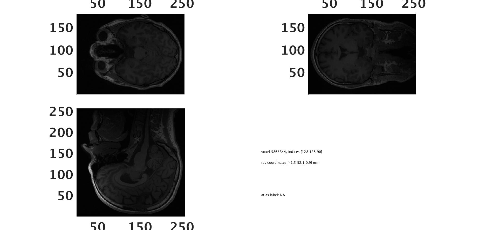

The subject appears to be upside down.

## Co-register MEG/EEG and MRI data
To align the MRI image to the head points in the MEG/EEG data, the first step is to make sure they are in the same coordinate system. As a default, dicom files are in the native coordinate system of the MRI scanner, whereas the MEG and EEG data are in a coordinate system defined by the MEG scanner. These coordinate systems are defined in different ways. 

> There a different ways to define head coordinate systems. Different devises use different default coordinate systems. You can read more about how the coordinate systems are defined here: http://www.fieldtriptoolbox.org/faq/how_are_the_different_head_and_mri_coordinate_systems_defined

The tutorial dataset was collected on an Electra Neuromag MEG scanner and use the Neuromag coordinate system. The Neuromag coordinate system is defined based on external landmarks, i.e. the fiducials that were defined as the first step when we digitized the subject before the recording. The coordinate system is defined like this:

* X-axis from the origin towards the RPA point (Right is positive on X-axis)
* Y-axis from the origin towards the nasion (posterior is positive on Y-axis)
* Z-axis from the origin upwards orthogonal to the XY-plane (superior is positive on Z-axis)
* Origin: The intersection of the X-axis and Y-axis (not an anatomical landmark).

Note, that through we transform everything to the Neuromag coordinate system, this procedure is the same for any head coordinate system your MEG or EEG data is defined in, whether given by other MEG/EEG device manufacturers. The difference is only what system we use; usually the "native" system of the MEG/EEG data. Also note, that this is just a practical formality to co-register the MER and MEG/EEG data. Transformation to anatomical coordinates such as Talairach-Tournoux or MNI is a different transformation, usually done at a later point (or some cases earlier) of the processing.

## Indicate coordinate system
The first step is to define the axes of the coordinate system. We do this with the FieldTrip function `ft_determine_coordsys`. When you call ``dt_determine_coordsys`` a figure will pop up with the axes ontop the MRI. 

```matlab
%% determine coordinate system
mri_coordsys = ft_determine_coordsys(mri);
```

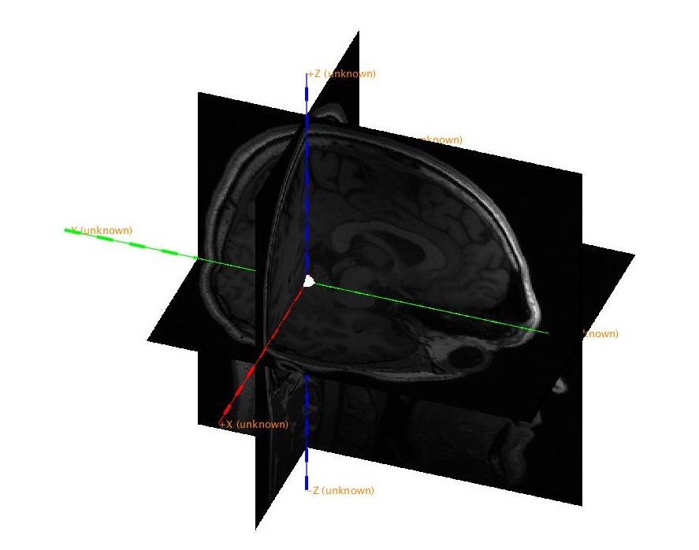

In the MATLAB terminal, FieldTrip is asking you to verify that the size of the MRI is correct and provide information about the direction of the axes:

````
The axes are 150 mm long in each direction
The diameter of the sphere at the origin is 10 mm
Do you want to change the anatomical labels for the axes [Y, n]? >>
What is the anatomical label for the positive X-axis [r, l, a, p, s, i]?
What is the anatomical label for the positive Y-axis [r, l, a, p, s, i]?
What is the anatomical label for the positive Z-axis [r, l, a, p, s, i]?
Is the origin of the coordinate system at the a(nterior commissure), i(nterauricular), n(ot a landmark)?
````

Look at the figure and provide the correct answer to Field Trip. First (r)ight or (l)eft for the X-axis, then (a)nterior or (p)osterior for the Y-axis, and (s)uperior or (i)nferior for the Z-axis.

> **Question 3.1:** What is the direction of the axes?

When you have defined the axes, it is a good idea to save the MRI.

```matlab
%% Save MRI with coordinate system
save(fullfile(output_path, 'mri_coordsys'), 'mri_coordsys'); disp('done');
```

## Co-register MRI to MEG/EEG data based on fiducials
Now we will co-register the MRI image to the head points. In FieldTrip this is done in a step-wise procedure.

First, we align the MRI to the fiducial points (nasion and left and right pre-auricular points). We will align in the coordinate system called *neuromag*. This coordinate system is the coordinate system that MEG scanner uses to outline sensor location.

To align the MRI and measured fiducials, we need to specify the fiducials on the MRI. We do this with the FieldTrip function ``ft_volumerealign``. This will again plot the volume. You now have to mark the approximate location of the fiducial points NAS, LPA, and RPA.

```matlab
%% Realign MRI to Neuromag coordsys
cfg = [];
cfg.method   = 'interactive';
cfg.coordsys = 'neuromag';

mri_realigned_1 = ft_volumerealign(cfg, mri_coordsys);
```

Click on the image until the crosshair is on a location corresponding to a fiducial point. You can also scroll through the volume with the arrow keys. Once the crosshair is in a location you think is correct, press "n" for NAS, "l" for LPA, and "r" for RPA on your keyboard. The coordinates of the fiducials will be written in the MATLAB terminal—Press "f" on your keyboard to toggle fiducial visibility on the plot.

You can mark the fiducials multiple times until you are satisfied with the positions. Do it as precise as you can, but do not get upset if it is not perfect. Imprecision will be adjusted in the following steps.

> **Question 3.2:** Once you are satisfied with the positions, save the figure (or take a screenshot) of the location of the fiducials. Make sure the fiducials are visible. Include this in your report.

Finally, you are asked to provide an extra control point that should have a positive z-value point. Click somewhere on the volume that you are sure has a positive Z-value (e.g., the top of the scalp) and press z.

At this point, you might want to save the data again.

## Co-register with the extra digitization points
Now we will load the head points from the MEG/EEG data with ``ft_read_headshape``.

```matlab
%% Read head points
infile = fullfile(meg_path, filenames{1});

headshape = ft_read_headshape(infile);
```
Inspect the head points:

```matlab
%% Plot head points
ft_plot_headshape(headshape);
```

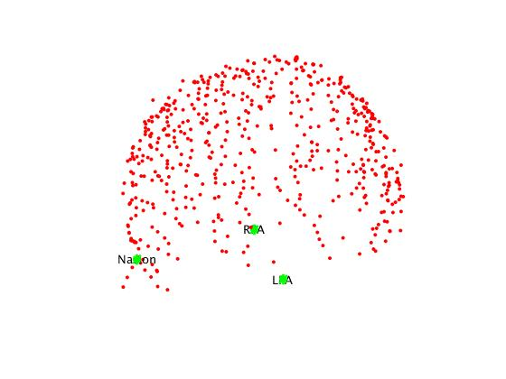

> **Question 3.3:** What is the coordinate system of the head points?

Toghether with the location of the head relative to the MEG sensors and the location of the EEG electrodes, we will now how to "fit" the anatomical data. Let us load the MEG sensor and EEG electrode locations and inspect:

```matlab
%% Read MEG/EEG sensor geometry
grad    = ft_read_sens(infile,'senstype','meg'); % Load MEG sensors
elec    = ft_read_sens(infile,'senstype','eeg'); % Load EEG electrodes

%% Plot head points and sensors
figure
ft_plot_headshape(headshape);     % Plot headshape again
ft_plot_sens(grad);
ft_plot_sens(elec, 'style', 'ob', 'elecsize',10);
```

Now use ``ft_volumerealight`` again, but this time we specify that we want to use an automatic procedure called *iterative closest point* (icp) to fit fiducials and head points.

```Matlab
%% Fit MRI to head points
cfg = [];
cfg.method              = 'headshape';
cfg.headshape.headshape = headshape;
cfg.headshape.icp       = 'yes';
cfg.coordsys            = 'neuromag';

mri_realigned_2 = ft_volumerealign(cfg, mri_realigned_1);
```

The code above will create the interactive figure shown below. You can manually move and scale the head by entering values in the 3x3 grid on the top of the menu to the right. However, since the head points and the MRI already are on the same scale, you should not attempt to scale the MRI. Ans since we selected ICP, it will automatically fit the MRI to the head points. The point of this step is simply to check that the nasion point (green in the figure) is pointing roughly in the direction of the nasion on the MRI. If it does so, click ``quit``. If not, go back to the step where you marked the fiducials with `ft_volumerealign`.

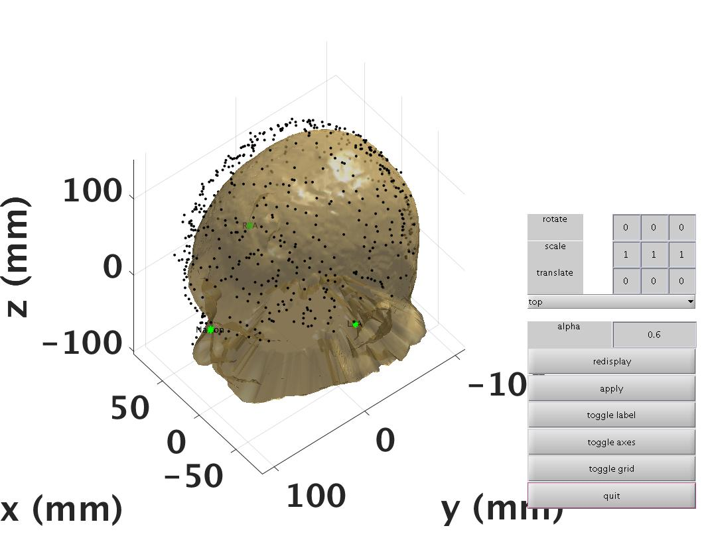

Check co-registration by calling `ft_volumerealign` a third time. This step is just used to check whether the coregistration went okay.

```Matlab
%% Check co-registration
cfg = [];
cfg.method              = 'headshape';
cfg.headshape.headshape = headshape;
cfg.coordsys            = 'neuromag';
cfg.headshape.icp       = 'no';        % Do not fit points again

mri_realigned_3 = ft_volumerealign(cfg, mri_realigned_2);
```

Save output realigned MRI.

```matlab
%% Save volume
save(fullfile(output_path, 'mri_realigned_3.mat'), 'mri_realigned_3'); disp('done')
```

How does the head points align with the scalp now?

## Reslice the MRI data
The final step of the co-registration is to reslice the MRI on to a 1x1x1 mm cubic grid aligned with the coordinate axes. 

```matlab
%% Reslice MRI
cfg = [];
cfg.resolution = 1;

mri_resliced = ft_volumereslice(cfg, mri_realigned_3);
```

To avoid unit errors later in the pipeline, we also convert the units of the volume to centimeters (note: this were sometimes an issue in older versions of FieldTrip, perhaps not anymore). Then we save the volume.

```matlab
%% Convert units
mri_resliced_cm = ft_convert_units(mri_resliced, 'cm');

%% Save
save(fullfile(output_path, 'mri_resliced_cm.mat'), 'mri_resliced_cm'); disp('done')
```

> Try to use `ft_sourceplot` like you did above to see the resliced MRI.

## Segment data into brain, skull, and scalp
We will segment the volume into three compartments: One for the brain, one for the skull, and one for the scalp. This is done automatically with the function `ft_volumesegment`. All it needs is a configuration specifying which output segments we want. Note that this step will take several minutes.

```matlab
%% Segment MRI
cfg = [];
cfg.output = {'brain' 'skull' 'scalp'};

mri_segmented = ft_volumesegment(cfg, mri_resliced_cm);

%% Save
save(fullfile(output_path, 'mri_segmented.mat'), 'mri_segmented'); disp('done')
```

> **Question 3.4:** What is covered by the *brain* compartment?
>
> You can plot the *brain* segmentation to see, like this:
> ```matlab
> %% Plot segmentation
> % Copy anatomy 
> mri_segmented.anatomy = mri_resliced_cm.anatomy
>
> % Plot
> cfg = [];
> cfg.funparameter = 'brain';           % Change to see other segmentations
> ft_sourceplot(cfg, mri_segmented);
> ```
> 

## Prepare volume layers for EEG

For MEG source reconstruction, we only need the *brain* segment of the MRI. But for EEG we need the *brain*, *skull*, and *scalp* segments.

> **Question 3.5:** Why do you only need the *brain* segment for MEG source reconstruction but the *brain*, *skull*, and *scalp* segments for EEG source reconstruction?

The following step is used to correct the segmentation to avoid overlap that will cause problems later on:

```matlab
%% Correct compartments
binary_brain = mri_segmented.brain;
binary_skull = mri_segmented.skull | binary_brain;
binary_scalp = mri_segmented.scalp | binary_brain | binary_skull;

% use boolean logic together with IMERODE
binary_skull = binary_skull & imerode(binary_scalp, strel_bol(2)); % fully contained inside eroded scalp
binary_brain = binary_brain & imerode(binary_skull, strel_bol(2)); % fully contained inside eroded skull
```

We will then copy the segmented volume into a new structure. We will also add the original anatomical image for plotting purposes.

```matlab
% Copy MRI
mri_segmented_2 = mri_segmented;                    % Copy stucture
mri_segmented_2.anatomy = mri_resliced_cm.anatomy;  % Copy anatomical data
  
% insert the updated binary volumes, taking out the center part for skull and scalp
mri_segmented_2.brain    = binary_brain;
mri_segmented_2.skull    = binary_skull & ~binary_brain;
mri_segmented_2.scalp    = binary_scalp & ~binary_brain & ~binary_skull;
```

Now it is a good idea to inspect that the segmentation went well and then save. 

```Matlab
%% Plot segmentations
cfg = [];
cfg.funparameter = 'brain';
ft_sourceplot(cfg, mri_segmented_2);

cfg.funparameter = 'skull';
ft_sourceplot(cfg, mri_segmented_2);

cfg.funparameter = 'scalp';
ft_sourceplot(cfg, mri_segmented_2);
```

Brain segment:


Skull segment:

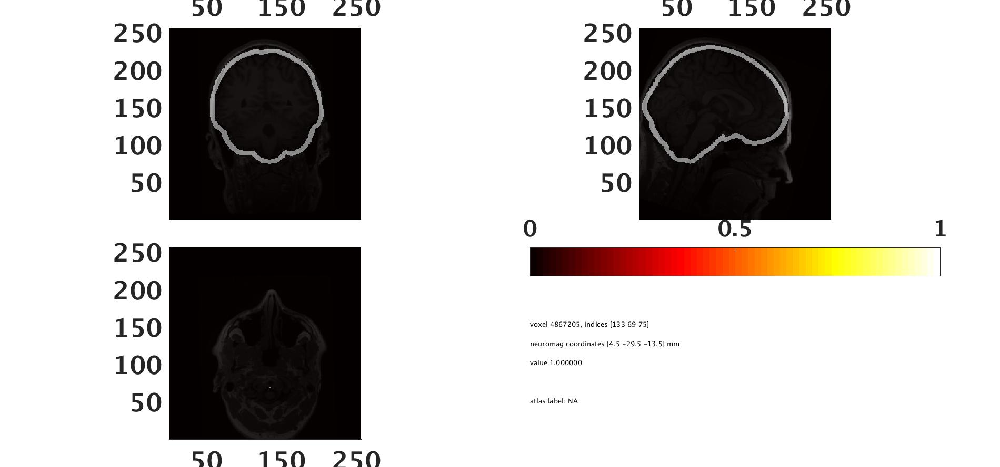

Scalp segment:

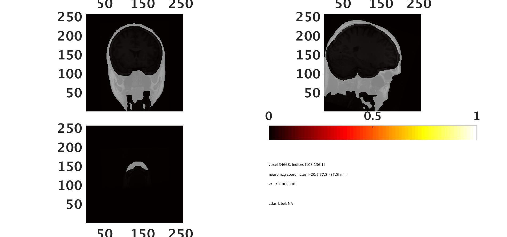

## Construct meshes for each segment
From the three compartments, we will now construct meshes that define the borders of the compartments: one for the outer scalp, one for the border between scalp and skull, and one for the inner skull, which we will call *brain*.

To prepare the meshes, we use the FieldTrip function ``ft_prepare_mesh``. We will also specify the number of vertices on each surface with the option `cfg.numverticies`. This argument defines the resolution of the boundary surfaces.

```matlab
%% Make meshes
cfg = [];
cfg.method = 'projectmesh';
cfg.tissue = 'brain';
cfg.numvertices = 3000;

mesh_brain = ft_prepare_mesh(cfg, mri_segmented_2);

cfg.tissue = 'skull';
cfg.numvertices = 2000;

mesh_skull = ft_prepare_mesh(cfg, mri_segmented_2);

cfg.tissue = 'scalp';
cfg.numvertices = 2000;

mesh_scalp = ft_prepare_mesh(cfg, mri_segmented_2);

% Collect meshes into a single structure
meshes = [mesh_brain mesh_skull mesh_scalp];

%% Save
save(fullfile(output_path, 'meshes.mat'), 'meshes'); disp('done')
```

Plot the meshes to see if they look fine (chage the arguments `'edgealpha'`/`'edgecolor'` and ``'facealpha'``/`facecolor` for other visualisation options):

```matlab
%% Plot meshes
figure; hold on
ft_plot_mesh(mesh_brain, 'facealpha', .5, 'edgealpha', 0)
ft_plot_mesh(mesh_skull, 'facealpha', .5, 'facecolor', 'g', 'edgealpha', 0)
ft_plot_mesh(mesh_scalp, 'facealpha', .5, 'facecolor', 'b', 'edgealpha', 0)
```

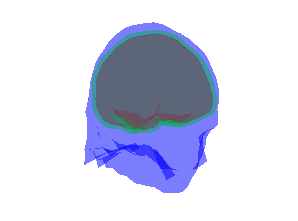

## Construct separate head models for EEG and MEG
Now we are ready to construct our volume conduction model that defines how electric potentials and magnetic fields spread throughout the conductor (the head). We need separate head models for source reconstruction of MEG and EEG data. 

For the EEG head model, we will use all three meshes to define a three-layer model consisting of three compartments. To do this, we specify the method as *boundary element compartments* (`cfg.method = 'bemcp'`) for the function ``ft_prepare_headmodel`` and give the structure containing all three meshes as input.

For MEG, we will use a single volume model based on the "brain" mesh. To create the single volume model, we specify the method as *singleshell* (``cfg.method = 'singleshell'``) for the function ``ft_prepare_headmodel`` and give only the brain mesh as input.

 
```matlab
%% Headmodel EEG
cfg = [];
cfg.method = 'bemcp';
cfg.conductivity = [1 1/20 1] .* (1/3);  % Standard values 

headmodel_eeg = ft_prepare_headmodel(cfg, meshes);

%% Headmodel MEG
cfg = [];
cfg.method = 'singleshell';

headmodel_meg = ft_prepare_headmodel(cfg, mesh_brain);

%% Save
save(fullfile(output_path, 'headmodel_eeg.mat'), 'headmodel_eeg');
save(fullfile(output_path, 'headmodel_meg.mat'), 'headmodel_meg');
```

Note that we define the conductivity of the compartments differently (the values in ``cfg.conductivity``).

> **Question 3.6:**: What could be a potential problem with how we define the conductivity of the different compartments, and how does the problem affect the source reconstruction of MEG and EEG respectively?

Finally, plot the head models together with the head points and sensors. This is a sanity check that the process went well. Note the simplicity of the MEG model compared to the EEG model.

First plot the MEG:

```matlab
%% Plot all aligned: MEG
figure; hold on
ft_plot_sens(grad)
ft_plot_headshape(headshape)
ft_plot_headmodel(headmodel_meg)
ft_plot_axes([], 'unit', 'cm');
```

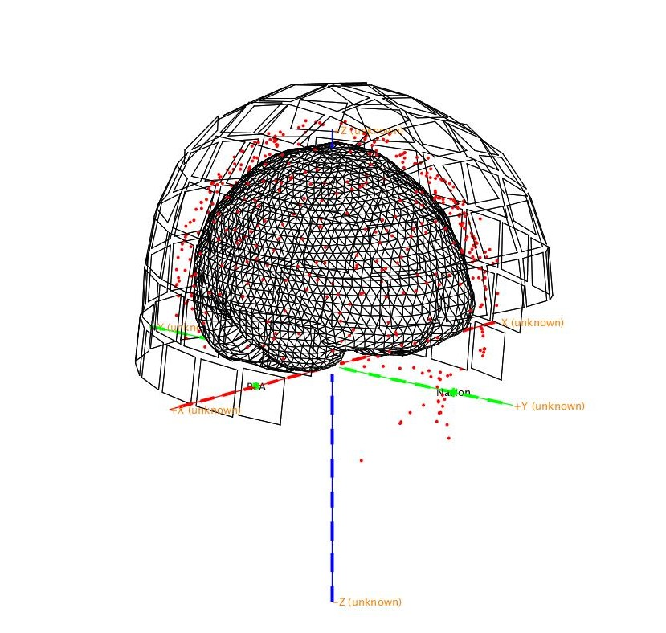

Then plot the EEG model. It can be challenging to see, but the figure should contain three meshes inside one another. If you rotate the figure, it might be easier to see.

```matlab
%% Plot all aligned: EEG
figure
ft_plot_sens(elec, 'style', 'ok','elecsize',10);
ft_plot_headshape(headshape);
ft_plot_headmodel(headmodel_eeg,'facealpha', 0.5, 'edgecolor','r')
ft_plot_axes([], 'unit', 'cm');
```

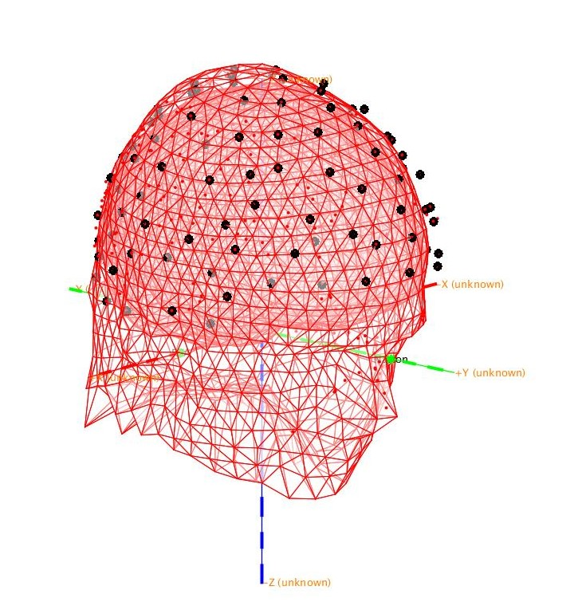

## Alternative "headmodel" for EEG
The reliability of the EEG head models depends on the quality of the MRI. If you tried to look through the MRI volume with `ft_sourceplot`, you might have noticed that the skull and skin layers are thin towards the back of the head. There is a risk that the following segmentation, therefore, is suboptimal.

An alternative method for constructing head models for EEG is to use concentric spheres. That is, rather than using an anatomically "correct" head model we will use a head model that consists of layers of spheres assuming that the head is approximately spherical. We might lose specificity for the following source reconstructions with this method. But if the segmentation and estimation of compartments in the head model are wrong, the specificity will be lost due to the inaccuracies anyway.

To use the alternative "headmodel", use `ft_prepare_headmodel` as before, but change the method to `'concentricspheres'`:

```matlab
%% Spherical headmodel
cfg=[];
cfg = [];
cfg.method = 'concentricspheres';

headmodel_eeg_sphere = ft_prepare_headmodel(cfg, meshes);
```

Plot spheres and scalp to see the difference:
```matlab
% Plot
figure
ft_plot_mesh(mesh_scalp, 'facealpha', .5, 'facecolor', 'y', 'edgealpha', 0)
ft_plot_headmodel(headmodel_eeg_sphere,'facealpha', 0.5, 'edgecolor','k')
ft_plot_sens(elec, 'style', 'ok','elecsize', 10);
ft_plot_axes([], 'unit', 'cm');
```

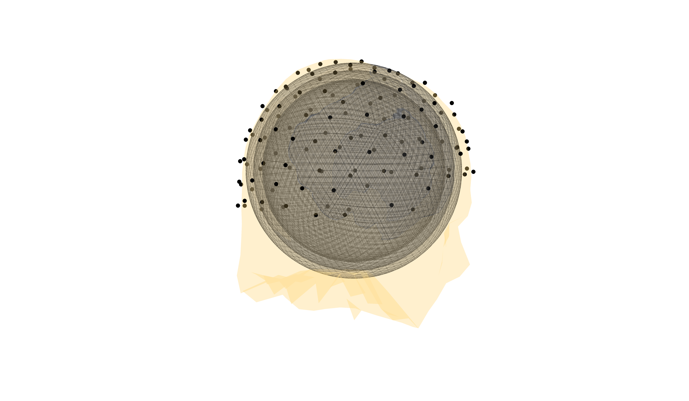

Save the headmodel
```matlab
save(fullfile(output_path, 'headmodel_eeg_sphere.mat'), 'headmodel_eeg_sphere'); disp('done')
```

For comparison, create a spherical head model for MEG: this needs only be a single sphere

```matlab
cfg = [];
cfg.method = 'singlesphere';

headmodel_meg_sphere = ft_prepare_headmodel(cfg, mesh_brain);

%% Save the headmodel
save(fullfile(output_path, 'headmodel_meg_sphere.mat'), 'headmodel_meg_sphere'); disp('done')
```

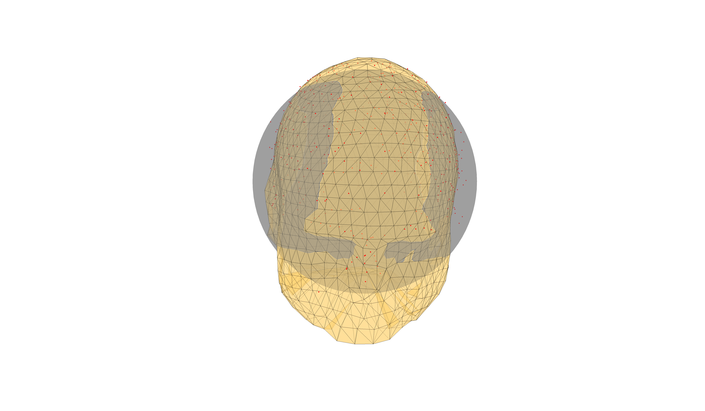

## End of Tutorial 3
Now you are ready to continue with the tutorials on source reconstruction: Tutorial 04: dipole fits, Tutorial 05: minimum-norm estimates, and Tutorial 06: beamformer.

Note that there is one step related to the MRI that we did not do in this tutorial, that otherwise is related to he MRI: that is, creating the source spaces. However, in FieldTrip this is often done in the same step as creating the *leadfield* which also require the MEG/EEG data. This will be covered in the next couple of tutorials. You can also take a look at Tutorial 99, which is how to create a surface-based source space with Freesurfer and FieldTrip (note, that this tutorial is an example not part of the tutorial you are expected to run).

