# Dipole Fitting

In this tutorial, you will do a dipole fit to evoked responses. For the dipole fits, we assume that the dipolar patters can be adequately explained by a few dipolar sources in the brain. We do not need to model activity in the entire brain with this method. What we will do is to create a source model of evenly distributed sources across the entire brain and then scan the sources for the best explanation of the observed scalp potentials and magnetic fields. The steps are as follows:

1. Create *source space* and *leadfield*
2. Do dipole fits
3. Evaluate outcome

To do this, you need to have completed three preceding steps:  

1. Calculate time-locked data for the MEG and EEG data (tutorial 1B).
2. Create the head model for the MEG data (tutorial 3).
3. Create the head model(s) for the EEG data (tutorial 3).


## Set up paths
Change these to appropriate paths for your operating system and setup

```matlab
restoredefaultpath
addpath('C:/fieldtrip/')                % Change to match your FieldTrip path
ft_defaults

%% Define subject paths
data_path = 'C:/meeg_course/data';      % Change to match your data path

subjects_and_dates = ...
                    {
                        'NatMEG_0177/170424/'  % add more as needed
                    };

%% Define where to put output data
meg_path = fullfile(data_path, subjects_and_dates{1}, 'MEG');
mri_path = fullfile(data_path, subjects_and_dates{1}, 'MRI');

output_path = meg_path;                 % Save in MEG folder
```
## Load relevant files

Load the required data files for dipole fits:

```matlab
%% go to relevant path and load data
cd(output_path)
disp('Loading timelockeds and headmodel...')
load('timelockeds.mat')
load('headmodel_meg.mat')
load('headmodel_eeg.mat')
```

## Identify ERP/ERF components of interest
Before doing the dipole fits, take a look at the sensor-level ERF/ERPs to look for dipolar patters in the scalp. Try to do a "manual" source localisation using the right-hand rule.

```matlab
%% identify components of interest
close all
figure('units', 'normalized', 'outerposition', [0 0 1 1]);

% multiplot over all magnetometers
cfg = [];
cfg.layout = 'neuromag306mag.lay'; % layour for magnetometers

ft_multiplotER(cfg, timelockeds{4}); % explore this by yourself
```

```matlab
% Plot combined planar gradiometers (makes them interpretable)
cfg = [];
cmb = ft_combineplanar(cfg, timelockeds{4});

% multiplot over all gradiometers
cfg = [];
cfg.layout = 'neuromag306cmb.lay'; % layour for magnetometers
```

```matlab
% Plot EEG
figure
cfg = [];
cfg.layout  = 'natmeg_customized_eeg1005.lay';
cfg.channel = 'eeg';

ft_multiplotER(cfg, timelockeds{4});
```

Notice the peaks around 55 msec and 135 msec


Topographical plot of the first ERF component for combined gradiometers and magnetometers:

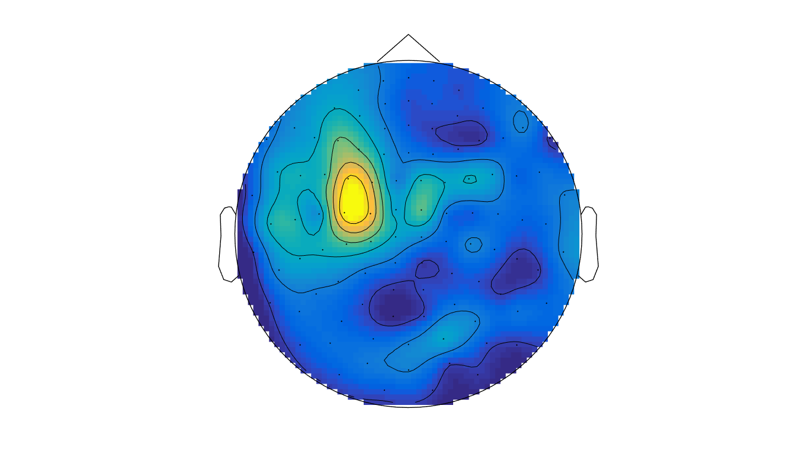
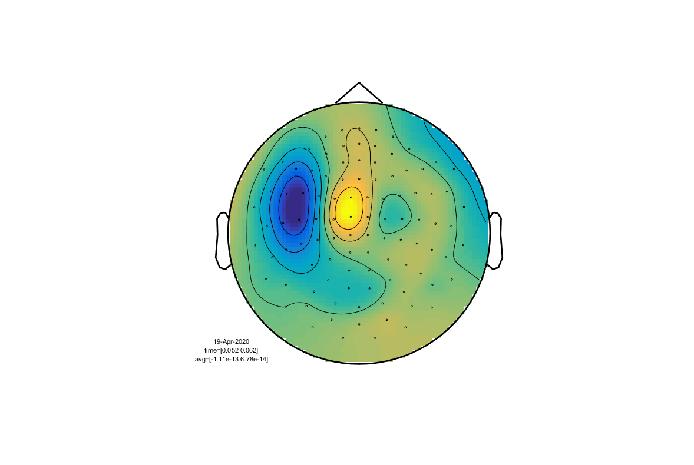

Topographical plots averaging over 115-155 msec for combined gradiometers and magnetometers:

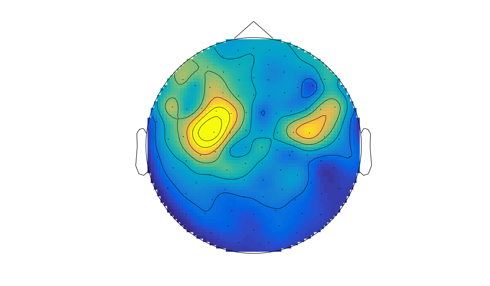
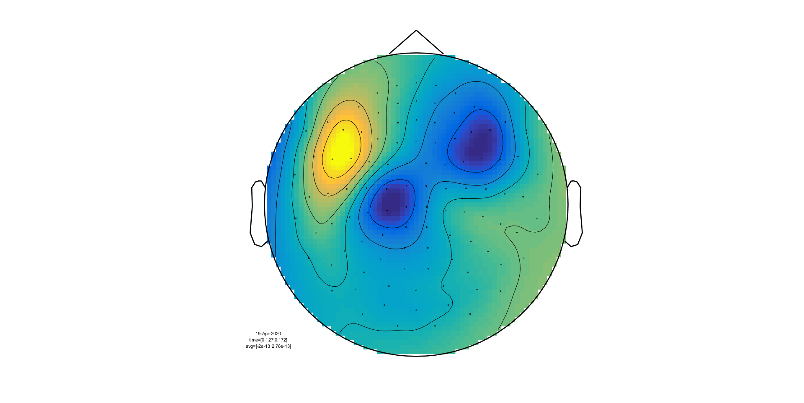

Notice how you on the topographies can make a qualified guess about the number of equivalent current dipoles and their approximate location.

## Create a leadfield and grid

Leadfield is an important concept. For any given source (a grid point inside the brain) it is calculated how each sensor (magnetometer, gradiometer or electrode) sees (how much T, T/m or V would it pick up) a source with unit strength (1 nAm). One might say that it says: "For a given source, _if_ it is active, how _would_ the different sensors see it. It is sometimes called the forward model in MEG/EEG literature. In FieldTrip they have kept the engineering term, and it is referred to as the *leadfield*.

We define the leadfields for each of the three kinds of data here (magnetometers, gradiometers and electrodes). To create the leadfield we first need to create a *source space*. The source space is out model of where the sources that generate the measured signals (potentially) can come from. How we define the source space determines our source reconstruction. We further assume that the dipole(s) can be anywhere in the brain. We will, therefore, create an evenly spaced grid as our source space and then calculate the leadfield for the points in the grid. In FieldTrip both these steps can be done with `ft_prepare_leadfield`.

Create a grid around the brain and estimate the leadfield for each of the grid points in the brain. Make three separate leadfields for electrodes, magnetometers, and gradiometers.

```matlab
%% make leadfields for EEG
cfg = [];
cfg.headmodel       = headmodel_eeg;
cfg.elec            = timelockeds{4}.elec;
cfg.senstype        = 'eeg';
cfg.grid.resolution = 1;            % Grid spacing 1x1x1 of unit defined below
cfg.grid.unit       = 'cm';         % Grid unit

leadfield_eeg = ft_prepare_leadfield(cfg, timelockeds{4});

%% Make leadfields for MEG: magnetometers
cfg.senstype        = 'meg';
cfg.grad            = timelockeds{4}.grad;
cfg.headmodel       = headmodel_meg;
cfg.channel         = 'megmag';

leadfield_mag = ft_prepare_leadfield(cfg, timelockeds{4});

%% Make leadfields for MEG: gradiometers
cfg.senstype        = 'meg';
cfg.grad            = timelockeds{4}.grad;
cfg.headmodel       = headmodel_meg;
cfg.channel         = 'meggrad';

leadfield_grad = ft_prepare_leadfield(cfg, timelockeds{4});
```

Plot the grids and the headmodel:

```matlab
%% plot grid and headmodel
figure; hold on
ft_plot_mesh(leadfield_mag);
ft_plot_headmodel(headmodel_meg);
```

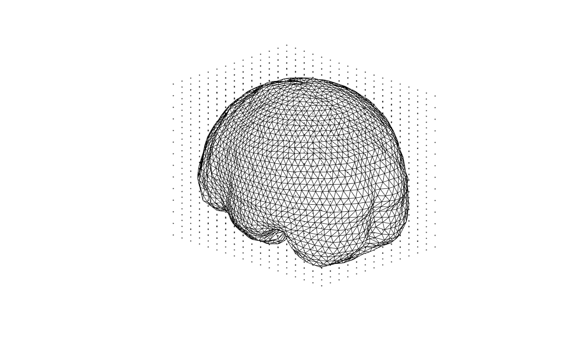

```matlab
%% Save leadfileds
save('dipole_leadfield.mat', 'leadfield_mag','leadfield_grad','leadfield_eeg')
```

## Fit dipoles
We fit single dipoles separately for the three kinds of sensors (magnetometers, gradiometers and electrodes). We do it for two latencies identified in the (sensor-level) evoked responses above:  
1. Early sensory response at 45-65 msec
2. Late sensory response at 115-155 msec

We will use these values several times, so start defining them:

```matlab
%% Define Times of interes
early_latency   = [0.045 0.065];    % s
late_latency    = [0.115 0.155];    % s
```
Our optimization parameter is residual variance, i.e. we will try to minimize the residual variance between fitted values and actutal measures data. This is how much data that is left unexplained by the dipole model. This procedure is done with `ft_dipolefitting`:

```matlab
cfg = [];
cfg.gridsearch      = 'yes';            % search the grid for an optimal starting point
cfg.numdipoles      = 1;                % N dipoles in model
cfg.symmetry        = [];               % Leave empty for single dipole fit
cfg.grid            = leadfield_mag;    % supply the grid/leadfield
cfg.headmodel       = headmodel_meg;    % supply the headmodel
cfg.dipfit.metric   = 'rv';             % the metric to minimize
cfg.model           = 'regional';       % Assume that the dipole has a fixed position
cfg.senstype        = 'meg';            % sensor type
cfg.channel         = 'megmag';         % which channels to use
cfg.nonlinear       = 'yes';            % do a non-linear search
cfg.latency         = early_latency;    % specify the latency
cfg.backproject     = 'yes';            % Predict values from model

dipole_mag_early = ft_dipolefitting(cfg, timelockeds{4});
```

## Dipole fit diagnostics
Take a look at what is in the newly created `dipole_mag_early` structure. The details about the dipole are stored in the `dip` field.

> **Question 4.1:** Explain what the various values in `dipole_mag_early.dip` contain?
>
> Hits: do the following plots, and it might be easier to answer.

For inspection and diagnostics of the dipole fit, let us take a look at where the dipole location. We will lode the resliced MRI from Tutorial 03 and plot the dipole on MRI slices:

```matlab
%% Load brain (for plotting)
load('mri_resliced_cm.mat'); disp('done');

%% Plot dipole on brain
figure; hold on

ft_plot_dipole(dipole_mag_early.dip.pos(1,:), mean(dipole_mag_early.dip.mom(1:3,:),2), 'color', 'r')
pos = mean(dipole_mag_early.dip.pos,1);
ft_plot_slice(mri_resliced_cm.anatomy, 'transform', mri_resliced_cm.transform, 'location', pos, 'orientation', [1 0 0], 'resolution', 0.1)
ft_plot_slice(mri_resliced_cm.anatomy, 'transform', mri_resliced_cm.transform, 'location', pos, 'orientation', [0 1 0], 'resolution', 0.1)
ft_plot_slice(mri_resliced_cm.anatomy, 'transform', mri_resliced_cm.transform, 'location', pos, 'orientation', [0 0 1], 'resolution', 0.1)

ft_plot_crosshair(pos, 'color', [1 1 1]/2);
axis tight
```

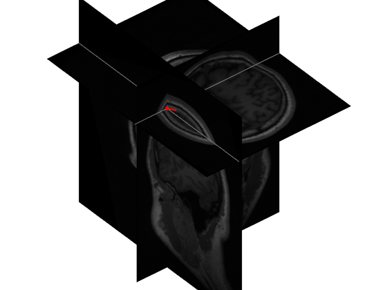

Try to rotate the figure to see where the dipole ended up in the brain.

Now, look at the values related to the dipole itself. You can use the code below to inspect the dipole moment, dipole strength, and the residual variance.

```matlab
%% Plot dipole diagnostics
figure;
subplot(3,1,1)
plot(dipole_mag_early.time, dipole_mag_early.dip.mom); title('Dipole moment')
subplot(3,1,2)
plot(dipole_mag_early.time, sqrt(mean(dipole_mag_early.dip.mom.^2))); title('Dipole strength')
subplot(3,1,3)
plot(dipole_mag_early.time, dipole_mag_early.dip.rv); title('Residual variance')
```
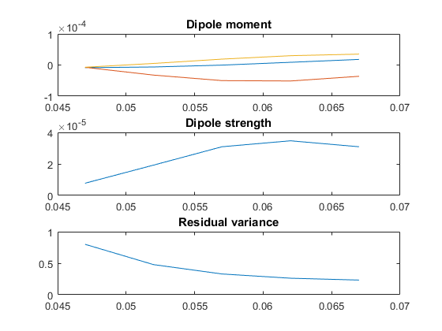

Another useful diagnostic is to assess how well the predicted activity pattern at the scalp generated by the dipole model corresponds to the actual data.

The measured data and the predicted data is stored respectively in the `Vdata` and `Vmodel` fields. From these we can create a "dummy" dataset and plot it using `ft_topoplotER`:

```matlab
%% Plot measures vs. predicted topographies
% Calculate error
error = dipole_mag_early.Vdata - dipole_mag_early.Vmodel;

% Make dummy data
temp = timelockeds{4};
temp.Vdata  = dipole_mag_early.Vdata;
temp.Vmodel = dipole_mag_early.Vmodel;
temp.error  = error;
temp.label  = dipole_mag_early.label;
temp.time   = dipole_mag_early.time;

% Plot (ignore the warnings)
figure
cfg = [];
cfg.zlim        = [-6e-14 6e-14];       % Color limits
cfg.layout      = 'neuromag306mag.lay'; % layour for magnetometers
cfg.figure      = gcf;
cfg.parameter   = 'Vdata';
subplot(1,3,1); ft_topoplotER(cfg,temp); title('Data');
cfg.parameter   = 'Vmodel';
subplot(1,3,2); ft_topoplotER(cfg,temp); title('Model')
cfg.parameter   = 'error';
subplot(1,3,3); ft_topoplotER(cfg,temp); title('Difference')
```

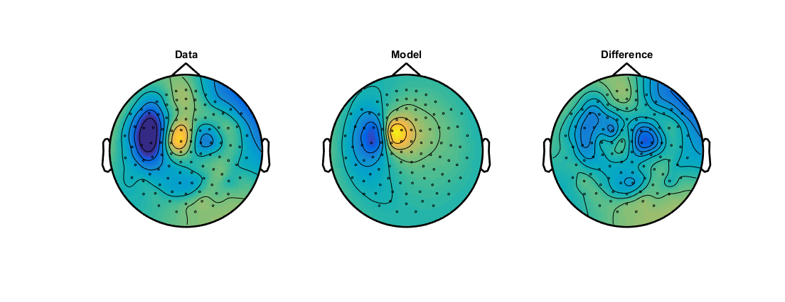

> **Question 4.2:** Give your interpretation of the dipole diagnostics? 

## Two-dipole models

Do a dipole fit again for the late ERF component by changing `cfg.latency = late_latency` and rerun the code.

Plot measures versus predicted topographies again. See if you get the same result as below:

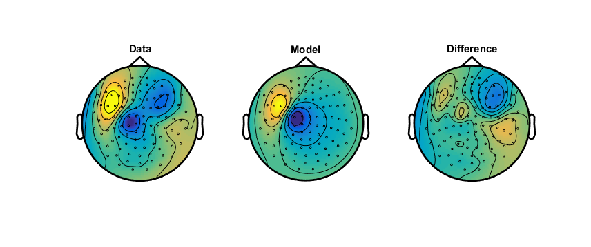

The residual activity hint that there might be an ipsilateral dipole. Try to do another dipole fit, this time specifying at two dipole model:

```matlab
%% Late component: two dipoles
cfg = [];
cfg.gridsearch      = 'yes';            % search the grid for an optimal starting point
cfg.numdipoles      = 2;                % N dipoles in model (we expect bilateral  activity)
cfg.symmetry        = 'x';              % Symmetrical dipoles
cfg.headmodel       = headmodel_meg;    % supply the headmodel
cfg.dipfit.metric   = 'rv';             % the metric to minimize
cfg.model           = 'regional';       % Assume that the dipole has a fixed position
cfg.senstype        = 'meg';            % sensor type
cfg.channel         = 'megmag';         % which channels to use
cfg.nonlinear       = 'yes';            % do a non-linear search
cfg.latency         = late_latency;     % specify the latency

dipole_mag_late = ft_dipolefitting(cfg, timelockeds{4});
```
Plot the results:

```matlab
%% Plot dipoles
figure; hold on
ft_plot_dipole(dipole_mag_late.dip.pos(1,:), mean(dipole_mag_late.dip.mom(1:3,:),2), 'color', 'r')
ft_plot_dipole(dipole_mag_late.dip.pos(2,:), mean(dipole_mag_late.dip.mom(4:6,:),2), 'color', 'r')
pos = mean(dipole_mag_late.dip.pos,1);
ft_plot_slice(mri_resliced_cm.anatomy, 'transform', mri_resliced_cm.transform, 'location', pos, 'orientation', [1 0 0], 'resolution', 0.1)
ft_plot_slice(mri_resliced_cm.anatomy, 'transform', mri_resliced_cm.transform, 'location', pos, 'orientation', [0 1 0], 'resolution', 0.1)
ft_plot_slice(mri_resliced_cm.anatomy, 'transform', mri_resliced_cm.transform, 'location', pos, 'orientation', [0 0 1], 'resolution', 0.1)
ft_plot_crosshair(pos, 'color', [1 1 1]/2);
axis tight
```

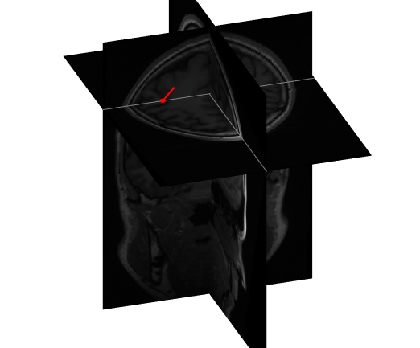

Rotate the figure to see where the dipole ended up in the brain. Then take a look at what is in the `dip` structure now?

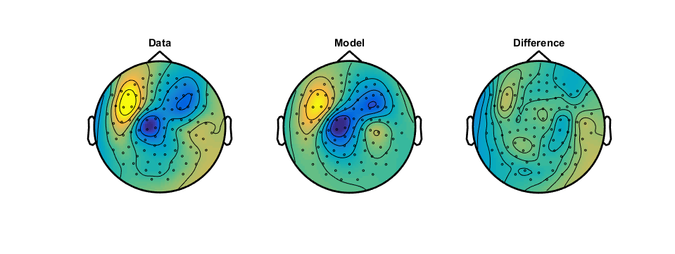

## Compare dipole fits for electrodes, magnetometers, and gradiometers
In the following section, you find code that do the dipole fits as above but will loop over all sensor types (magnetometers, gradiometers, and electrodes) and all five experimental conditions (i.e. stimulations on the five fingers on the right hand) for the early and late ERF components.

```matlab
%% dipole fits

events = [1, 2, 4, 8, 16];
n_events = length(events); % the events to be looped through

% the six cell arrays below are preparation for the fits
dipoles_mag_early =  cell(1, n_events);
dipoles_grad_early = cell(1, n_events);
dipoles_eeg_early =  cell(1, n_events);

dipoles_mag_late =  cell(1, n_events);
dipoles_grad_late = cell(1, n_events);
dipoles_eeg_late =  cell(1, n_events);

% Loop over conditions
for event_index = 1:n_events

    cfg = [];
    cfg.gridsearch      = 'yes';
    cfg.dipfit.metric   = 'rv';
    cfg.model           = 'regional';
    cfg.nonlinear       = 'yes';

    % magnetometer fits
    cfg.grid            = leadfield_mag;
    cfg.headmodel       = headmodel_meg; 
    cfg.senstype        = 'meg';
    cfg.channel         = 'megmag';
    cfg.latency         = early_latency; %% specify the latency
    cfg.numdipoles      = 1; %% we only expect contralateral activity
    cfg.symmetry        = []; %% empty for single dipole fit
    dipoles_mag_early{event_index} = ft_dipolefitting(cfg, timelockeds{event_index});
    
    cfg.latency         = late_latency;
    cfg.numdipoles      = 2;
    cfg.symmetry        = 'x';
    cfg.grid            = [];
    dipoles_mag_late{event_index} = ft_dipolefitting(cfg, timelockeds{event_index});
 
    % gradiometer fits
    cfg.channel         = 'meggrad';
    cfg.grid            = leadfield_grad;

    cfg.latency         = early_latency;
    cfg.numdipoles      = 1;
    cfg.symmetry        = [];
    dipoles_grad_early{event_index} = ft_dipolefitting(cfg, timelockeds{event_index});
    
    cfg.latency         = late_latency;
    cfg.numdipoles      = 2;
    cfg.symmetry        = 'x';
    cfg.grid            = [];
    dipoles_grad_late{event_index} = ft_dipolefitting(cfg, timelockeds{event_index});
    
    %% electrode fits
    cfg.senstype        = 'eeg';
    cfg.channel         = 'eeg';
    cfg.grid            = leadfield_eeg;
    cfg.headmodel       = headmodel_eeg;
    
    cfg.latency         = early_latency;
    cfg.numdipoles      = 1;
    cfg.symmetry        = [];
    dipoles_eeg_early{event_index} = ft_dipolefitting(cfg, timelockeds{event_index});
    
    cfg.latency         = late_latency;
    cfg.numdipoles      = 2;
    cfg.symmetry        = 'x';
    cfg.grid            = [];
    dipoles_eeg_late{event_index} = ft_dipolefitting(cfg, timelockeds{event_index});
end
disp('Done')
```

### Plot EARLY dipoles
Plot all the dipole fits for the early ERF/ERP component for comparison:

```matlab
%% plot dipoles_early on brain
% Plot settings
close all
all_dipoles = {dipoles_mag_early dipoles_grad_early dipoles_eeg_early};
colours = {'r' 'g' 'y' 'b' 'm'};
fingers = {'right little finger' 'right ring finger' 'right middle finger' 'right index finger' 'right thumb'};

% Loop and plot
for dipole_type_index = 1:length(all_dipoles)
    figure;
    for event_index = 1:n_events
        subplot(2, 3, event_index)
        dipole = all_dipoles{dipole_type_index}{event_index};

        hold on
        ft_plot_dipole(dipole.dip.pos(1, :), mean(dipole.dip.mom(1:3, :), 2), 'color', colours{event_index});

        pos = mean(dipole.dip.pos, 1);

        ft_plot_slice(mri_resliced_cm.anatomy, 'transform', mri_resliced_cm.transform, 'location', pos, 'orientation', [1 0 0], 'resolution', 0.1);
        ft_plot_slice(mri_resliced_cm.anatomy, 'transform', mri_resliced_cm.transform, 'location', pos, 'orientation', [0 1 0], 'resolution', 0.1);
        ft_plot_slice(mri_resliced_cm.anatomy, 'transform', mri_resliced_cm.transform, 'location', pos, 'orientation', [0 0 1], 'resolution', 0.1);

        title(fingers{event_index})

        axis tight
        axis off
    end
end
```

Dipole EARLY for magnetometers. We get a good fit to the SI:

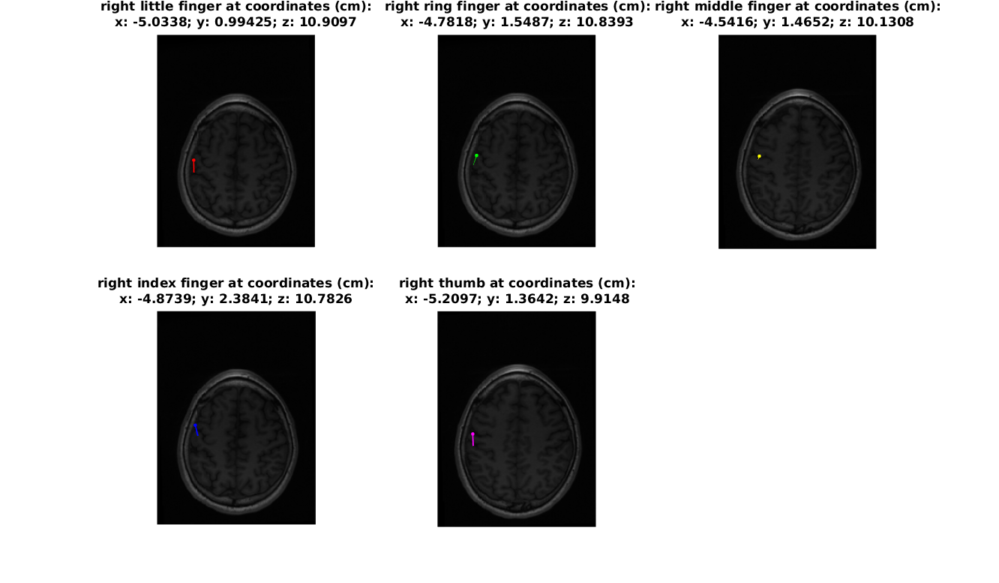

Dipole EARLY for gradiometers. We get a good fit to the SI:

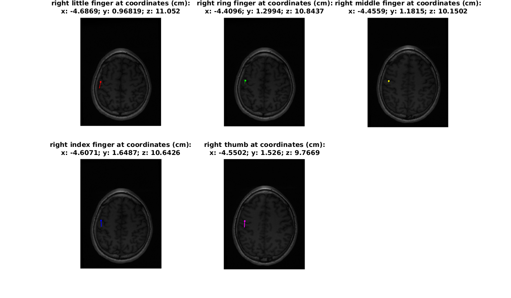

Dipole EARLY plot electrodes. We get a bad fit to the SI:

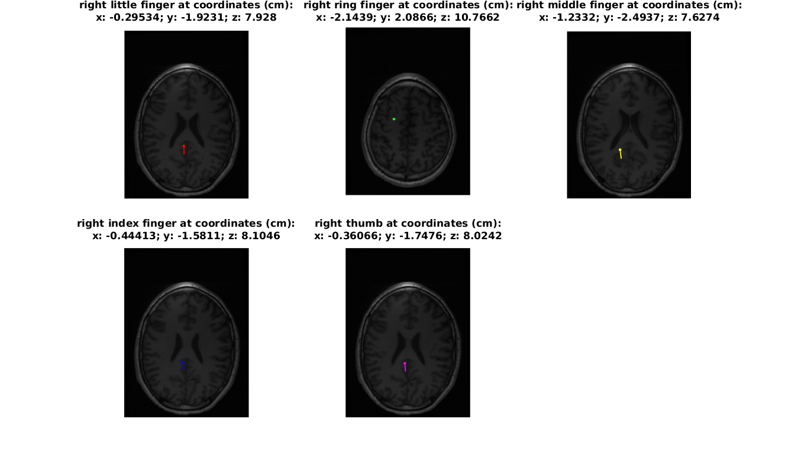

You can still rotate each of the subplots. Try to rotate these with the plot tools to get a feeling of where the dipoles are located for the different conditions and sensor types.

## Plot LATE dipoles
Plot all the dipole fits for the late component for comparison:

```matlab
%% plot dipoles_late on brain
% Plot settings
close all
all_dipoles = {dipoles_mag_late dipoles_grad_late dipoles_eeg_late};
colours = {'r' 'g' 'y' 'b' 'm'};
fingers = {'right little finger' 'right ring finger' 'right middle finger' 'right index finger' 'right thumb'};

% Loop and plot
for dipole_type_index = 1:length(all_dipoles)
    figure;
    for event_index = 1:n_events
        subplot(2, 3, event_index)
        dipole = all_dipoles{dipole_type_index}{event_index};

        hold on
        ft_plot_dipole(dipole.dip.pos(1, :), mean(dipole.dip.mom(1:3, :), 2), 'color', colours{event_index});
        ft_plot_dipole(dipole.dip.pos(2, :), mean(dipole.dip.mom(4:6, :), 2), 'color', colours{event_index});

        pos = mean(dipole.dip.pos, 1);

        ft_plot_slice(mri_resliced_cm.anatomy, 'transform', mri_resliced_cm.transform, 'location', pos, 'orientation', [1 0 0], 'resolution', 0.1);
        ft_plot_slice(mri_resliced_cm.anatomy, 'transform', mri_resliced_cm.transform, 'location', pos, 'orientation', [0 1 0], 'resolution', 0.1);
        ft_plot_slice(mri_resliced_cm.anatomy, 'transform', mri_resliced_cm.transform, 'location', pos, 'orientation', [0 0 1], 'resolution', 0.1);

        title(fingers{event_index})

        axis tight
        axis off
    end
end
```

Dipole LATE for magnetometers. We get a bad fit for the SII:

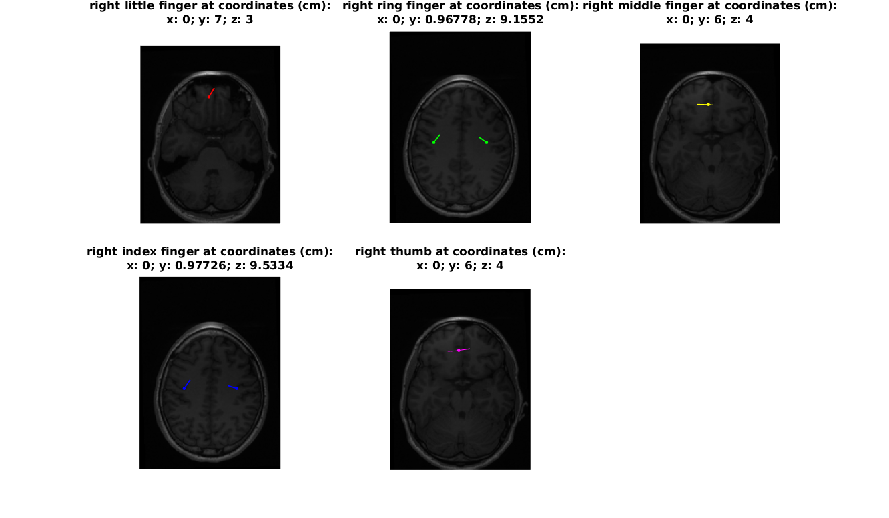

Dipole LATE for gradiometers. We get a good fit for the SII:

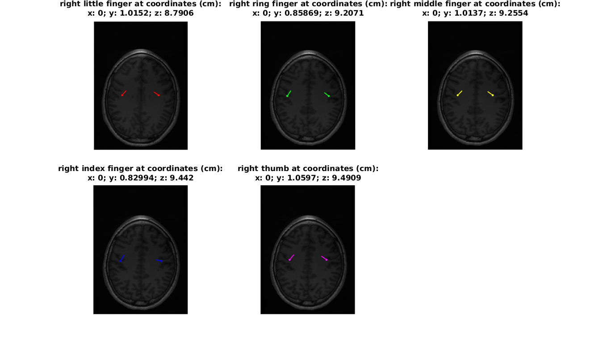

Dipole LATE plot electrodes. We get a bad fit for the SII:

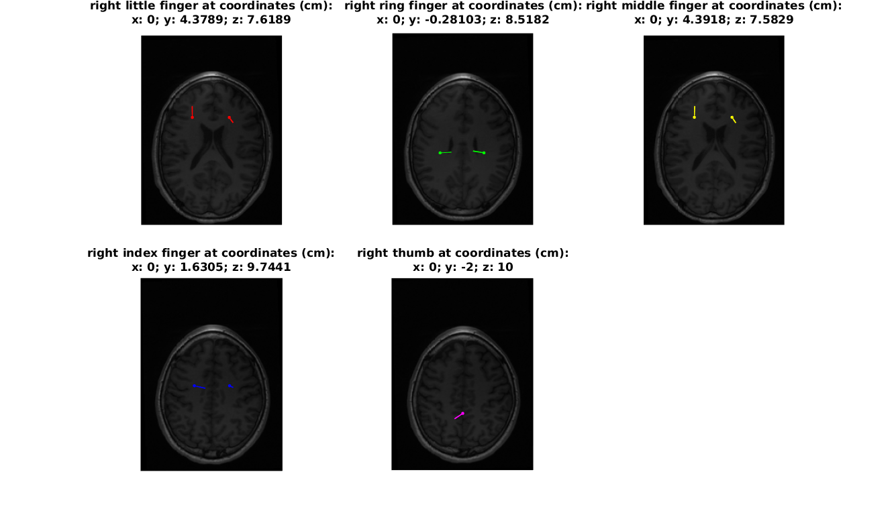

## Intermittent conclusions
We get the best fits from the gradiometers. In contrast, the electrodes seem way off.  

Now try to load the spherical head model for EEG created in Tutorial 03. Then rerun the dipole analysis script to do dipole fits based on the sphere model instead of the tissue-based head model. 

## Dipole fits with concentric spheres head model

Now try to do the dipole fits again, but this time using the spherical head models from *Tutorial 03*.

```matlab
%% Load spherical headmodels
load('headmodel_meg_sphere.mat')
load('headmodel_eeg_sphere.mat')
```

Run the dipole fits again, but this time change the ``cfg.headmodel`` to `headmodel_meg_sphere` and `headmodel_eeg_sphere`. Look at the dipole locations on the plots as before:

Dipole EARLY for magnetometers _single sphere_. We get a good fit to the SI:

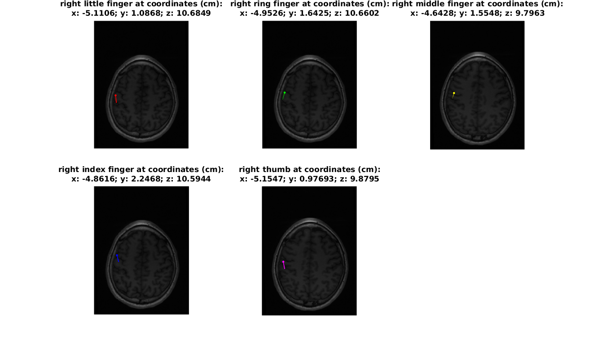

Dipole EARLY for gradiometers _single sphere_. We get a good fit to the SI:

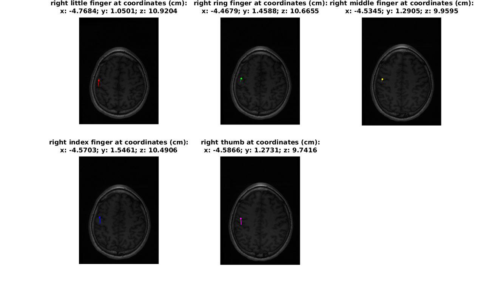

Dipole EARLY for electrodes _concentric spheres_. _Now_ We get a good fit to the SI:

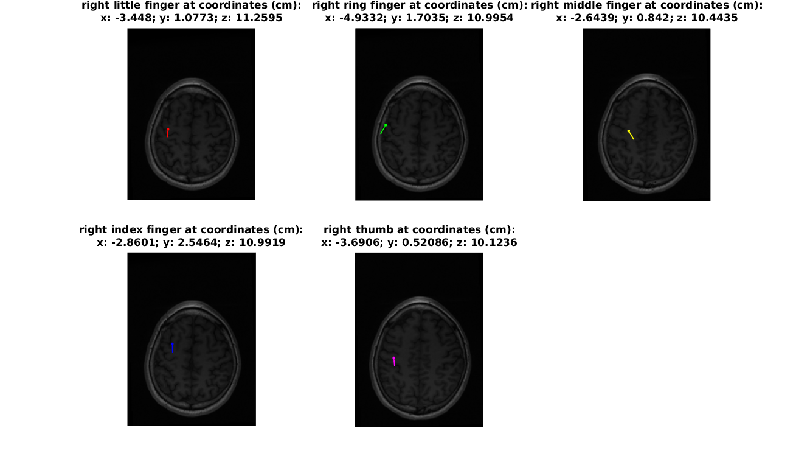

Dipole LATE for magnetometers _single sphere_. We still get a bad fit to the SII:

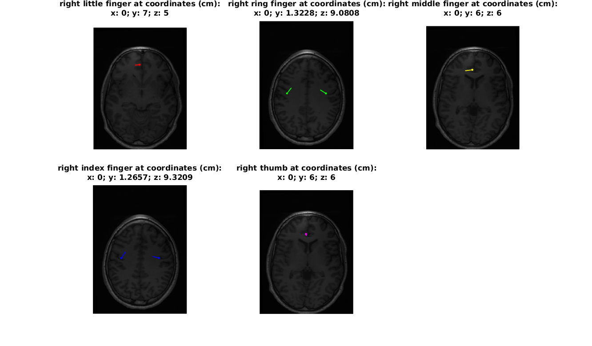

Dipole LATE plot gradiometers _single sphere_. We get a good fit for the SII:

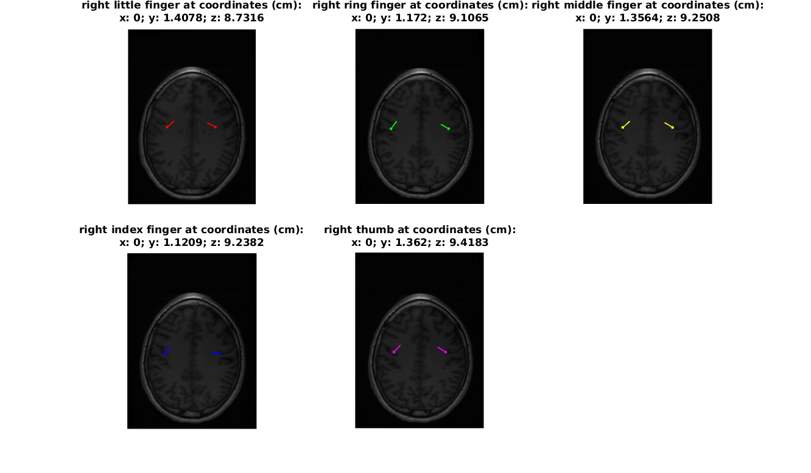

Dipole LATE plot electrodes _concentric spheres_. _Now_ we also get a good fit to the SII:

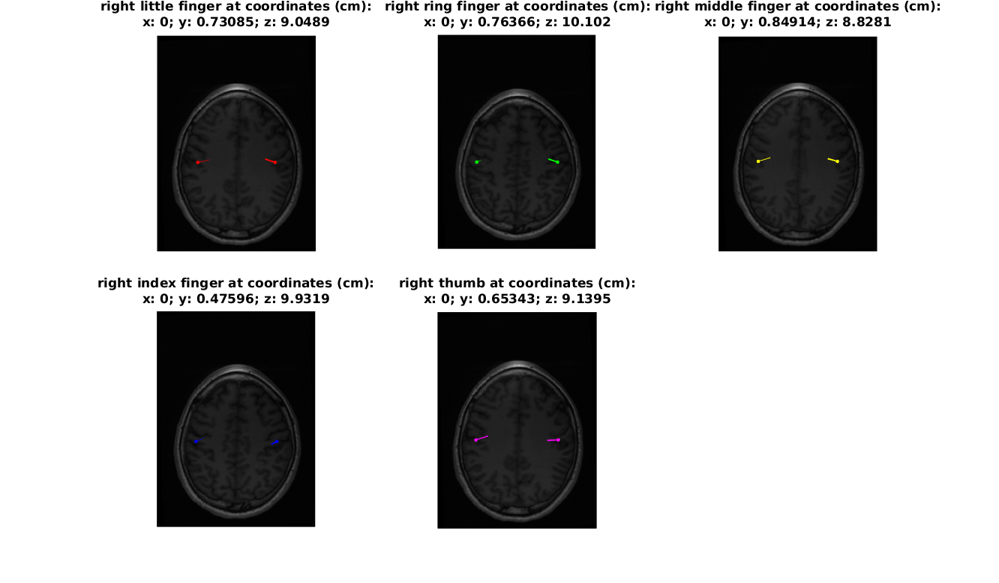

## End of Tutorial 4A
With the non-tissue related models, we can get reasonable fits with the EEG as well. Still, spherical models do not make sense for the more advanced modelling techniques such as beamformer and minimum-norm estimates that we will turn to in next tutorials. This underlines that the tissue-based EEG head models are hard to create (It may have to do with a poor quality MRI), but in general the advantage of MEG is that you just need to be able to delineate the brain.
