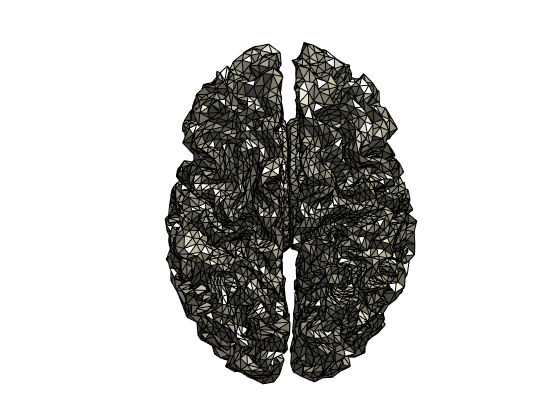
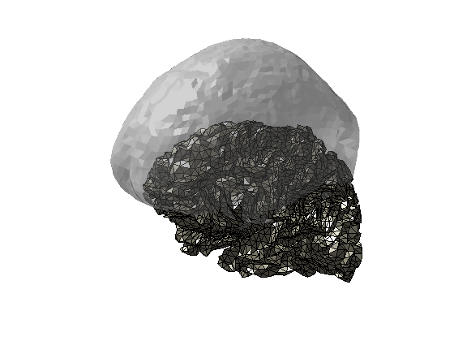
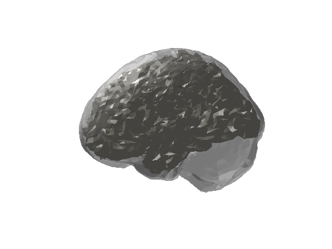
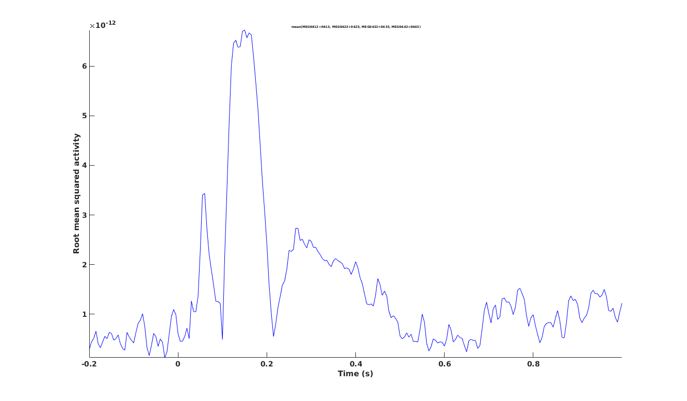
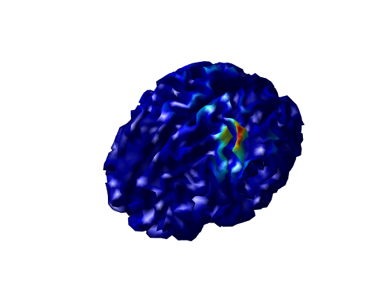
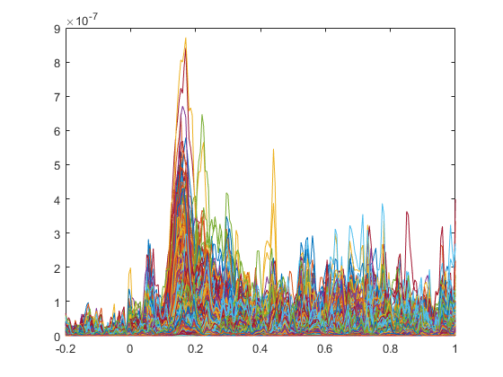
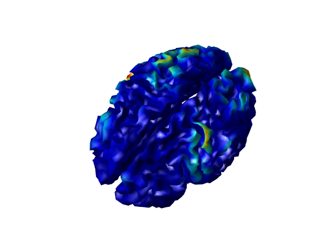
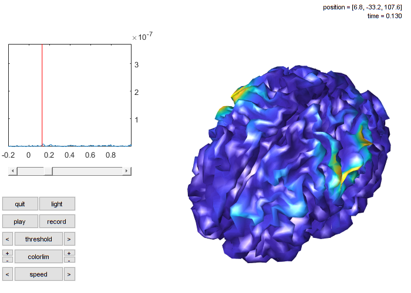
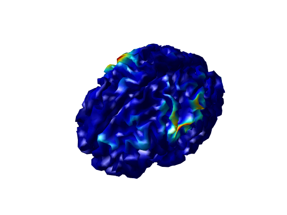

# Minimum-Norm Estimate (MNE)
In this tutorial, you will do source reconstruction with Minimum-Norm Estimates (MNE). This method is related to dipole fits but more advanced in that it assumes dipoles distributed equally over the cortex that all, to some extent, are active at any point in time.

The steps for MNE source reconstruction are:
1. Create a surface source model.
2. Create head model and leadfield
3. Do inverse modelling
4. Evaluate outcome.

The first step is the most time consuming, it takes up to 10 hours to run, and is not covered in the main tutorial (but take a look at Tutorial 99 to see how it can be done). Instead, you should load the already preprocessed files and then do the source reconstruction.

## Setup paths
Change these to appropriate paths for your operating system and setup

```matlab
restoredefaultpath
addpath('C:/fieldtrip/')                % Change to match your FieldTrip path
ft_defaults

%% Define subject paths
data_path = 'C:/meeg_course/data';      % Change to match your data path

subjects_and_dates = ...
                    {
                        'NatMEG_0177/170424/'  % add more as needed
                    };
           
% List of all MEEG filenames          
filenames = {...
        'tactile_stim_raw_tsss_mc.fif' 
        'tactile_stim_raw_tsss_mc-1.fif'
        'tactile_stim_raw_tsss_mc-2.fif'
            };

%% Define where to put output data
meg_path = fullfile(data_path, subjects_and_dates{1}, 'MEG');
mri_path = fullfile(data_path, subjects_and_dates{1}, 'MRI');

output_path = meg_path;                 % Save in MEG folder
```

## Import source space
Minimum-norm estimate (MNE) use a cortical surface as source model. We will not run the preparation of the cortical surface as it takes about 10 hours. You can find tutorial documentation on how the cortical surface source model was made in Tutorial 99. In the tutorial, you can read how to export MRI to *Freesurfer* to extract the cortical surface, and set up a source model with *MNE-C*. In short, the  procedure creates a set of point equally sampled across the cortical surface. These points are our source model for MNE. 

You can find the file *Sub02-oct-6-src.fif* in the tutorial data files.

We read the *MNE-C* source space into MATLAB by using ``ft_read_headshape``:

```matlab
%% Read Freesurfer/MNE source space
% Go to Freesurfer dir
cd(fullfile(mri_path,'freesurfer/Sub02/bem'))  % This should change if looping over subjects

% Read model
sourcemodel = ft_read_headshape('Sub02-oct-6-src.fif', 'format', 'mne_source'); 

% Change back to output dir
cd(output_path)
````

Note that the units are in meters. You can use ``ft_convert_units`` to make the units millimetres instead:

```matlab
%% Convert units
sourcemodel = ft_convert_units(sourcemodel, 'mm');
````

You can plot the source model with the function ft_plot_mesh:

```matlab
%% Plot source space
figure; ft_plot_mesh(sourcemodel, 'edgecolor', 'k'); camlight 
````



Looks nice!

Each point on the grid represents a dipole in the MNE source reconstruction.

> **Question 4.3:** How many dipoles will the MNE source reconstruction contain?

## Load MEG/EEG data and headmodel
```matlab
%% Load headmodel and MEG/EEG data
load('headmodel_mne_meg.mat')
load('timelockeds.mat')
````

Now you should have the three main ingredients for doing MNE source reconstruction with MEG:

1. Evoked MEG data.
2. A volume model of the brain.  
3. A source space model of the cortical surface.  

Take a look at the headmodel and sourcemodel toghether:

```matlab
figure; hold on
ft_plot_vol(headmodel_mne_meg, 'facealpha', 0.5, 'edgecolor', 'none');
ft_plot_mesh(sourcemodel, 'edgecolor', 'k'); camlight 
````




### Aligning source space and volume model

We have aligned the MRI that we used to create the volume model to the Neuromag coordinate system used by the MEG scanner. However, to make the cortical surface in Freesurfer, we had to convert the MRI to the SPM coordinate system and exported it to Freesurfer. When we imported the source space back into MATLAB, it kept this coordinate system. Our head model and source space are now in two different coordinate systems.

To get the cortical surface back into the head, you need to transform the points in source space to the coordinate system of the head model. Load the transformation matrix of the resliced MRI in the SPM coordinate system (_transform_vox2spm_rs_). We will use this to create a transformation from the SPM coordinate system to the *neuromag* coordinate system. If you have run the prepare MNE source space tutorial, you must read the transformation files you created yourself.

Note: the following step assumes that all units are in millimetres. Make sure that this is the case.

```matlab
%% Transform source space
% from voxel to spm-coordsys.
load transform_vox2spm.mat

% Load segmented mri and get transform
load mri_segmented_mne.mat

% Get transformation matrix from voxel to neuromag-coordsys
transform_vox2neuromag = mri_segmented_mne.transform;

% Get transformation matrix from spm to neuromag
T = transform_vox2neuromag/transform_vox2spm_rs;
```

Now transform the source space using the transformation matrix ``T``. Note, that if you run the following line several times, it applies the transformation each time, transforming from the current position to a new location, which will be wrong. If in doubt, save the source model before proceeding.

```matlab
% Transform source model
sourcemodelT = ft_transform_geometry(T, sourcemodel);
````

Take a look at the headmodel and sourcespace again:

```matlab
figure; hold on
ft_plot_vol(headmodel_mne_meg, 'facealpha', 0.5, 'edgecolor', 'none');
ft_plot_mesh(sourcemodelT, 'edgecolor', 'k'); camlight 

````



Remember to save the source model.

```matlab
%% Save transformed source space
save('sourcemodelT.mat','sourcemodelT')
disp('Done');
````

## MNE source reconstruction on MEG data

Now we can create the leadfield and do the source reconstruction. Load the relevant files (if you do not already have then loaded):

```matlab
%% Load (or re-load) data
load('timelockeds.mat')
load('sourcemodelT.mat')
load(' headmodel_mne_meg.mat')
disp('done')
````

For this tutorial, we will use the stimulation of the index finger, corresponding the 4th condition:

```matlab
%% Select data (trigger = 4)
data_meg = timelockeds{4};
````

Calculate the leadfield using ft_prepare_leadfield with the MEG data, the source model, and the appropriate head model. Here we use the gradiometers (``meggrad``).

```matlab
cfg = [];
cfg.grad             = data_meg.grad;              % sensor positions
cfg.channel          = 'meggrad';                  % the used channels
cfg.senstype         = 'meg';
cfg.grid.pos         = sourcemodelT.pos;           % source points
cfg.grid.inside      = 1:size(sourcemodelT.pos,1); % all source points are inside of the brain
cfg.headmodel        = headmodel_mne_meg;          % volume conduction model

leadfield_mne = ft_prepare_leadfield(cfg,data_meg);
```

Take a look at the ``leadfield_mne`` structure.

Plot the points in the surface MNE source model compared to the "grid" source model used to do the dipole fits (and later on beamformers). Require that you have the leadfield from the dipole fit tutorial loaded in memory. Otherwise, you have to re-load it (or skip this part).

```matlab
%% compare source models
plot3(leadfield_mne.pos(:,1),leadfield_mne.pos(:,2),leadfield_mne.pos(:,3),'o'); % o's not zero's
plot3(leadfield.pos(:,1),leadfield.pos(:,2),leadfield.pos(:,3),'o');             % o's not zero's
```

## MNE source reconstruction
Finally, we do the source reconstruction using ``ft_sourceanalysis``. ``ft_sourceanalysis`` is another general-purpose FieldTrip function (type `help ft_sourceanalysis` to see all the options). Specify ``cfg.method = 'mne'`` to do source reconstruction with MNE.

MNE require additional parameters (``cfg.mne.lambda``) that indicate how to scale the noise covariance. Note that the noise covariance matrix already is in the `data` structure. This was calculated already in the preprocessing steps when we calculated the evoked fields.

```matlab
%% Do MNE
cfg                     = [];
cfg.method              = 'mne';
cfg.channel             = 'meggrad';
cfg.senstype            = 'meg';
cfg.grid                = leadfield_mne;
cfg.headmodel           = headmodel_mne_meg;
cfg.mne.prewhiten       = 'yes';
cfg.mne.lambda          = 3;
cfg.mne.scalesourcecov  = 'yes';

source_mne  = ft_sourceanalysis(cfg,data_meg);
```

Look at the ``source_mne`` structure; especially the ``source_mne.avg`` structure. 

> **Question 4.4:** What is in the output structure, what is the dimension of the data? 

```matlab
%% Save data
save('source_mne.mat', 'source_mne'); disp('done')
```
## Visualize MNE

Plot the MNE source reconstruction on the grid. The ``source_mne`` structure contains values for all grid points and all time points. To visualize the source reconstruction on the grid, we need to decide what time points to plot.

Go back to the evoked data to find some interesting times to plot using ``ft_multiplotER``. Since we used the gradiometers, we start by plotting the fields from the combined gradiometers. For example, let us compare the first peak around 50 ms and the large peak from 140-150 ms. Use the drag-and-click tool on the multiplot to plot topographical plots.

```matlab
%% Look at sensor-level ERF
data_cmb = ft_combineplanar([],data_meg); %Combine gradiometers

cfg = [];
cfg.layout = 'neuromag306cmb.lay';
figure; ft_multiplotER(cfg, data_cmb);
````

Find peaks in sensor space, look at the topographies, and try to guess what the sources might look like?




Select the time-windows of interest and plot on the source space:

```matlab
%% Plot MNE source estimate
% add to triangulation information source reconstruction for plotting
source_mne.tri = sourcemodelT.tri;

% plot
cfg = [];
cfg.method          = 'surface';
cfg.funparameter    = 'pow';
cfg.funcolormap     = 'jet';    % Change for better color options
cfg.latency         = .060;     % The time-point to plot (s)
cfg.colorbar        = 'no';

ft_sourceplot(cfg, source_mne)
```



> **Question 4.5:** By a glance, where do you see activated sources? How many different cortical patches are "active" at this time point?

This image shows a single time point for all estimated sources. Each source (i.e., each grid-point on the cortical surface) has a time series of activation. You can in principle treat each source as its own "channel" -- you can view the activation of all sources over time, analogous to the activation in MEG or EEG channels. Use MATLAB to plot source activation across time (here only plotting every third time-series to save memory)

```matlab
%% Plot source time-courses
plot(source_mne.time, source_mne.avg.pow(1:3:end,:));
```



Try to visualize the sources of some of the following components from the scalp data. You can visualize the average across time-points over with ``ft_sourceplot`` by changing the ``cfg.latency`` to an interval ``[start stop]``, and give an additional argument ``cfg.avgovertime = 'yes'``.

```matlab
cfg = [];
cfg.method          = 'surface';
cfg.funparameter    = 'pow';
cfg.funcolormap     = 'jet';
cfg.latency         = [.350 .40]; % average actvity from 350 ms to 400 ms
cfg.avgovertime     = 'yes';
cfg.colorbar        = 'no';

ft_sourceplot(cfg, source_mne)
```



To get an overview of both the temporal and spatial features of the source reconstruction, you can use ``ft_sourcemovie`` to make a movie of the source activation. Note that the triangulation field must be present in the `source_mne` structure for ``ft_sourcemovie`` to work. You can play around with the scaling to get a more beautiful looking movie.

```matlab
cfg = [];
cfg.funparameter = 'pow';
ft_sourcemovie(cfg,source_mne);
```



Now try to use ``ft_sourceplot`` and ``ft_sourcemovie`` (as above) to plot the source space topography of other time points and explore the source topo.

> **Question 4.6:** Can you find the time-point corresponding to the image below? Try to look at the scalp topographies to get an educated guess about the time.  



It is difficult to answer what type of source model and source reconstruction method that is better. The matter model depends on the question you want to answer and the kind of signal you are interested in for the particular answer. For example, if you know that a focal patch of cortex generates the signal, then a single dipole model might be sufficient, and you do not gain extra information by including the entire cortex. Similar, if we know that the process we are interested in requires distributed sources, then it is not valid to assume that a single dipole is sufficient.

> **Question 4.7:** Around what times in the time-series might a dipole model be sufficient, and at what points is a distributed model better?

## End of Tutorial 4B
This tutorial demonstrates how to do MNE source reconstruction. Compared to the dipole (and beamformer, as you will see later) it differs in how to prepare the source model because of the assumptions behind MNE. But the additional assumption means that MNE is a quite robust source reconstruction method.