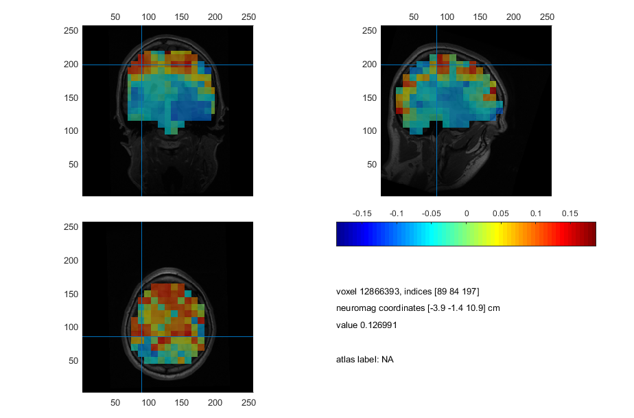
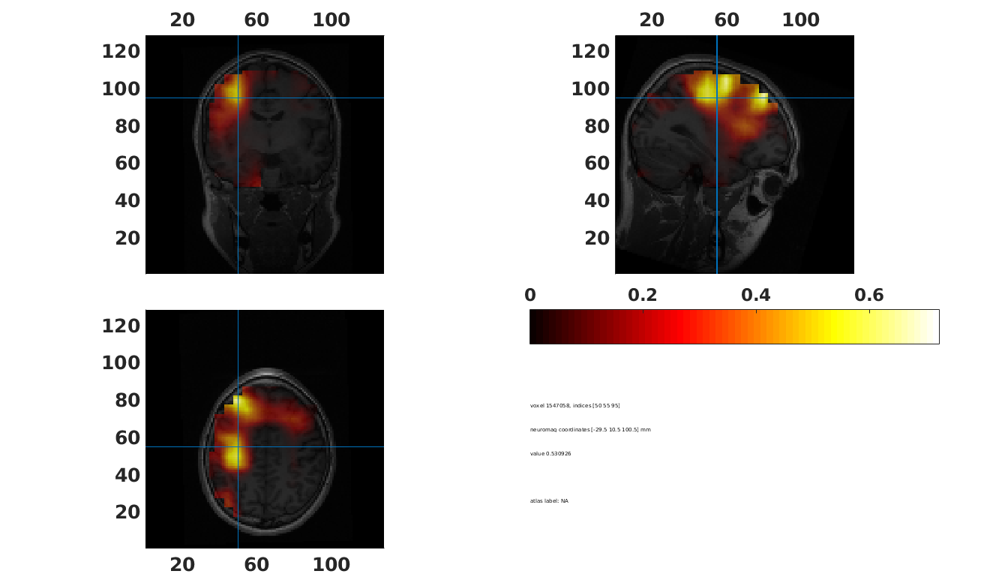
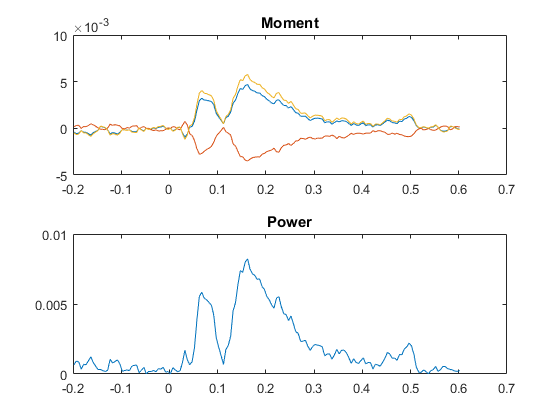

# Beamformer source analysis

In this tutorial, we will do various forms of beamformer methods for source reconstructions. The beamformer is a *spatially adaptive filter* that allows us to estimate the amount of activity at any given location in the brain. The inverse filter is based on minimizing the source power (or variance) at a given location, subject to unit-gain constraint. Unit-gain constraint means that, if a source had the power of amplitude 1 and was projected to the sensors by the lead field, the inverse filter applied to the sensors should then reconstruct power of amplitude one at that location. 

First, we need to prepare the raw data, define a source model, and calculate the lead fields.

## Set up general paths
Note that if work from the path where all the downloadable parts are downloaded to, you don't need to change the paths(leave them as is, but do evaluate the sections). The paths serve as an example of how you can set up your analysis structure, which is especially useful if you have more than one subject 

Change these to appropriate paths for your operating system and setup. Note that if work from the path where all the downloadable parts are downloaded to, you don't need to change the paths (leave them as is, but do evaluate the section).

```matlab
%% Setup FieldTrip
restoredefaultpath
addpath('C:/fieldtrip/')            % Change to match your FieldTrip path
ft_defaults

%% Define subject paths
data_path = 'C:/meeg_course/data';   % Change to match your data path

subjects_and_dates = ...
                    {
                        'NatMEG_0177/170424/'  % add more as needed
                    };
           
% List of all MEEG filenames          
filenames = {...
        'tactile_stim_raw_tsss_mc.fif' 
        'tactile_stim_raw_tsss_mc-1.fif'
        'tactile_stim_raw_tsss_mc-2.fif'
            };

%% Define where to put output data
meg_path = fullfile(data_path, subjects_and_dates{1}, 'MEG');
mri_path = fullfile(data_path, subjects_and_dates{1}, 'MRI');

% output_path = meg_path;         % Save in MEG folder
output_path = meg_path;         % Save in MRI folder

%% Go to work dir
cd(output_path)
```

## Load files necessary for the beamforming

We are loading four different files here:  

1. We are loading the head model for the MEG data  
2. We are loading the head model for the EEG data  
3. We are loading the pre-processed data (baseline_data) on which we will do the actual source reconstruction  

If you saved the files from the preprocessing tutorial, head model tutorial, and TFR analysis tutorial, you should load those files. If not, you can find the following files in the tutorial material folder:

```Matlab
%% go to relevant path and load data
cd(output_path)
disp('Loading input data')
load headmodel_meg.mat
load headmodel_eeg.mat
load cleaned_downsampled_data.mat
disp('Done')
```

## Create forward models/leadfields

Create a grid around the brain and estimate the lead field for each of the grid points in the brain.

For any given source (a grid point inside the brain) it is calculated how each sensor (magnetometer, gradiometer or electrode) sees (how much T, T/m or V would it pick up) a source with unit strength (1 nAm). One might say that it says: "For a given source, _if_ it is active, how _would_ the different sensors see it"  

```matlab
%% make leadfields for EEG
cfg = [];
cfg.headmodel       = headmodel_eeg;
cfg.elec            = cleaned_downsampled_data.elec;
cfg.senstype        = 'eeg';
cfg.grid.resolution = 1;            % Grid spacing 1x1x1 of unit defined below
cfg.grid.unit       = 'cm';         % Grid unit

leadfield_eeg = ft_prepare_leadfield(cfg);

%% Make leadfields for MEG: magnetometers
cfg.senstype        = 'meg';
cfg.grad            = cleaned_downsampled_data.grad;
cfg.headmodel       = headmodel_meg;
cfg.channel         = 'meg';
cfg.grid.resolution = 1;            % Grid spacing 1x1x1 of unit defined below
cfg.grid.unit       = 'cm';         % Grid unit

leadfield_meg = ft_prepare_leadfield(cfg);
```

## Beamformer in time-domain (LCMV)

For our first beamformer source reconstruction, we will select the time evoked response from 100 ms to 200 ms (you can always play around with what time to select). Then calculate the evoked response and the data covariance matrix by specifying `cfg.covariance = 'yes'`:

```matlab
%% Select data
cfg = [];
cfg.trials = cleaned_downsampled_data.trialinfo == 8;
cfg.latency = [0.100 0.200];

data = ft_selectdata(cfg, cleaned_downsampled_data);

%% evoked
cfg = [];
cfg.covariance              = 'yes';
cfg.covariancewindow        = 'all';
cfg.preproc.demean          = 'yes';

evoked = ft_timelockanalysis(cfg, data);
```

Then you are ready to do the source reconstruction with `ft_sourceanalysis`. This type you specify that the method should be `lcmv`: the Least Constraints Minimum Variance (LCVM) beamformer.

```matlab
%% LCMV
cfg = [];
cfg.method          = 'lcmv';
cfg.grid            = leadfield_meg;
cfg.headmodel       = headmodel_meg;
cfg.lcmv.lambda     = '5%';
cfg.channel         = 'meggrad';
cfg.senstype        = 'MEG';
source_lcmv = ft_sourceanalysis(cfg, evoked);
```

### Visualise source reconstruction

To visualise the source reconstruction, we will project the estimates source points onto the anatomical MRI. Load the resliced MRI and use `ft_sourceinterploate`. Specify that we want the interpolate the estimated (``pow``):

```matlab
%% Load MRI
load('mri_resliced_cm.mat')

%% Interpolate
cfg = [];
cfg.parameter    = 'pow';
cfg.interpmethod = 'nearest';
source_int  = ft_sourceinterpolate(cfg, source_lcmv, mri_resliced_cm);

%% Plot
cfg = [];
cfg.method        = 'ortho';
cfg.funparameter  = 'pow';
ft_sourceplot(cfg,source_int);
```

> **Question 5.1:** Give your interpretation of the source plot.

### Beamformer contrasts

The centre of the head bias means that the source reconstructions in themselves are not readily interpretable. To compensate, we will calculate a contrast between the time of interest and a baseline period. However, to avoid bias between the two different beamformer source reconstructions due to different filters, we create a common filter consisting of a data segment that contains both time-windows-

```matlab
%& Select data
cfg = [];
cfg.trials = cleaned_downsampled_data.trialinfo == 16;
cfg.latency = [-0.200 0.200];

data_all = ft_selectdata(cfg, cleaned_downsampled_data);

cfg.latency = [-0.200 -0.100];

data_base = ft_selectdata(cfg, cleaned_downsampled_data);

cfg.latency = [0.100 0.200];

data_stim = ft_selectdata(cfg, cleaned_downsampled_data);
```

Calculate evoked sepratly for time of interest, basline, and the combined time-window::

```matlab
%% Evoked for TOI
% Combined
cfg = [];
cfg.covariance         = 'yes';
cfg.covariancewindow   = 'all';
cfg.preproc.demean     = 'yes';
evo_all = ft_timelockanalysis(cfg, data_all);

% Baseline and stimulation
cfg = [];
cfg.covariance         = 'yes';
cfg.covariancewindow   = 'all';
evo_base = ft_timelockanalysis(cfg, data_base);
evo_stim = ft_timelockanalysis(cfg, data_stim);
```

Then do the LCMV source inversion. We are not interested in the source reconstruction as such. We only use this part to calculate the beamformer filter, that we then will apply separately to the stimulation data in baseline data. When we call `ft_sourceanalysis` as we did above, we then further specify that we want to keep the filter.

```matlab
cfg=[];
cfg.method          = 'lcmv';
cfg.grid            = leadfield_meg;
cfg.headmodel       = headmodel_meg;
cfg.lcmv.keepfilter = 'yes';        % save the filter in the output data
cfg.lcmv.lambda     = '5%';
cfg.channel         = 'meggrad';
cfg.senstype        = 'MEG';

source_all = ft_sourceanalysis(cfg, evo_all);
```

> **Question 5.2:** Explore what is in the the `source_all.avg.filter` structure and then explain what is in the structure?
>
> *Hint*: if you get confused about large empty fields, take a look at the size of the `pos` field and the `inside` field.

For the next step, we now run `ft_sourceanalysis` on both the stimulation data dn baseline data. Use the same setting for both calls. Additionaly, we specify the filter to be the filter we just estimated for the combined data:

```matlab
cfg=[];
cfg.method              = 'lcmv';
cfg.grid                = leadfield_meg;
cfg.sourcemodel.filter  = source_all.avg.filter;  % Reuse avg filter
cfg.headmodel           = headmodel_meg;
cfg.channel             = 'meggrad';
cfg.senstype            = 'MEG';

source_base = ft_sourceanalysis(cfg, evo_base);
source_stim = ft_sourceanalysis(cfg, evo_stim);
```

Now that you have two beamformer source reconstruction, you should create a contrast between the two:

``` matlab
%% Make contrast
contrast_lcmv = source_stim;       % Copy
contrast_lcmv.avg.pow = (source_stim.avg.pow-source_base.avg.pow)./source_base.avg.pow;
```

The contrast is our result.

Remember to save:

```matlab
%% Save
save(fillfile(output_path, 'contrast_lcmv.mat'), 'contrast_lcmv'); disp('done');
```

Now you can plot the contrsted source reconstruction, similar to thow you did before: by first interpolate onto the structural MRI with `ft_sourceinterpolate` and then plot with `ft_sourceplot`:

```matlab
%% Interpolate
cfg = [];
cfg.parameter    = 'pow';
cfg.interpmethod = 'nearest';
source_int  = ft_sourceinterpolate(cfg, contrast_lcmv, mri_resliced_cm);

%% Sourceplot 
cfg = [];
cfg.method          = 'ortho';
cfg.funparameter    = 'pow';
cfg.funcolormap     = 'jet';
ft_sourceplot(cfg, source_int);
```



## Frequency-domain beamformer (DICS)

In the next part, we will do source reconstruction of time-frequency data with a beamformer method known as Dynamic Imaging of Coherent Sources (DICS).

We will start by finding a time-frequency area of interest that want to know the underlying sources. From time-domain data, we will calculate the cross-spectral density of the frequency (or frequencies) of interest and then use the cross-spectral density to find underlying the sources. We will here focus on reconstructing the activity underlying the beta rebound.  

1. We crop the data to find the period of interest (690 to 970 msec).
2. We define a baseline period of similar duration. We will compare the period of interest against this since the power estimates that the beamformer results in are not informative in themselves.


In this step, we will also make a combination of the time-window of interest and the baseline. Its use will become apparent later.

```matlab
%% time window of interest Beta Rebound
beta_toi     = [0.690 0.970];
baseline_toi = [-0.500 -0.220];

%% Crop data   
cfg = [];
cfg.toilim = beta_toi;
cfg.trials = cleaned_downsampled_data.trialinfo == 16;

tois_rebound = ft_redefinetrial(cfg, cleaned_downsampled_data);

cfg.toilim = baseline_toi;

tois_baseline = ft_redefinetrial(cfg, cleaned_downsampled_data);
```

Then combine to create the data we will use to create the beamformer filter:

```matlab
% combined data
cfg = [];
tois_combined = ft_appenddata(cfg, tois_rebound, tois_baseline);
```

### Fourier analyses
Here we make Fourier decompositions of the time courses in the cropped data for each of the times of interest. Here we use ``ft_freqanalysis`` similar to how we earlier calculated PSD and TFR. But rather than focusing on the entire spectral range, we confine ``ft_freqanalysis`` to only the 16 Hz. This (sort of) represents the primary band where we saw the beta rebound in the TFR plots. Also, we will not get the spectral power of the signal, but keep the complex-valued Fourier representation (`cfg.output = 'fourier'`).

The complex-valued Fourier representation will be used to calculate the cross-spectral density later. Note that we compute three different Fourier decompositions: 
1. One for the beta rebound time of interest.
2. One for the baseline time of interest.
3. One for the beta rebound and baseline combined.

```matlab
%% Fourier decomposition 
cfg = [];
cfg.method     = 'mtmfft';
cfg.output     = 'fourier';     % Return comblex numbers
cfg.taper      = 'hanning';
cfg.channel    = channels;
cfg.foilim     = [16 16];       % 16 Hz
cfg.keeptrials = 'yes';
cfg.pad        = 'nextpow2';

fouriers_rebound  = ft_freqanalysis(cfg, tois_rebound;
fouriers_baseline = ft_freqanalysis(cfg, tois_baseline);
fouriers_combined = ft_freqanalysis(cfg, tois_combined);   
```

## Source analysis using the DICS beamformer
In this step, ``ft_sourceanalysis`` will take all the previous ingredients and do the source reconstruction. We specify that we want to use DICS with _cfg.method = 'dics'_. Besides, we will give parameters that tell how the DICS beamformer will regularise noise, and ask to keep the spatial filters that are estimated (_cfg.dics.keepfilter = 'yes'_), which we will plot for educational purposes.

We start by calculating a spatial filter that is shared between the rebound and the baseline based on the combined Fourier analysis. The combined filter is then used on the beta rebound and baseline data separately. 

```matlab
%% source analysis
cfg = [];
cfg.method              = 'dics';                   % Dynamic Imaging of Coherent Sources
cfg.frequency           = fouriers_combined.freq;   % the frequency from the fourier analysis
cfg.grid                = leadfield_meg;
cfg.headmodel           = headmodel_meg;
cfg.dics.projectnoise   = 'yes';                    % estimate noise
cfg.dics.lambda         = '5%';                     % how to regularise
cfg.dics.keepfilter     = 'yes';                    % keep the spatial filter in the output
cfg.dics.realfilter     = 'yes';                    % retain the real values
cfg.channel             = 'meggrad';
cfg.senstype            = 'MEG';
cfg.grad                = fouriers_combined.grad;
    
dics_combined = ft_sourceanalysis(cfg, fouriers_combined);
```

As before, we are not interested in this source estimate: what we need is the estimated filter. We then call `ft_sourceanalysis` again for the rebound and baseline times of interest specifying that we want to use the filter from above:

```matlab
% Copy filter to cfg (do not reset cfg)
cfg.sourcemodel.filter = dics_combined.avg.filter;

dics_rebound    = ft_sourceanalysis(cfg, fouriers_rebound);
dics_baseline   = ft_sourceanalysis(cfg, fouriers_baseline);
```

Then make the difference between the source reconstructions and divide it by the baseline power. This gives us the relative increase in power in the beta rebound time-window.

```matlab
%% contrasts
contrast_dics = dics_rebound; % make a copy
contrast_dics.avg.pow = (dics_rebound.avg.pow - dics_baseline.avg.pow) ./ dics_baseline.avg.pow;
```

Save the output

```matlab
%% Save
save(fullfile(output_path, 'contrast_dics.mat'), 'contrast_dics')
```

Interpolate pow data onto the MRI of the participant to plot the results:

```matlab
%% Load MRI
load(mri_resliced_cm.mat)

%% contrast interpolated onto MRI
cfg = [];
cfg.downsample = 1;
cfg.parameter = 'pow';

contrast_int = ft_sourceinterpolate(cfg, contrast_dics, mri_resliced_cm);
```

Now plot all the contrasts:

```matlab
%% plot DICS source analyses   
% Find min/max to scale data
max_pow = max(contrast_int.pow);
min_pow = min(contrast_int.pow);

% Plot
cfg = [];
cfg.method          = 'ortho';
cfg.funparameter    = 'pow';
cfg.maskparameter   = cfg.funparameter;
cfg.funcolorlim     = [0 max_pow];
cfg.opacitylim      = [0 max_pow];

ft_sourceplot(cfg, contrast_int);
```



> **Question 5.3:** Explain how you would interpret your newly the image that you created?

## Use beamformers to make a "virtual electrode."

Virtual electrodes are a useful tool to get time-series "*as if*" we had recorded data from a given site in the brain and if we do not want to deal with source data from the whole volume, e.g. if we have hypotheses about specific regions of interest.

For the last beamformer application, we will create a virtual electrode in the point that showed the largest power for the beta rebound as identified above. 

```matlab
%% Find peak source
[~, idx] = max(contrast.avg.pow);
maxpos = contrast.pos(idx,:);
```

For the virtual electrode, we want to reconstruct the single trial data at the selected location. To do this, we will create a new forward model. This time, rather than creating a source space that covers the whole brain or the brain surface, we create a source space that only contains our desired location.

The "virtual electrode" is a single source space point, where we estimate the activity by applying the spatial filter calculated for that position. The difference is that this time, we will use the filter on single-trial data rather than the averaged response.

```matlab
%% Create leadfield for "virtual electrode"
cfg = [];
cfg.headmodel           = headmodel_meg;
cfg.channel             = 'meggrad';
cfg.senstype            = 'MEG';
cfg.grid.pos            = maxpos;
cfg.grad                = evoked.grad;

leadfield_virt = ft_prepare_leadfield(cfg);
```

Now let us just go one step back and select the pre-processed data at the sensor-level, that we want to construct at the source. We then calculate the evoked response that we shall use to create the beamformer filter.

```matlab
%% Select data
cfg = [];
cfg.trials = cleaned_downsampled_data.trialinfo == 16;
cfg.latency = [-0.200 0.600];
cfg.channel = 'meggrad';

data = ft_selectdata(cfg, cleaned_downsampled_data);

cfg = [];
cfg.covariance              = 'yes';
cfg.covariancewindow        = 'prestim';
cfg.preproc.demean          = 'yes';
cfg.preproc.baselinewindow  = [-0.200 0];

evoked = ft_timelockanalysis(cfg, data);
```

Use the evoked data to create a filter. We are not interested in the output of this first source analysis besides estimating the spatial filter.

```matlab
cfg = [];
cfg.method          = 'lcmv';
cfg.grid            = leadfield_virt;
cfg.headmodel       = headmodel_meg;
cfg.lcmv.lambda     = '5%';
cfg.lcmv.keepfilter = 'yes';
cfg.lcmv.realfilter = 'yes';
cfg.channel         = 'meggrad';
cfg.senstype        = 'MEG';

source_temp = ft_sourceanalysis(cfg, evoked);
```

Copy the filter to a new structure:

```matlab
%% Copy filter
filt = source_temp.avg.filter{:};
```

Now we create the virtual channel by multiplying the filter with each single-trial data. This is (simple) matrix multiplication, so it is done just in MATLAB.

```Matlab
%% Apply filter to single-trial data
virt_elec = [];
for i=1:length(data.trial)
    virt_elec.trial{i}= filt*data.trial{i};
end
```

For good measure, let us just organise the data according to the FieldTrip convention. Then we can continue to use FielTrip function to analyse our virtual channel.

```matlab
%% Organice in FieldTrip stucture
virt_elec.time      = data.time;        % Copy time
virt_elec.fsample   = data.fsample;     % Copy sample frequency
virt_elec.label     ={'virtual_chan_x', 'virtual_chan_y', 'virtual_chan_z'};
```

Take a look at the new data with `ft_databrowser`

```matlab
% Inspect virtual electrode
cfg = [];
cfg.viewmode = 'vertical';      % you can also specify 'butterfly'
ft_databrowser(cfg, virt_elec);
```

The data in the "virtual electrode" is now equivalent to the epoched data. We can now apply all the same types of analyses that we would do to our sensor-level data, e.g. calculate evoked responses or TFR. The "virtual electrode" approach can be thought of as a preprocessing step

Try to calculate the evoked response in the virtual sensor:

```matlab
%% Virtual evoked response
cfg = [];
cfg.channel = 'all';
virt_evo = ft_timelockanalysis(cfg, virt_elec);

%% Plot
figure;
subplot(2,1,1); plot(virt_evo.time, virt_evo.avg)
mn = sqrt(sum(virt_evo.avg.^2));        % Calculate the norm of the signal to get dipole "power"
subplot(2,1,2); plot(virt_evo.time, mn);
```

)

> **Question 5.4:** The procedure to create a "virtual channel" is the same for magnetometers and EEG electrodes (though the actual calculation "under the hood" is different). Repeat the procedure to calculate the virtual electrode, but this time for the EEG data. Change all the `cfg.channel` from `meggrad` to `EEG*` and the ``cfg.senstype`` from `MEG` to `ÈEG`. Also, be aware that you should specify sensor information as `cfg.elec` rather than `cfg.grad` and points to the appropriate electrode structure.
>
> Also remember to change the data selction in the beginning or you might end up with an error when applying the filter to the raw data:
>
>```matlab
>%% Select data
>cfg = [];
>cfg.trials = cleaned_downsampled_data.trialinfo == 16;
>cfg.latency = [-0.200 0.600];
>cfg.channel = 'EEG*';
>
>data = ft_selectdata(cfg, cleaned_downsampled_data);
>```
> How does the virtual channel estimated from the EEG electrodes compare the virtual channel estimated from the gradiometers and why might this be?

## End of Tutorial 5
Beamformers offers a variety of methods to analyse MEG (and to some extend EEG) data. You can use it to localize responses in the data, localize specific oscillatory activity, or to "reconstruct" signals *as if* they were measured at a given location. In the next tutorial, we will also look at how beamformers can be used in connectivity analysis.
