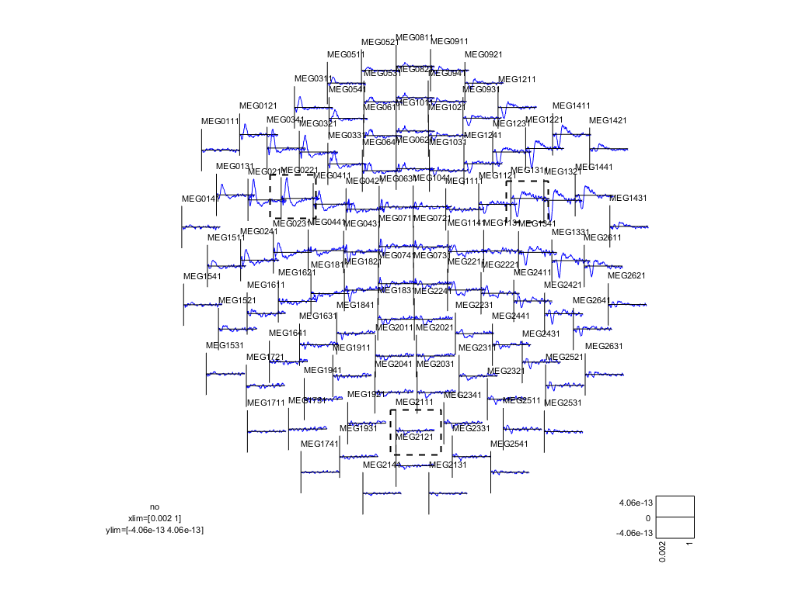
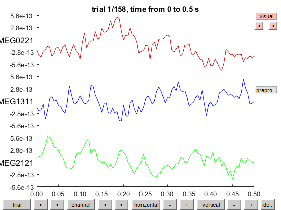
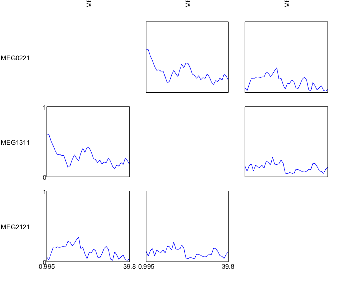
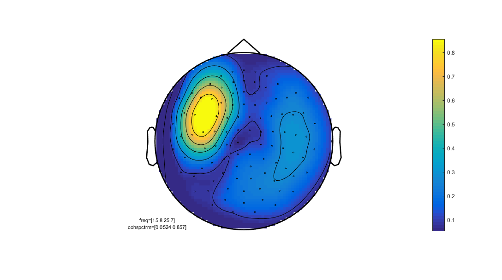
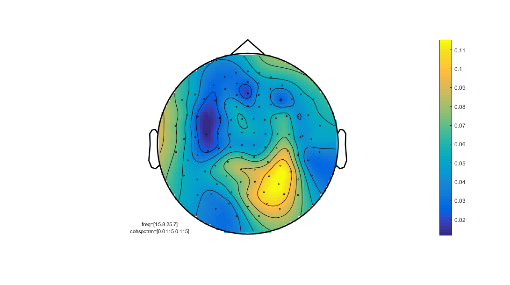
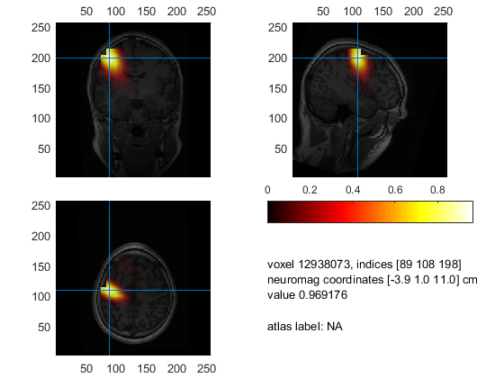
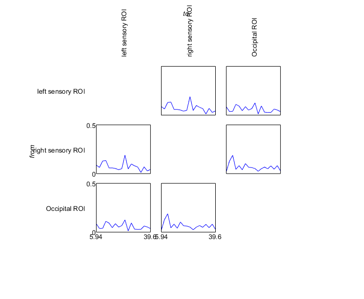

# Connectivity
In this tutorial you will do three connectivity analyses. Connectivity is a broad topic. In short, we are looking for statistical dependence between signals; what is often called *functional connectivity*. MEG and EEG are perfect methods to study connectivity as the temporal dynamics allows for estimation of various statistical measurements of dependence between signals. While it is relatively simple to apply and calculate various connectivity measures to MEG/EEG data, it is, however, far from trivial to just look for dependencies in MEG/EEG signals. Spurious connections may arise from trivial issues, such as field spread. General considerations when doing connectivity analysis with MEG/EEG is whether you are in source- or sensor-space and what connectivity measure that you use, and what the combination of the two say about your signals and then in the end, how the signals relate to processes in brain or cognition.

This tutorial does not offer definite answers to the problems. The tutorial is designed to outline various strategies for calculating connectivity with MEG/EEG signals. It is a demonstration of how it can be done. The tutorial is divided into three parts:

1. Sensor-level connectivity
2. Source-level connectivity
3. ROI-based connectivity

## Set up general paths

Change these to appropriate paths for your operating system and setup. Note that if work from the path where all the downloadable parts are downloaded to, you don't need to change the paths (leave them as is, but do evaluate the section).

```matlab
%% Setup FieldTrip
restoredefaultpath
addpath('C:/fieldtrip/')            % Change to match your FieldTrip path
ft_defaults

%% Define subject paths
data_path = 'C:/meeg_course/data';   % Change to match your data path

subjects_and_dates = ...
                    {
                        'NatMEG_0177/170424/'  % add more as needed
                    };
           
% List of all MEEG filenames          
filenames = {...
        'tactile_stim_raw_tsss_mc.fif' 
        'tactile_stim_raw_tsss_mc-1.fif'
        'tactile_stim_raw_tsss_mc-2.fif'
            };

%% Define where to put output data
meg_path = fullfile(data_path, subjects_and_dates{1}, 'MEG');
mri_path = fullfile(data_path, subjects_and_dates{1}, 'MRI');

% output_path = meg_path;         % Save in MEG folder
output_path = meg_path;         % Save in MRI folder

%% Go to work dir
cd(output_path)
```

## Sensor-level connectivity

First, we will look at connectivity between two selected channels and then look at all-to-all connectivity between channels.

First load data:

````matlab
%% Load data
load('cleaned_downsampled_data.mat'); disp('done')
````

Then select parts of the signals in which we will calculate connectivity. The code below selects data for the index finger stimulation (trigger = 8) in the time window from 0 ms to 500 ms after the stimulation.

````matlab
%% Select data
cfg = [];
cfg.trials = cleaned_downsampled_data.trialinfo == 8;
cfg.latency = [0.000 0.500];

data = ft_selectdata(cfg, cleaned_downsampled_data);
````

Estimate the evoked response and identify channels that you want to calculate the connectivity. Try to select channels that show significant evoked response and one that does not show that much evoked activity.

````matlab
Estimate the evoked/averaged 
%% evoked
cfg = [];
cfg.covariance          = 'yes';
cfg.covariancewindow    = 'prestim';
cfg.preproc.demean      = 'yes';

evoked = ft_timelockanalysis(cfg, data);

cfg = []
cfg.layout              = 'neuromag306mag';
cfg.showlabels          = 'yes';        % Show channel names
cfg.comment             = 'no'
ft_multiplotER(cfg, evoked)
````



Based on the visual inspection above, I have chosen three channels that roughly are located above the left- and right sensory areas and one sensor towards the bach above the occipital areas.

Write the sensors you pick in an array. Note that the results of the following steps will be different if you pick another set of sensors. But that is fine!

```Matlab
%% sensors
sensors = {'MEG0221', 'MEG1311', 'MEG2121'}
````

Then select only data from those three channels with `ft_selectdata`:

````matlab
%% Select sensors
cfg = [];
cfg.channel = sensors;
slct_data = ft_selectdata(cfg, data);
````

You can inspect the selcted channels with `ft_databrowser`:

````matlab
%% Inspect selection
cfg = []
cfg.viewmode = 'vertical';  % you can also specify 'butterfly'
ft_databrowser(cfg, slct_data)
````



FOr the first connectivity estimation, we will calculate the coherence between the three channels. Coherence between signals is estimated by calculating the cross-spectral density (CSD) between the signals and dividing by the power spectral densities (PSD) of the signals. Coherence is a measure in the frequency-domain and is calculated for each frequency bin.

To calculate the coherence between the signals, we first do a Fourier-transform of the data. As is the previous tutorials,we use `ft_freqanalysis` and specify that the output should be the complex-valued Fourier decomposition (``cfg.output = 'fourier'``;):

````matlab
%% Fourier transform
cfg = [];
cfg.method    = 'mtmfft';
cfg.taper     = 'hanning';
cfg.output    = 'fourier';
cfg.foilim    = [5 40];

slct_freq = ft_freqanalysis(cfg, slct_data);
````

Now we are ready to calculate the coherence. To do connectivity analysis, we use the FieldTrip function `ft_connectivityanalysis`. `ft_connectivityanalysis` is a high-level function that supports many different connectivity methods. Take a look at the documentation to see how you can calculate connectivity with FieldTrip. In this example, we specify that to use coherence (`coh`).

````matlab
% Coherence
cfg = [];
cfg.method = 'coh';
slct_coh = ft_connectivityanalysis(cfg, slct_freq)
````

This calculates coherence between all three channels for all the frequencies we selected above when we called `ft_freqanalysis`-. Let us visualise the coherence spectra:

````matlab
cfg = [];
cfg.parameter = 'cohspctrm';
cfg.zlim      = [0 1];
ft_connectivityplot(cfg, slct_con);
````



This is a 3x3 grid showing the coherence spectra for each pair of channels.

> **Question 6.1:** Look at the coherence spectra in connectivity plot and compare plots across the diagonal. Why are the plots mirrored across the diagonal?

We are not limited to estimating connectivity between only a few sensors. For the next part, we calculate the coherence between all sensors. First, select one sensor that will be the reference sensor. This is not a reference in the same sense as the reference for EEG. Here it means the sensor that we use to calculate coherence between this sensor and all other sensors; i.e. one-to-all connectivity. Sometimes this is also called the "seed".

As before, choose a sensor that shows a strong evoked response, e.g.:

````matlab
%% Reference sensor
ref_chan = 'MEG0221';
````

As you did above, use `ft_connectivityanalysis` to estimate the coherence. First calculate the complex valued Fourier transform of the data:

````matlab
%% Fourier transform
cfg = [];
cfg.method    = 'mtmfft';
cfg.taper     = 'hanning';
cfg.output    = 'fourier';
cfg.foilim    = [2 40];

data_freq = ft_freqanalysis(cfg, data);
````

Then do the connectivity analysis. This time, also specify a combination of channels (`cfg.channelcmb`). The way it is specified below (`{ref_chan, 'megmag'}`) means the combination of the selected channel and all magnetometers. If you omit this line, it will try to calculate coherence-spectra between all possible combinations of channels. This will probably be too intensive to run within a reasonable timeframe.

````matlab
cfg = [];
cfg.method          = 'coh';
cfg.channel         = 'megmag';
cfg.channelcmb      = {ref_chan 'megmag'};
coh_meg = ft_connectivityanalysis(cfg, data_freq);
````

This time, we will visualise the results on the sensor topography with `ft_multiplotER`.

````matlab
cfg = [];
cfg.layout      = 'neuromag306mag';
cfg.parameter   = 'cohspctrm';
cfg.refchannel  = ref_chan;
ft_multiplotER(cfg, coh_meg)
````

Notice that the channel you selected is missing. Use the drag option to zoom in on different frequency bands. E.g. below the beta band:



Remember to toggle the color bar to make sense of the topographies.

You might notice that the high coherence values tend to cluster around the channel that you selected as the seed?

Try another connectivity measrue: the imaginary part of the coherence:

````matlab
% Img coh
cfg = [];
cfg.method      = 'coh';
cfg.complex     = 'absimag';
cfg.channel     = 'megmag';
cfg.channelcmb  = {ref_chan 'megmag'};
icoh_meg = ft_connectivityanalysis(cfg, data_freq);
````

Plot as before and selct a frequencyband camparable to the plot you made above:
````matlab
cfg = []
cfg.layout      = 'neuromag306mag';
cfg.parameter   = 'cohspctrm'
cfg.refchannel  = ref_chan
ft_multiplotER(cfg, icoh_meg)
````


> **Question 6.2:** Explain the differences between the two topographies.

### Coherence with EEG
For EEG, the procedure is the same. The only thing you have to change is the channel selection and the channel combinations:

````matlab
% EEG reference channels
ref_chan = 'EEG032'

% Coherence
cfg = [];
cfg.method          = 'coh';
cfg.channel         = 'eeg';
cfg.channelcmb      = {ref_chan 'EEG*'};
coh_eeg = ft_connectivityanalysis(cfg, data_freq);
````

Plot with EEG layout:
````matlab
cfg = []
cfg.layout          = 'natmeg_customized_eeg1005';
cfg.showlabels      = 'yes';
cfg.parameter       = 'cohspctrm';
cfg.refchannel      = ref_chan
ft_multiplotER(cfg, coh_eeg)
````

## Whole-brain connectivity with DICS

The beamformer method Dynamic Imaging of Coherent Sources (DICS) is based on calculating the CSD to calculate the inverse model. It can, therefore, be used to calculate the coherence between sources in the brain when doing the source inversion. The procedure is almost identical to what you did in the beamformer tutorial.

First, load the headmodel and MRI for source reconstruction:

````matlab
%% Load 
load('headmodel_eeg')
load('headmodel_meg')
load('mri_resliced.mat')
````

To calculate the coherence in source space with DICS, we need to specify a reference or seed point in the source space. In the example below I use the location that had maximum power in the DICS source reconstruction in the beamformer tutorial (``maxpos = [-4 1 11]``).

First calculate the leadfield (or load the one created in the beamformer tutorial):

````matlab
%% Make leadfields for MEG: gradiometers
cfg.senstype        = 'meg';
cfg.grad            = cleaned_downsampled_data.grad;
cfg.headmodel       = headmodel_meg;
cfg.channel         = 'meggrad';
cfg.grid.resolution = 1;            % Grid spacing 1x1x1 of unit defined below
cfg.grid.unit       = 'cm';         % Grid unit

leadfield_meg = ft_prepare_leadfield(cfg);
````

The call `ft_sourceanalysis`:

````matlab
cfg = [];
cfg.method              = 'dics';           % Dynamic Imaging of Coherent Sources
cfg.frequency           = 20;               % Hz
cfg.grid                = leadfield_meg;
cfg.headmodel           = headmodel_meg;
cfg.dics.projectnoise   = 'yes';            
cfg.dics.lambda         = '5%';             
cfg.dics.keepfilter     = 'yes';            
cfg.dics.realfilter     = 'yes';
cfg.channel             = 'meggrad';
cfg.senstype            = 'MEG';
cfg.grad                = data_freq.grad;
cfg.refdip              = maxpos;

dics_coh = ft_sourceanalysis(cfg, data_freq);
````

Take a look at `dics_coh.avg`. A new field `coh` has appeared.

Visualise the result by interpolating onto the structural MRI.

````matlab
%% Plot
cfg = [];
cfg.downsample  = 1;
cfg.parameter   = 'coh';
dics_coh_int = ft_sourceinterpolate(cfg, dics_coh, mri_resliced_cm);

% Find min/max to scale data
max_coh = max(dics_coh_int.coh);

% Plot
cfg = [];
cfg.method            = 'ortho';
cfg.funparameter      = 'coh';
cfg.maskparameter     = cfg.funparameter;
% cfg.funcolorlim     = [0 max_pow];
% cfg.opacitylim      = [0 max_pow];

ft_sourceplot(cfg, dics_coh_int);
````



> **Question 6.3:** Explain the result.

## Connectivity between ROI

Connectivity analyses can easily lead to many connectivitions being estimated, which leads to a multiple comparison problem. A solution to deal with this is to narrow the connectivity analysis to pre-specified regions of interest, e.g. specific point on the cortex.

In the following part, I have chosen three points in the brain defined by the coordinates below corresponding to points in left- and right primary-sensory cortex and V1/V2. You can take a look at the DICS figure above and find your own coordinates to use if you want?

````matlab
%% Define ROI
roi_left        = [-4 1 11];
roi_right       = [4 1 12];
roi_occipital   = [-2 -8 6];
````

We will now create virtual sensors for each of the ROIs

````matlab
%% Make "virtual sensors"
% Selct data
cfg = [];
cfg.channel = 'meggrad';
data_grad = ft_selectdata(cfg, data);

%Evoked
cfg = [];
cfg.covariance         = 'yes';
cfg.covariancewindow   = 'all';
cfg.preproc.demean     = 'yes';

evoked = ft_timelockanalysis(cfg, data_grad);

% Leadfield
cfg = [];
cfg.headmodel           = headmodel_meg;
cfg.channel             = 'meggrad';
cfg.senstype            = 'MEG';
cfg.grid.pos            = [roi_left; roi_right; roi_occipital];
cfg.grad                = evoked.grad;

leadfield_virt = ft_prepare_leadfield(cfg);

% LCMV
cfg = [];
cfg.method              = 'lcmv';
cfg.grid                = leadfield_virt;
cfg.headmodel           = headmodel_meg;
cfg.lcmv.lambda         = '5%';
cfg.lcmv.keepfilter     = 'yes';
cfg.lcmv.realfilter     = 'yes';
cfg.channel             = 'meggrad';
cfg.senstype            = 'MEG';

source_temp = ft_sourceanalysis(cfg, evoked);
````

Apply the filters to the single-trial data. Note that this time, we do the procedure three times: one for each filter for each ROI.

````matlab
virt_chans = [];
virt_chans.label = {'left sensory ROI';
                    'right sensory ROI';
                    'Occipital ROI'};
virt_chans.trial = [];                
for i = 1:size(data_grad.trial, 2)
    virt_chans.time{i} = data_grad.time{i};
    virt_chans.trial{i}(1, :) = sqrt(sum(source_temp.avg.filter{1}*data_grad.trial{i}).^2);
    virt_chans.trial{i}(2, :) = sqrt(sum(source_temp.avg.filter{2}*data_grad.trial{i}).^2);
    virt_chans.trial{i}(3, :) = sqrt(sum(source_temp.avg.filter{3}*data_grad.trial{i}).^2);
end
````

We have also added extra information so FieldTrip can read the `virt_chans` structure. We will then calculate the coherence between each pair of virtual sensors, similar to how we did for the real sensors.

````matlab
%% Calculate coherence
% First fourier
cfg = [];
cfg.method    = 'mtmfft';
cfg.taper     = 'hanning';
cfg.output    = 'fourier';
cfg.foilim    = [5 40];
virt_freq = ft_freqanalysis(cfg, virt_chans);

% Coherence
cfg = [];
cfg.method = 'plv';
virt_coh = ft_connectivityanalysis(cfg, virt_freq)
````

Plot the result:

````matlab
figure;
cfg = [];
cfg.parameter = 'plvspctrm';
cfg.zlim      = [0 .5];
ft_connectivityplot(cfg, virt_coh);
````



## End of Tutorial 6
This tutorial has only scratched the surface of the various ways to calculate connectivity in MEG/EEG. However, the example code above can easily be changed to other connectivity measures. If you want, try to change the `method` argument when calling `ft_connectivityanalysis`. Type `help ft_connectivityanalysis` in the MATLAB terminal to get a list of the connectivity measures supported by FieldTrip.