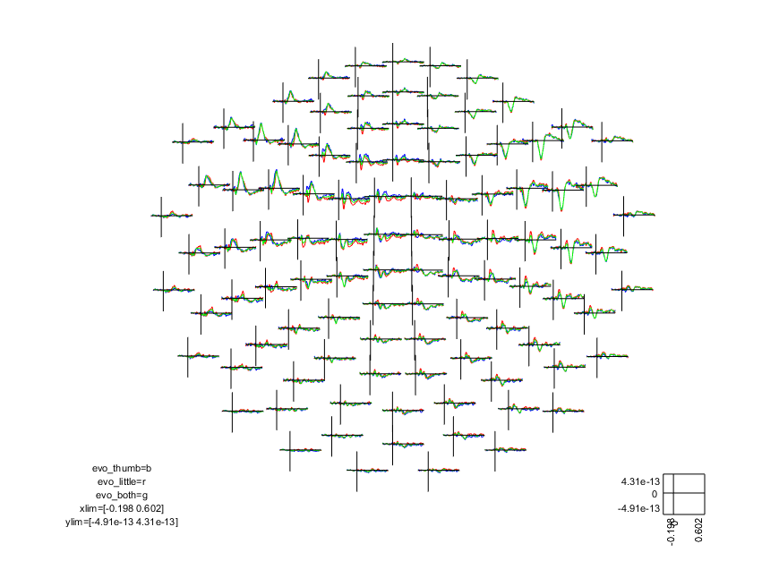
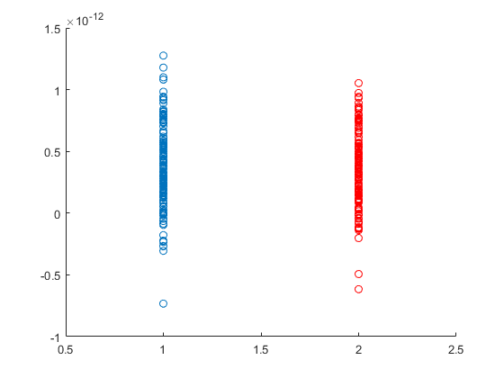
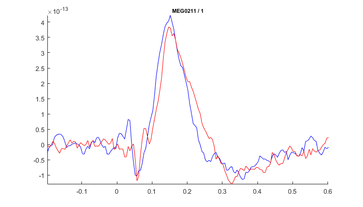
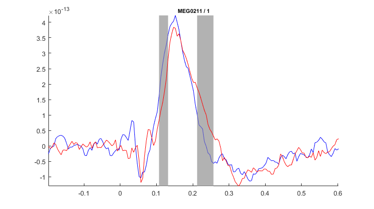
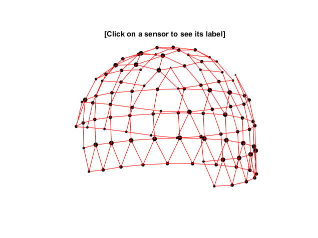
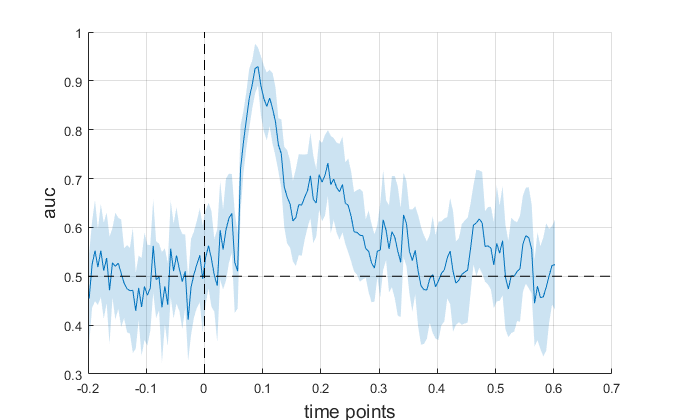

# Statistical analyses of MEG/EEG data

Statistical comparison and testing with MEG/EEG signals require considerable considerations on the design of the study and how to control for multiple comparisons. In this tutorial we shall look at different approaches to comparing MEG/EEG signals from two conditions;

1. Analysis based on pre-specified data feature.
2. Non-parametric cluster-based permutation tests.
3. Multivariate pattern analysis (MVPA).

In this tutorial you will do a within-subject analysis. That means that you compare data across repetitions from only a single subject. The *unit of observation* is the single trial. In a real dataset, you would, in most cases, have data from many subjects, and the unit of observation is data from each subject. Data from each subject would first be processed to get the ERF/ERP, TFR response, etc., as you have done in the previous tutorials. The within-subject averaged data will be the unit of observation. The principles of the statistics are, however, the same as presented in this tutorial, but be aware that the unit of observation will change when doing analysis "for real".

_The MVPA analysis in FieldTrip requires an additional standalone Matlab toolbox [MVPA-Light](https://github.com/treder/MVPA-Light). The MVPA-Light toolbox can be downloaded for free, but if you have trouble getting it, then you can skip this part of the tutorial._

## Setup paths

Begin by setup paths.

````matlab
%% Define subject paths
data_path = 'C:/meeg_course/data';   % Change to match your data path          
%% Define where to put output data
meg_path = fullfile(data_path, subjects_and_dates{1}, 'MEG');

output_path = meg_path;

cd(output_path)
````

## Load data
Load the data that contains the pre-processed single-trial data. For a group-level comparison you would load the averaged data for each participant.

````matlab
%% Load data
load('cleaned_downsampled_data.mat'); disp('done')

````

## Statistics on data feature

The first option to compare conditions is to select pre-specified features in the data. Say we have a hypothesis that there is a difference in the amplitude of ERF that occurs around 130-160 ms after stimulation between conditions. To test this hypothesis, we only need to select the amplitude of the ERF. That can be represented as a single scalar number per unit of observation.

To compare the amplitude of the ERF component between conditions, we first need to extract this value from the data. We find the channel that shows the largest effect in the time-window of interest and then take the average value withing this time-window to compare between conditions.

In this example, we compare the difference between the tactile stimulation of the thumb (condition *A*) and the little finger (condition *B*).

The first step is to select our trials of interest for the two conditions. In this step, we also create a joint data structure containing both conditions to create an unbiased "localizer" condition.

````matlab
%% Select conditions
cfg = [];
cfg.latency                 = [-0.200 0.600];

% Condition A
cfg.trials = cleaned_downsampled_data.trialinfo == 16;
data_thumb = ft_selectdata(cfg, cleaned_downsampled_data);

% Condition B
cfg.trials = cleaned_downsampled_data.trialinfo == 1;
data_little = ft_selectdata(cfg, cleaned_downsampled_data);

% Condition A+B
cfg.trials = cleaned_downsampled_data.trialinfo == 1 | cleaned_downsampled_data.trialinfo == 16;
data_both = ft_selectdata(cfg, cleaned_downsampled_data);
````

As we extract and compare the values of the ERFs, we need to make sure that the baseline is the same for all conditions. Otherwise, the comparisons are meaningless.

````matlab
%% Baseline
cfg = [];
cfg.demean          = 'yes';
cfg.baselinewindow  =  [-0.200 0];
data_thumb_bs   = ft_preprocessing(cfg, data_thumb);
data_little_bs  = ft_preprocessing(cfg, data_little);
data_both_bs    = ft_preprocessing(cfg, data_both);
````

Calculate the evoked responses for condition *A*, *B*, and *A+B* and do a visual inspection of the data:

````matlab
%% Evoked
evo_thumb   = ft_timelockanalysis(cfg, data_thumb_bs);
evo_little  = ft_timelockanalysis(cfg, data_little_bs);
evo_both    = ft_timelockanalysis(cfg, data_both_bs);

%% Inspect
cfg = [];
cfg.layout = 'neuromag306mag.lay';
cfg.showlabels = 'yes';
ft_multiplotER(cfg, evo_thumb, evo_little, evo_both);
````



Here we could manually look for the channel with the largest response, but this is a sub-optimal procedure for many reasons. Instead, we use the evoked response for the combined data to define the channel where we extract the peak value.

Since the values for magnetometers, gradiometers, and electrodes are in different units, it only makes sense to look at one of the sensor types at the time. For now, we select the magnetometers.

We will find the magnetometer that has the largest peak in the specified time-window (`t_win`) in the combined data.

````matlab
%% Find peak channel
t_win = [0.130 0.160];

cfg = [];
cfg.channel = 'megmag';
evo_both_mag = ft_selectdata(cfg, evo_both);

% Select windows
toi = evo_both_mag.time > t_win(1) & evo_both_mag.time < t_win(2);

% Find peak channel
[mx1, idx1] = max(mean(evo_both_mag.avg(:,toi),2))
pk_chan = evo_both_mag.label(5);
````

We then use the name of the channel that we found (stores in `pk_chan`) to select data from the thumb and little finger data separately with `ft_selectdata`. In `ft_selectdata` we can also specify the time-window, and we can specify that we want to average data over the time-window.

````matlab
%% Select data feature
cfg = [];
cfg.channel     = pk_chan;
cfg.latency     = t_win;
cfg.avgovertime = 'yes';

tmp_thumb = ft_selectdata(cfg, data_thumb_bs);
tmp_little = ft_selectdata(cfg, data_little_bs);
````

If you look at the `trial` field in the either of two data structures, you should see that they still have the same number of repetitions as before, but that for each trial there is now only a single value rather than time-series data. These values are the data that we want to compare between conditions.

Rearrange the values into two arrays for easy comparison:

````matlab
%% Arrange data
dat_thumb  = [tmp_thumb.trial{:}];
dat_little = [tmp_little.trial{:}];
````

Before we do the test, let us just have a look at the data that we are comparing. USe the Matlab function `mean` and `std` to explore the mean and standard deviation. Visually inspect with a scatter plot:

````matlab
%% Scatter plots
scatter(ones(size(dat_thumb)), dat_thumb); hold on
scatter(ones(size(dat_little))*2, dat_little, 'r')
xlim([0.5 2.5])
````



Finally, let us make the statistical comparison. Though data in the two conditions come from the same subject, each unit of observation is independent of the other condition, so we use a two-sample t-test (i.e., there is no logical pairing of data on the single-trial level). To do the test between conditions, we use Matlab's built-in function for a two-sample t-test (``ttest2``):

````matlab
%% T-test
[H, P, CI] = ttest2(dat_thumb, dat_little);
````

Explore the test result on your own.

> **Question 7.1:** In this analysis, we compared values averaged over a fixed time-window. Another approach to get a summary value of the same component could be to find the maximum value of the peak in the peak channel. However, this approach is discouraged. Reflect on why this might be the case, and give your answer.

### Intermediate summary

The *feature summary* approach to comparing features of MEG/EEG signals, like what you have just done, is easy to apply and does not require more statistical knowledge compared to any other comparison between two samples. However, the step of selecting which features to compare, requires careful consideration and that you are specific about the hypothesis that you want to test. More exactly, what part of the MEG/EEG signal that you want to compare. This approach open for easy ways to cheat at statistics, by first looking at your data and then select the feature that you want to compare based on how the data looks. This is known as hypothesising after the results are known, or *HARKing*, and is wrong. The features of the MEG/EEG signals that you compare should be defined in advance before you look at your data and even before you do the experiment.

## Non-parametric cluster-based permutation tests on single-channel data

Non-parametric cluster-based permutation tests is a way to analyse more than just a single feature of the data signals while at the same time, correcting for multiple comparisons. The principles of non-parametric cluster-based permutation tests are, in short, that we test for differences across all time points (or frequency points, or whatever type of data that we test) and then take the sum data points that are connected. In this example, it will be time-points that are connected. The test is then repeated *N*-times where the data labels are randomly assigned. The cluster sum of the largest cluster in the real data is compared to the distribution of the largest cluster values for all permutation. If the real largest cluster sum is higher than 95% of the permutated largest cluster sums, we can with reject the null-hypothesis (for a detailed description see [Maris & Oostenveld, 2007](https://www.sciencedirect.com/science/article/pii/S0165027007001707)).

Now let us test for differences between the ERFs for the tactile stimulation on the thumb and the little finger, i.e. the null-hypothesis that there is no difference.

We select the channel that showed the largest ERF peak (as above) as the best representation fo the ERF time-course.

````matlab
%% Select single channel data
cfg = [];
cfg.channel     = pk_chan;
cfg.avgovertime = 'no';

chandat_thumb = ft_selectdata(cfg, data_thumb_bs);
chandat_little = ft_selectdata(cfg, data_little_bs);
````

For good measure, let us inspect the ERFs before we proceed with the statistics.

````matlab
%% Caluclate evoked
chandat_thumb_avg = ft_timelockanalysis([], chandat_thumb);
chandat_little_avg = ft_timelockanalysis([], chandat_little);

%% Plot evoked
cfg = [];
cfg.channel = pk_chan;
ft_singleplotER(cfg, chandat_thumb_avg, chandat_little_avg)
````



To do the non-parametric cluster-based permutation test on evoked signals, we use the function `ft_timelockstatistics` (or ``ft_freqstatistics`` for time-frequency responses). These functiosns are high-level functions that are used to do the different types of statistical test implemented in FieldTrip. Type `help ft_timelockstatistics` in your Matlab terminal for more information on what you should specify for the function.

We need to specify what statistical test we want to perform and the specific setting for the tests. In the example below, we specify `cfg.method = 'montecarlo'` with means that we use random permutations of data. We further specify that correction for multiple comparisons should be done with *clustering* (``cfg.correctm = 'cluster'``); i.e., a cluster-based permutation test. We also need to specify the type of test statistic that should be done as the individual test on each time-point, which is specified in ``cfg.statistic``. Here we will use an *independent t-test* (i.e. a two-sample t-test as above) which is defined by specifying that we want to use the function `ft_statfun_indepsamplesT`. For the t-tests on each time-point, we specify the critical alpha (`cfg.alpha`) and that we want the test to be two-tailed (`cfg.tail` - where `-1` is the negative tail, `0` is a two-tailed test, and `1` is the positive tail). Here we use the conventional threshold for "significance" of 5% false rejection rate.

We then specify that we want to use the sum of t-values as cluster-level statistics: that is, we want to use the sum of the t-values of connected individual time-points that are significantly different across conditions. For the cluster-based permutation test, we also specify the critical alpha (`cfg.clusteralpha`) and that we want the test to be two-tailed (`cfg.clustertail = 0`). Here we us a threshold analogous to the conventional critical alpha of 5% (divided by 2 to account for the two-tailed hypothesis).

Finally, we specify how many times we want to randomly shuffle the data labels in `cfg.numrandomization`. The number of permutations determines the precision of the cluster p-values.

````matlab
%% Cluster-based permutation tests on single channel data
cfg = [];
cfg.method              = 'montecarlo';
cfg.correctm            = 'cluster';
cfg.statistic           = 'ft_statfun_indepsamplesT';
cfg.alpha               = 0.025;
cfg.tail                = 0;
cfg.clusterstatistic    = 'maxsum';
cfg.clusteralpha        = 0.05;
cfg.clustertail         = 0;
cfg.numrandomization    = 1000;
````

The code above will tell ``ft_timelockstatistics`` what test to do. The final step is to specify the design of the test with a design matrix. The design matrix for a two-sample t-test requires a column that denotes the *independent variable*, i.e. which condition a given trial belongs to in the example (defined in `tmp_ivar` below), and a column that denotes the unit of observation (defined in `tmp_unit` below).

Here we use the single trials as the unit of observation. In a real experiment, it will most likely be the individual subjects.

````matlab
% Desing matrix
tmp_ivar  = [ones(size(chandat_thumb.trial,2),1); ones(size(chandat_little.trial,2),1)*2];
tmp_unit = [1:(size(chandat_thumb.trial,2)+size(chandat_little.trial,2))];
design = [tmp_ivar, tmp_unit'];
````

We then add the design matric to the ``cfg`` structure and specify which column in the matrix that is the independent variable. Then we call `ft_timelockstatistics`.

````matlab
cfg.design              = design;
cfg.ivar                = 1;

stat_single = ft_timelockstatistics(cfg, chandat_thumb, chandat_little);
````

Explore the `stat_single` structure. You will find the test statistics in the structures ``posclusters`` and ``negclusters`` for respectively positive- and negative differences between conditions. The field in ``posclusters`` and ``negclusters`` are listed according to maximum cluster value in descending order. To get the test statistics, you only need to look at the first field in structures.

To get an overview of the test result, we can plot the clusters above the significance threshold of permutation distribution ontop of the ERFs. We copy the binary mask to the first evoked field and then use `ft_singleplotER`:

````matlab
%% Plot stat
% Copy stat mask
chandat_thumb_avg.mask = stat_single.mask;

% Plot
cfg = [];
cfg.channel         = pk_chan;
cfg.maskparameter   = 'mask';
cfg.maskfacealpha   = 0.5;
ft_singleplotER(cfg, chandat_thumb_avg, chandat_little_avg)
````



The shaded areas are the clusters above the significance threshold that, in this case, mean that we reject the null hypothesis.

> **Question 7.2:** Write a summary of the single-channel non-parametric cluster-based permutation test as if you were to report the result of the test and interpretation hereof in the results section of a scientific paper.

## Non-parametric cluster-based permutation tests on all channel data

Non-parametric cluster-based permutation tests are not limited to finding clusters that are adjacent in time. We can define other dimensions where data points can be adjacent, such as frequency bins, adjacent sensors, adjacent source points, etc.. Data points can also be adjacent along more than one dimension. In the next example, we test for a difference between the thumb and little finger sensory stimulation, but across the entire time-period and for all sensors at the same time.

The principle is almost the same as before, with the addition that we specify how the sensors are connected as well.

Since we cannot combine the test across magnetometers, gradiometers, or electrodes due to them having different units, we focus only on magnetometers in this example:

````matlab
%% Select magnetometer data
cfg = [];
cfg.channel = 'megmag';

data_thumb_mag = ft_selectdata(cfg, data_thumb_bs);
data_little_mag = ft_selectdata(cfg, data_little_bs);
````

The next step is to define which sensors are "neighbours". We will create a structure that tell `ft_timelockstatistics` what magnetometers that are spatially connected. In this context, "connected" only means that they are within proximity based on the physical distance.

````matlab
%% Prepare neighbours
cfg = [];
cfg.method  = 'distance';
cfg.channel = 'megmag';
neighbours_mag = ft_prepare_neighbours(cfg, data_thumb_mag);
````

Use `ft_neighbourplot` to visually inspect how the neighborhoos structure looks:

````matlab
%% Plot neighbours for inspection
cfg = [];
cfg.neighbours = neighbours_mag;
cfg.senstype = 'meg';
ft_neighbourplot(cfg, data_thumb_mag);
````



The dots are sensors, and the red lines are the connections. Rotate the figure to get a better view.

We are now ready to call `ft_timelockstatistics`. We use the same test as before with the same settings and have added ``cfg.neighbours = neighbours_mag``.

````matlab
cfg = [];
cfg.method              = 'montecarlo'; 
cfg.statistic           = 'ft_statfun_indepsamplesT';
cfg.correctm            = 'cluster';
cfg.clusteralpha        = 0.05;        
cfg.clusterstatistic    = 'maxsum';
cfg.tail                = 0;
cfg.clustertail         = 0;
cfg.alpha               = 0.025;
cfg.channel             = 'megmag';
cfg.numrandomization    = 1000;
cfg.neighbours          = neighbours_mag;
````

As before, we also create the design matrix with the independent variable (condition) and unit of observation (trial). Again, in a real experiment, it will be the individual subjects’ responses.

````matlab
% Desing matrix
tmp_ivar  = [ones(size(data_thumb_mag.trial,2),1); ones(size(data_little_mag.trial,2),1)*2];
tmp_unit = [1:(size(data_thumb_mag.trial,2)+size(data_little_mag.trial,2))];
design = [tmp_ivar, tmp_unit'];

cfg.design = design;
cfg.ivar  = 1;
````

Then call `ft_timelockstatistics`:

````matlab
stat_mags = ft_timelockstatistics(cfg, data_thumb_mag, data_little_mag);
````

The structure `stat_mags` look somewhat similar to the previous `stat_single` structure. You will find the test statistics in the structures ``posclusters`` and ``negclusters`` for respectively positive- and negative differences between conditions. To get the test statistics, you only need to look at the first field in structures.

You can also visualise the test result by adding the stat-mask to `ft_multiplotER`


````matlab
%% Plot
% copy stat mask
evo_thumb.mask = stat_mags.mask;

% Plot
figure;
cfg = [];
cfg.channel         = 'megmag';
cfg.maskparameter   = 'mask';
cfg.maskfacealpha   = 0.5;
cfg.layout          = 'neuromag306mag';
ft_multiplotER(cfg, evo_thumb, evo_little)
````


> **Question 7.3:** Write a summary of the non-parametric cluster-based permutation test on the full magnetometer array as if you were to report the result of the test and interpretation hereof in the results section of a scientific paper.

## Optional: Multivariate pattern analysis

In the final example, we use multivariate pattern analysis (MVPA) to test for difference between conditions. Instead of testing to reject the null hypothesis, we test how well a *classifier* can discriminate between the two conditions.

In short, we use the full magnetometer array to train a classifier to predict which of the two conditions (thumb or little finger tactile stimulation) that a new dataset belongs to. From this, we look at how well we can classify over time.

Again we use `ft_timelockstatistic`, but with different parameters. First, we specify that we want to use MVPA with the stat function `ft_statistics_mvpa` (which require the MVPA-Light toolbox to work). We then parse the statistics specific parameters that specify that we want to use a *linear discriminant analysis* (``cfg.mvpa.classifier = 'lda'``), that we want to summarise the prediction specificity/sensitivity with the area under the receiver operator curve (``cfg.mvpa.metric = 'auc'``), and that we want to repeat the classification over *k = 10* random split (``cfg.mvpa.k = 10``).

````matlab
%% Import MVPA-Light toolbox
addpath('C:\MVPA-Light\startup')
startup_MVPA_Light

%% Do MVPA
cfg = [] ;  
cfg.method           = 'ft_statistics_mvpa';
cfg.mvpa.classifier  = 'lda';
cfg.mvpa.metric      = 'auc';
cfg.mvpa.k           = 10;
cfg.mvpa.repeat      = 2;
cfg.mvpa.stratify    = 1;
cfg.design           = [ones(size(data_thumb_mag.trial,2),1); ones(size(data_little_mag.trial,2),1)*2];

stat_mvpa = ft_timelockstatistics(cfg, data_thumb_mag, data_little_mag);

% Plot AUC over time
mv_plot_result(stat_mvpa.mvpa, data_thumb_mag.time{1})
````



## End of Tutorial 7

This tutorial has present three ways to do statistical comparisons MEG/EEG signals. Which method that is optimal depends on the research question at hand.

> **Question 7.4:** Select **one** of the above ways to do statistical comparisons and redo that analysis using either gradiometers or electrodes instead of magnetometers (you decide yourself). Write a summary of the procedure from selecting data features, how you did the statistical test, the results of the test, and interpretation of the result as if you were to report the procedure and result in the statistics and results-sections of a scientific paper.
>
> Feel free to change any parameters of the functions or data selection procedure as you like, but describe what you did and why in the text.
>
> *Note that if you choose the gradiometers, you need to combine the planar gradiometers with `ft_combineplanar`.*
